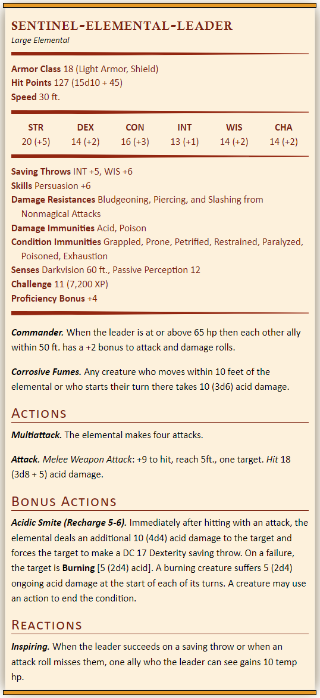
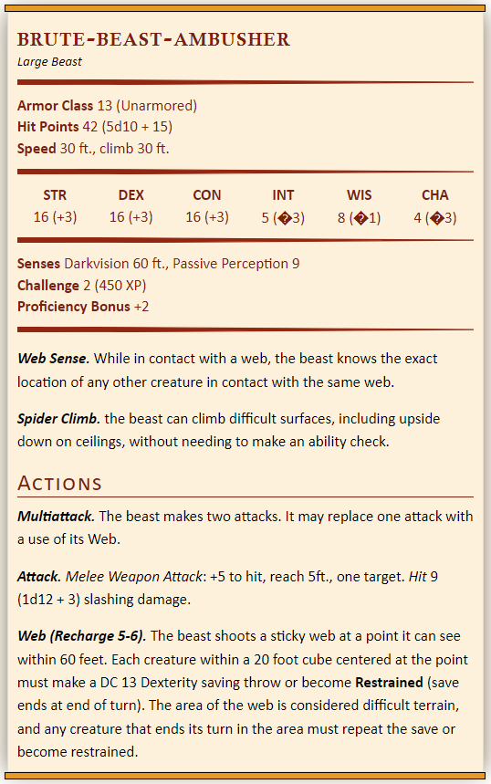
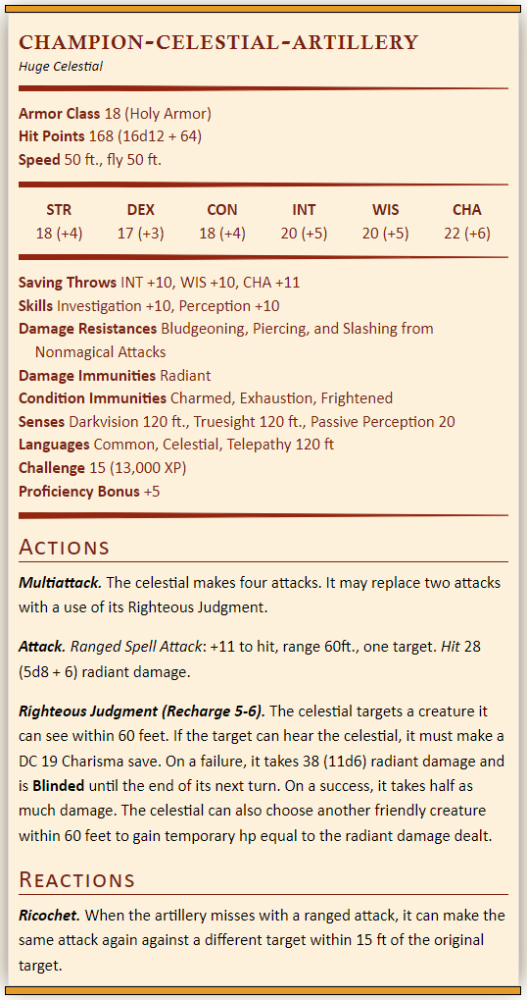
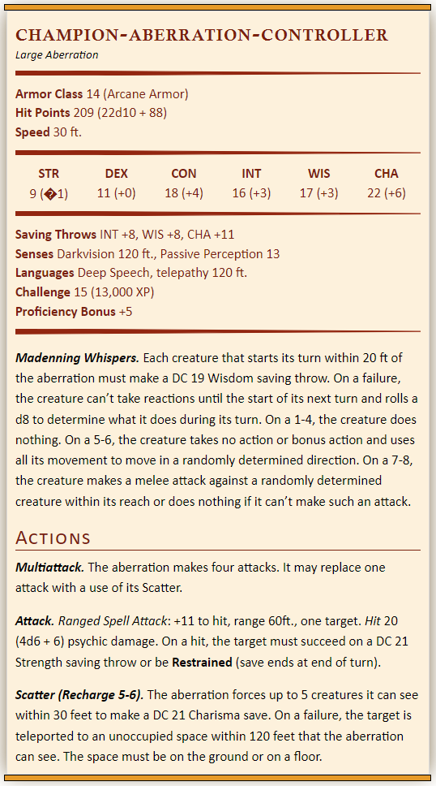
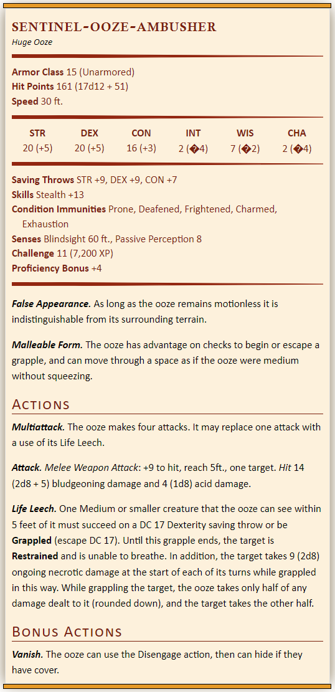
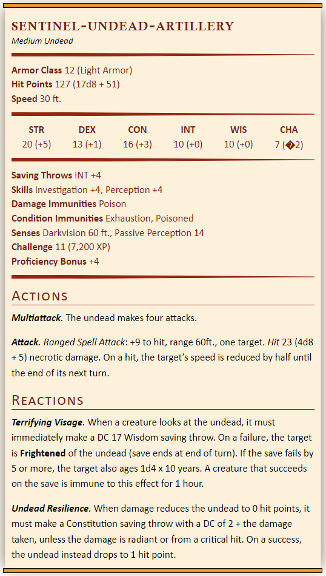

## Welcome to Foe Foundry



**Foe Foundry** is a project to procedurally generate interesting and powerful D&D 5e Monsters.

It's inspired by the [***Forge of Foes***](https://slyflourish.com/build_a_quick_monster_with_forge_of_foes.html) book written by Teos Abadia, Scott Fitzgerald Gray, and Michael Shea.

**Foe Foundry** is still work-in-progress. Eventually, there will be a site where you can generate your own monsters!

## Design Philosophy

- **Monsters should be powerful, flavorful, and easy to run**
- **The primary threat of a monster should come from its damage.** If you just multiattack with the monster, it should present a challenge in its raw damage output. Abilities should then create intersting flavor, unique mechanics, and other tactical effects to make combat exciting
- **Monsters shouldn't have to sacrifice damage output to do something interesting**. Foe Foundry monsters often have bonus actions or powerful actions that can replace attacks in the multiattack. This way, your monster will always do something interesting on its turn and still be able to threaten players with damage output
- **Monsters should have a clearly identified role**. Foe Foundry monsters have explicit roles that dictate their behavior and combat style. For example, monsters may be brutes, ambushers, leaders, etc. This leads to interesting encounters but also makes hte monster easier to run.
- **Monsters are procedurally generated using 200+ Unique Powers**. These unique powers are assigned to monsters based on their creature type, role, CR, size, attributes, skill proficiencies, etc. The powers automatically scale damage, range, DCs, etc. based on the creature they're being applied to!

## Example Monsters

All of these monsters were generated procedurally using Foe Foundry

### Acid Elemental Lord

This example shows off the *Leader* creature type - granting it bonuses to mental attributes, saves, and skills, as well as the *Commander* feature and *Inspiring* reaction - as well as th elemental power *Acidic Smite* that can deliver ongoing acid damage and melt a foe.

### Ambushing Spider

This spider is an example of a lower-CR creature that still has some unique mechanics. The *Web* abilty is built into the multi-attack so the spider can still make an attack even if the *Web* fails (compare this to the *Monster Manual* spider, which has to use its entire turn to try and web someone).

### Celestial Artillery

This high-CR celestial has impressive damage output and can rain holy fire down on the unrighteous.

### Controlling Aberration

This high-CR aberration can control its enemies with mind-freezing attacks, madenning whispers, and teleportation abilities.

### Sneaky Ooze

This sneaky ooze can hide, ambush its prey, and envelop it in life-draining acid.

### Terrifying Undead

This frightening undead can shoot bolts of necrotic energy at range and terrify any foe that tries to approach it.

