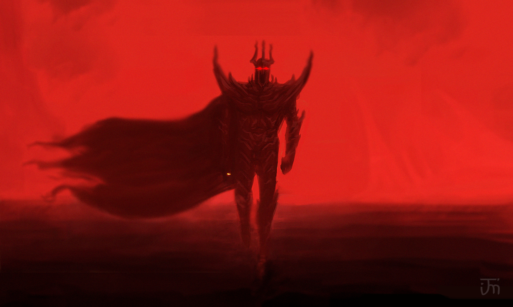

# The Villains the DMG Forgot

The 2024 *Dungeon Master’s Guide* makes big strides in teaching new DMs how to run adventures, but quietly removes a fan-favorite feature: the villain creation tables. Tools that once helped GMs create flavorful D&D villains, evil factions, and Big Bads are nowhere to be found in the new edition.  

This is fine for new DMs if the assumption is that they're running a pre-written module or adventure, where the main villain, or "Big Bad Evil Guy" (BBEG), is already defined. But what about DMs who want to craft their own epic antagonist, faction, or campaign-worthy threat? The new DMG doesn't give you much.  

Luckily there's room for the community to create tools to share with DMs!

## Foe Foundry's Villain Toolkit

[Foe Foundry's](https://foefoundry.com){.branding} lets you summon unforgettable monsters instantly. But an epic statblock for your villain is only half the equation.  

I built [**Creating Awesome Villains**](../families/villains.md) to give you the tools the DMG forgot:

- **20 villain archetypes** with threats for every tier of play, ranging from an Ancient Dragon Alliance to Misguided Zealouts 
- **20 Themed monster groups** to spice up your villainous faction
- **20 villainous goals** to keep your campaign moving forward
- **Villain Ideals, Bonds, Flaws, and Personalities** for interesting and unique motivations
- **Spicy Twists** to shake things up

Whether you're running a sandbox, prepping for a one-shot, or building a campaign arc around a single enemy, these tables make it easy and fun to summon your own BBEG. With over 200 mix-and-match options across themes, goals, and personality you'll never run into the same villain twice!

{.masked .blog-image-large}

[Summon your own **Awesome Villains**](../families/villains.md){.burnt-parchment .burnt-parchment-button .branding}

## Let's Try It Out

Let's create a Tier 1 threat for our campaign using these tables.

### Rolling Up a Threat

Let's start by rolling on the tables:

| Element | Roll | Choice                   |
| ------------|------|--------------------------|
| Threat      | 2  | Invasion: Pillaging Horde |
| Monsters    | 3  | Webbed: **Giant Spider**, **Ettercap**, or **Phase Spider** |
| Ways To Use | 2  | Unwilling Allies |
| Villain Goal| 9  | Erect dread monoliths of absolute power |
| Ideals      | 6  | Nationalism |
| Bonds       | 35 | Entitlement - "I deserve to be the strongest/richest/wisest/most powerful" |
| Flaws       | 2  | If I want something, I have to do it myself. Everyone else is incompetent |
| Personality | 7  | Haughty; overly elaborate gestures; smells strongly of cinnamon |
| Relation to PCs|7| The villain was once responsible for protecting the PC, or vice versa |
| Spicy Twist | 2  | Villain is actually trying to stop an even worse threat (15) Cursed Kingdom |
| Name        |20,2| Halisera Drogo - *The Iron Fist* |
| Sidekick    | 4  | **Shield Guardian** butler that projects the villain's voice |

{.masked .blog-image}

### Interpreting the Rolls

Right off the bat I'm interested by the fact that we have a lawful villain whose ideal is nationalism and is leading an invasion of a pillaging horde of unwitting spiders. Halisera Drogo is very interested in uniting her people into a single, powerful kingdom. And she wants to do this because of an ancient curse affecting the region that she believes can only be broken by a leader powerful enough to unite all the fractured clans of the region together.  

Since she's connected to the PCs, I think it makes sense for Halisera to be a local strong-woman. Perhaps she was the leader of a mercenary company the PCs were part of formerly.  

She's famous for Lawbearer Gauntlets, powerful magical items that allow her to bind foes she has defeated to her will. Hence her nickname "The Iron Fist". She grew tired of the constant petty squabling of the clans and the fact that no one was making any progress towards breaking the ancient curse laid on the continent and decided everyone else is incompetent and she'll have to take matters into her own hand.  

To do this, she has bound an army of **Phase Spiders** to her will through the power of her Lawbearer Gauntlets and she is planning on invading each of the clans, defeating their chieftan and binding him to her will, and erecting a dread Oathstone in the center of town that binds the clansmen to her will.  

Only then will she be powerful enough to break the ancient curse that drains the vitality from the land...  

Given that this is a Tier 1 villain, I'm thinking her forces can consist of:

- Halisera Drogo herself can be a [[Berserker Commander]] (CR8), perfect when they get to level 5
- She has conventional forces composed of [[Shock Infantry]] and [[Line Infantry]] with some [[Shock Infantry Veterans]] and [[Line Infantry Veterans]] sprinkled in
- She has bound some **Phase Spiders** to her will using the power of the gauntlets

### Final Product: Ironbound Horde

The Duchy of Florenza has long been afflicted by an ancient curse that dooms its scattered clans to interminable conflict. Generation after generation of petty wars have weakened the land and its people.  

That is, until a local strongwoman began her meteoric rise to power. Halisera Drogo the "Iron Fist", wielding the magical Lawbearer Gauntlets, has decided that only she is capable of ending this ancient curse. And the only way to do so is to conquer each and every one of the clans and force them to submit to her rule. Using an army of enslaved **Phase Spiders** that she has bound to her, she has begun conquering neighboring clans. In the center of each town that she conquers, she erects a dread Oathstone and forces the inhabitants to magically swear allegiance to her. So far, she has conquered almost half of the Duchy. Who remains with the power or will to resist her tyrannical rule?

Enter the PCs, former mercenaries serving under Halisera. How will they deal with their former mentor?

### Example Statblocks

Here are example statblocks, pulled from the Foe Foundry [Monster Generator](../generate.md), ready to drop in to your campaign.

#### Halisera Drogo, the Iron Fist

A **Berserker Commander** is perfect for our main villain.

[[!Berserker Commander]]

[[$Berserker Commander]]

#### Troops

[[!Line Infantry]]

[[!Shock Infantry]]

[[!Line Infantry Veteran]]

[[!Shock Infantry Veteran]]

---

I hope this inspires you to create many fun and memorable villains for your campaign! Looking for your own unforgettable villain?

[Use the Foe Foundry: Awesome Villains Toolkit to rolle one up in seconds](../families/villains.md)

Your next Big Bad is waiting.

**– Cordialgerm**