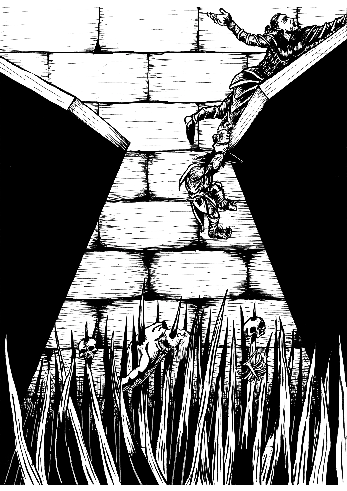

# Avoiding Stale 5E Combat with Tokens

If you've ran TTRPGs for a while, you'll start to notice that combats can eventually become routine. The players kick down the door, focus fire the first enemy until they're dead, move on to the next, and rinse and repeat.  

Sure, your players technically are using tactics, but it can risk turning into both sides bonking each other until someone drops first. It works, but it's not exactly the deepest and most engaging experience round after round.  

How do we, as DMs, avoid having combats getting stale?

## The Problem: 5E Combat is Often Static

The root issue is that many encounters in 5e are too linear. Players enter the room, assess the targets, and grind through enemies one at a time. Without anything usually to spice things up, combats will eventually boil down into a repeated set of tactics and a spreadsheet simulation of HP, AC, and spell slots.  

## The Fix: Dynamic Combat

The fix for this situation is to introduce dynamic combat elements. There are tons of ways you can do this, including:

- environmental effects like rising pools of lava
- changing terrain like crumbling dungeon ceilings and floors
- interactive terrain like a portcullis that can slam down and split the party
- changing enemies with new waves and new tactics

In this article, we're going to talk about a new tool called [**Tokens**](../topics/tokens.md). Tokens are one of <a href="https://foefoundry.com" class="branding">Foe Foundry's</a> ways to spice up D&D combat without rewriting the rulebook. They're interactive terrain elements like magical effects or objects that players need to interact with during the course of the fight.  

Some examples include a **Shadow Rift token** that keeps summoning [[Shadows]] until the players find a way to seal it or a **Runic Wards token** that gives that pesky [[Abjurer Mage]] immunity to all damage while it's active.

{.masked .blog-image-large}

## Example Combat: Using a **Runic Wards token**

Let's walk through an example combat with an [[Abjurer Archmage]] who will be using **Runic Wards token**.

[[!Runic Wards token]]

[[!Abjurer Archmage]]

The vibe we want for this combat is that the abjurer is either creating powerful wards to protect themselves or has already prepared the environment with these powerful defensive wards.  

> DM: As Boldrak rages and charges towards the Archmage she lets out a chuckle - "Your headlong charge is as foolish as it is impotent" - and with a wave of her hand three glowing Runic Wards appear above her head and form a complex series of interlocking patterns. You can tell this is powerful protective magic  
>  
> Merla: I fire my longbow at the mage to wipe that smug grin off her face. I get a 28 to hit.  
>  
> DM: You can tell your aim is true, but the arrow vaporizes when it hits the runic shield. You can tell that these Runic Wards are giving the archmage immunity to damage until they're dealt with  
>  
> Merla: Damn... well OK let me see if I can destroy one of the runes. Can I try to shoot one of the runes out of the sky?  
>  
> DM: Of course! Go ahead and make an attack.  
>  
> Merla: I got a 19 to hit.  
>  
> DM: (Checking the AC/DC of the rune, which is 18...) Perfect. Your second shot strikes true and destroys one of the runes. Now there are only two left (one of the token's charges is now depleted)  
>  
> Belmund: I want to use my mage hand and try to disable one of the runes  
>  
> DM: OK, give me a sleight of hand check, but at disadvantage because it'll be hard to get the timing right considering the spinning interlocking shields  
>  
> Belmund: I got a 15, is that enough?  
>  
> DM: Sorry, the Archmage turns and gives you a haughty laugh as your mage hand incinerates upon contact with the spinning shields  

## Want to Try It Out?

Tokens give your players new problems to solve, not just another bag of hitpoints to slog through.

You can:

- read through the full breakdown of [How Tokens Work](../topics/tokens.md) 
- <a href="https://foefoundry.com/generate" class="branding">Summon your own monsters with Foe Foundry</a>
- [Browse a list of token powers](../powers/emanation.md)