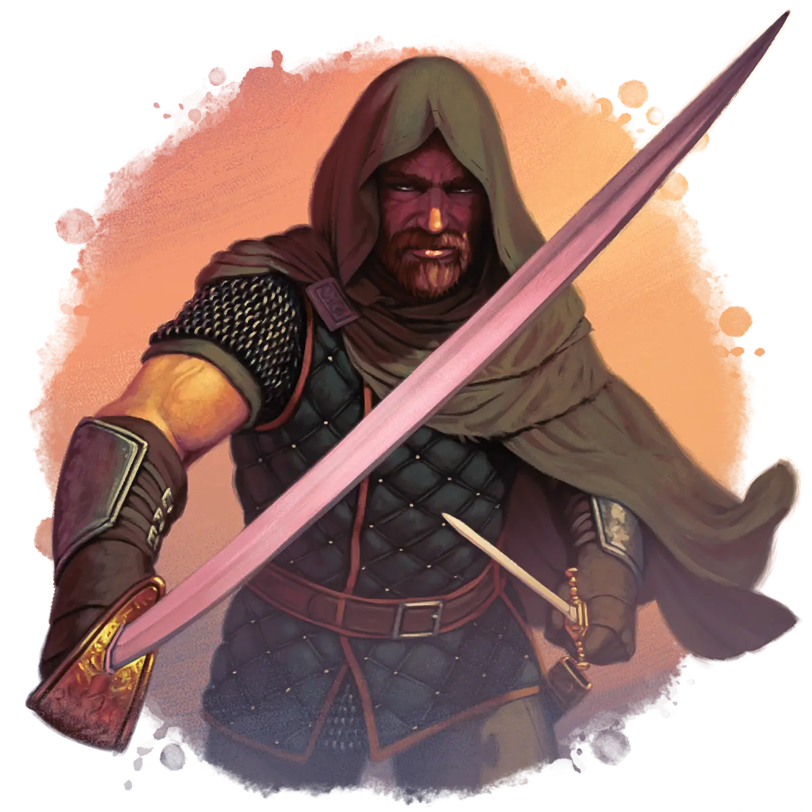

[[@Subscribe to the Newsletter]]

---

#	Building Memorable Rivals

Want to make your D&D world feel more alive? Rival adventuring parties are the secret sauce. In this post, I’ll walk you through creating a fully fleshed-out rival NPC group using the Foe Foundry generator - complete with backstory, hooks, and statblocks.

## Foe Foundry's Rival NPCs Toolkit

[Foe Foundry](https://foefoundry.com){.branding} lets you summon unforgettable NPC statblocks instantly. But an epic statblock is only half the equation. One of the most interesting ways to use Foe Foundry's unique NPC statblocks (like a [[Thug Overboss]] or a [[Knight of the Realm]]) is to have the NPC team up with others to create a **Rival Adventuring Party**.

I built [**The Ultimate Guide to Rival Adventuring Parties**](../families/rivals.md) to give you the tools to easily create fun, interesting, and memorable rivals that your players will love to hate, or maybe even hate to love.

- Pre-made [Rival Parties](../families/rivals.md#rival-adventuring-party-statblocks-for-dd-5e) with easy-to-use [Rival Introductions](../families/rivals.md#how-to-introduce-rivals-to-your-campaign)
- [Rival Adventure Hooks](../families/rivals.md#adventure-hooks-for-rival-adventuring-parties-in-dd-5e) ranging from wagers to team-ups to integrate rivals directly into your campaign
- Ways to [Link Rivals](../families/rivals.md#linking-rival-npc-parties-with-your-campaign-villains) to your campaign's [Villains](villains.md)
- [Rival Party Statblocks](../families/rivals.md#rival-adventuring-party-statblocks-for-dd-5e) that you can fully customize with the [Foe Foundry Generator](../generate.md)

Whether you're running a sandbox, prepping for a one-shot, or building a campaign arc around a single enemy, these tables make it easy and fun to summon your own rival adventurers.

{.monster-image}

[Summon your own **Rival NPC Adventurers**](../families/rivals.md){.burnt-parchment .burnt-parchment-button .branding}

## Let's Try It Out

Let's create a Rival NPC group that we can instantly drop into our campaigns:

### Rolling Up the Rivals

Let's start by rolling on the tables and create a rival adventuring party that we can introduce relatively early in the campaign, when the party is level 3 or so.

| Element | Roll | Choice                   |
| ------------|------|--------------------------|
| Rival Party      | 4  | Demon Hammers, goal to slay a fabled monster, wield cursed hammers containing fragments of slain fiends |
| Rival Introduction | 5 | Rival party is meeting with an important NPC right before or after the PCs |
| Previous Connection to PCs | 4 | One of the PCs once drank the rival’s leader under the table, or vice versa |
| Rival Adventure Hook | 2 | Competition - the rivals have been hired to complete the same task and the race is on. Who will get the job done first? |
| Linking Rival NPCs with Campaign Villains | 6 | Double Agents - The Rivals discover that they are working for the Villain and are considering switching sides |

### Interpreting the Rolls

I'm immediately inspired by these rolls to create a "race to kill the monster" adventure arc. Given that the Demon Hammers specialize in taking down fiends, it makes sense for the monster in question to be a fiend. Let's pick something interesting like a [[Vrock]] as our monster for this arc.  

I also love the setup where the rivals are meeting an important NPC right before the PCs. I think this is a great way to frame their introduction. The PCs can arrive in town and meet with the contact who will tell them about the [[Vrock]] they've been hired to hunt down and slay, only to find out that the Demon Hammers, their competition, are already there.

The drinking challenge is also a fun and easy way to create an instant connection to the new NPCs. In this case, let's say that one of the Demon Hunters once drank one of the PCs under the table. I would pick the PC who is the most outgoing and engaging as the target of this connection to maximize the hook.  

The double agent angle is interesting as well. Let's say that the Demon Hammers have been hired, unknowingly, by one of the campaign's [Villains](../families/villains.md) to slay the [[Vrock]]. Eventually, they can discover that they've been working for the villain the whole time and are in too deep, and may even seek out the PCs for advice on what to do.

## Final Product: The Race to Slay the Vrock

The PCs arrive in the frontier town of Lurtra, a wealthy wine-growing region that has been troubled of late. A foul [[Vrock]] has been defiling the local vineyards, causing untold havoc. The PCs have been hired by a wealthy absentee vintner to slay the fiend, for the promised reward of 1000g.  

Arrving in the town, the PCs meet up with their contact, Sister Elia, at the local temple. To the PC's surprise, they're not alone. The Demon Hammers are already here, getting a briefing. Sir Jordan, their grizzled leader, turns to the party and says "You're interrupting our briefing". A tall, muscled orc claps her arm on the knight's shoulder and turns to the party - "Boldrak, is that you? I'm surprised you can show your face around these parts after I drank you under the table last year! So you're our competition to take down this foul Vrock, eh?" 

### Demon Hammers Example Statblocks

Here are example statblocks for the Demon Hammers, pulled from the Foe Foundry [Monster Generator](../generate.md), ready to drop in to your campaign.

We'll use the level 5 rival party composition. Since this is a group of demon slayers, we'll tweak the leader statblock from the table and change it from a [[Thug Overboss]] to a [[Knight]].

|Rival| Role | Statblock | Notes |
|-----|------|-----------|-------|
|Sir Jordan | Leader | [[Knight]] | Swore an oath to hunt down every fiend on the continent after his family was slain |
| Big Mamsy | Brute | [[Orc Reaver]] | In love with her demon-slaying hammer |
| Crimsona | Ambusher | [[Spy]] | Obsessed with rooting out demonic corruption in the local elites |
| Brother Heith | Support | [[Priest]] | Cousin to Sister Elia, local to region |
| Gristle | Pet | [[Dire Wolf]] | Loyal guardian of Big Mamsy |

#### Leader

The Demon Hammers are led by Sir Jordan, a grizzled middle-aged [[Knight]] who swore an oath of retribution to hunt down every fiend on the continent after his family was slain by demons years ago.

[[!Knight]]

[[$Knight]]

#### Brute

Big Mamsy, a nomadic [[Orc Reaver]], worked a couple jobs with Sir Jordan and ended up falling in love with her demon-slaying hammer. It just smashes things so well!

[[!Orc Reaver]]

[[$Orc Reaver]]

#### Pet

Gristle is Big Mamsy's faithful [[Dire Wolf]] that she raised from a pup.

[[!Dire Wolf]]

[[$Dire Wolf]]

#### Ambusher

Crimsona the [[Spy]] mostly keeps to herself until you really get to know her. She likes to keep her hood up at all times, even when it's a hot day. She's obsessed with keeping tabs on the politics of the nobility and is a bit of a conspiracy theorist, convinced that all the local nobles are under the influence of powerful fiends.

[[!Spy]]

[[$Spy]]

#### Support

Brother Heith is a native Lurtran [[Priest]] and Sister Elia is his cousin. He's happy that his party is helping his hometown deal with this fiendish threat.

[[!Priest]]

[[$Priest]]

---

I hope this inspires you to create many fun and memorable Rival Adventuring Parties for your campaign! If you found this content helpful or inspiring, consider subscribing to get more free content just like this.

[[@Subscribe to the Newsletter]]

**– Cordialgerm**

---

