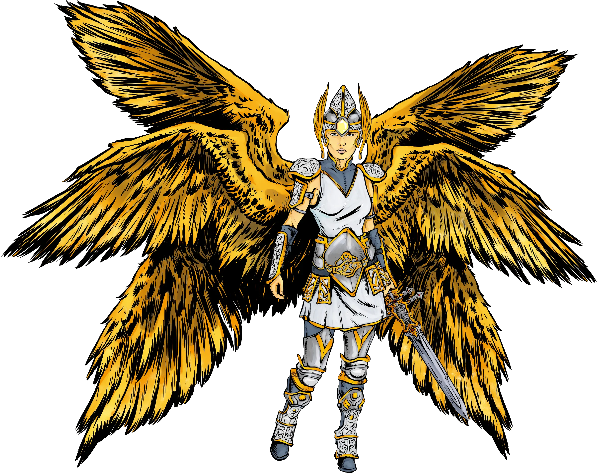

[[@Join the Foe Foundry Newsletter]]

# 10 Interesting Celestial Powers

The stock angels in the 2014 and 2024 Monster Manual are relatively uninspired. With [**Foe Foundry**](../index.md){.branding}, you have the opportunity to break out of the bland box. These celestial powers are designed to create powerful, memorable, and flavorful moments to really make celestial forces stand out to your party.

[Celestial Powers](../powers/celestial.md) are used by creatures from the Upper Planes such as angels (**Devas**, **Planetars**, and **Solars**). In default 5E lore, the upper planes are realms of radiant light, divine order, and unyielding ideals. These are the domains of angels, archons, and the countless beings forged from pure purpose. The Upper Planes are not idyllic heavens. They are battlegrounds for ideology, home to divine crusades and celestial judgments. Their denizens may offer aid, or test the unworthy with fire and light. These celestial powers are ideal for creatures that deal radiant damage, enforce divine law, or serve as holy champions in your campaign - such as an [[Archpriest]] or a [[Paragon Knight]].

So, let's take a look at 10 interesting celestial powers that will strike the fear of the gods into your party, should they dare oppose the will of the heavens. These angelic abilities will transcend the traditional divine smite and elevate your holy-themed encounters.

{.blog-image-large}

---

[[!Divine Law]]

[[Divine Law]] is my favorite celestial power in [Foe Foundry](../index.md){.branding}. It's such a unique and memorable ability that's dripping with flavor. Use it to really drive home the ironclad order and law associated with celestial beings. This is one of the best angelic abilities to add to your 5E celestial.

[[!Awe Inspiring Gaze]]

With [[Awe Inspiring Gaze]], you can really lean into the otherworldy grace and power of a celestial being. This is not an entity to treat lightly.

[[!Absolute Conviction]]

[[Absolute Conviction]] is a great way to flavorfully show how dedicated your [[Knight]], [[Priest]], or [[Angel]] is. Be sure to voice a flavorful quote like "My faith will never falter!" when activating the ability.

[[!Divine Mercy]]

[[Divine Mercy]] is great for flavor and creating interesting encounters. This ability gives you permission, as the DM, to throw a very powerful celestial creature in front of your party of misbehavors and allow the celestial to offer mercy and repentence.

[[!Righteous Judgement]]

[[Righteous Judgement]] is great as an ability to use against the PCs that are morally grey. Use it as a chance to inject some roleplay moments into combat as the celestial calls out the PC for their misdoings and subjects them to sacred judgement. 

[[!Words of Righteousness]]

[[Words of Righteousness]] is a reasonable AOE ability that also has a bit of flavor built in. You can highlight what actions are causing the PC to either gain advantage or disadvantage.

[[!Death Ward]]

[[Death Ward]] is a fun and interesting holy magic ability. The [[Angel]] or [[Priest]] doesn't even have to use it on its own allies. It can use it to offer mercy to one of the PCs.

[[!Guidance]]

[[Guidance]] is a classic. Players love to use it, and the monsters can too!

[[!Encouragement]]

[[Encouragement]] is another ability built for injecting roleplay into combat. Be sure to have the celestial speak calm words as it uses this ability.

[[!Divine Smite]]

[[Divine Smite]] isn't terribly unique, but it's classic, resonant, and gets the job done!

---

## Example Statblocks

If you like these powers, check out the [Foe Foundry Generator](../generate.md), where you can easily summon the perfect foe for you game tonight using over 600 unique powers like the ones described above.

Here's some example statblocks that can showcase these powers:

[[!Archpriest]]

[[$Archpriest]]

[[!Paragon Knight]]

[[$Paragon Knight]]

---

## Celestials FAQ

### What are celestial powers in D&D?

[Celestial Powers](../powers/celestial.md) are used by creatures from the Upper Planes such as angels (**Devas**, **Planetars**, and **Solars**). In default 5E lore, the upper planes are realms of radiant light, divine order, and unyielding ideals. These are the domains of angels, archons, and the countless beings forged from pure purpose. The Upper Planes are not idyllic heavens. They are battlegrounds for ideology, home to divine crusades and celestial judgments. Their denizens may offer aid, or test the unworthy with fire and light.

### How do I add celestial powers to a homebrew monster?

You can use the [Foe Foundry Generator](../generate.md) to instantly add [Celestial Powers](../powers/celestial.md) to any monster, or start with an **Angel** and customize it as you see fit!

### Can celestial powers be used by villains or fallen angels?

Yes! A great use-case would be to create a powerful **Cultist** like a [[Cultist Grand Master]] or [[Cultist Exarch]] to really sell the power of the devotion the cult leader has accumulated.

---