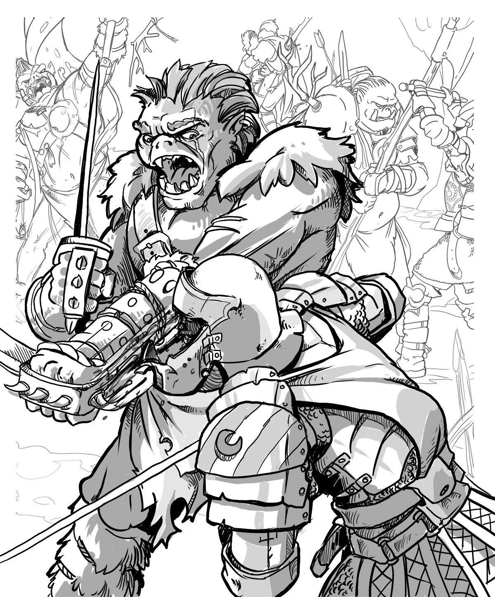

[[@Join the Foe Foundry Newsletter]]

# Where are the Orcs?

The 2024 revision of the *Monster Manual* made some bold choices. Overall, I think it's a great improvement. Many of these changes streamline encounter prep and emphasize statblock reuse. But in the name of simplicity (or perhaps to avoid a nuanced discussion), the book cuts some corners. Particularly when it comes to iconic creature types like [[Orcs]] and **Drow**.  

There used to be dedicated [[Orc]] statblocks. Instead, the 2024 monster manual suggests that GMs should simply reflavor a [[Thug]] as an orc. 

{.masked .blog-image}

## Reflavoring Isn't Always Enough

Reflavoring or reskinning a monster is a useful improvisational tool. But it has limits. Without any bespoke statblocks, [[Orcs]] lose flavor and you as the GM lose access to fun and interesting mechanics and lore. Over time, reskinned orcs lose their flavor and distinctiveness and feel forgettable, interchangeable, or bland.

## Foe Foundry Does It Differently

[Foe Foundry](../index.md){.branding} takes a different approach. Instead of flattening everything into "generic humanoids," we embrace the flavor and identity that made Orcs and Goblins iconic in the first place.

Here’s how:

- **Dedicated statblocks** for specific Orc monsters like an [[Orc Warchief of the Bloody Fang]] or an [[Orc Hardened One]]
- **Species templates** that turn *any* NPC into a flavorful Orc, like an Orc Questing Knight (see below)
- **Lore-driven design** with every statblock grounded in its place in the world.

[[$Orc Questing Knight]]

## Not All Orcs Are the Same

One potential reason that the *2024 Monster Manual* removed orcs as monsters and removed all lore about orcs is to avoid a nuanced discussion around stereotyping an entire sentient humanoid species as evil based on one statblock. Rather than have a discussion about how Game Masters can present varied humanoid species, the 2024 MM simply removed orcs entirely. I find this approach deeply unsatisfying.  

Foe Foundry doesn't treat Orcs as a monolith. Our dedicated Orc monster statblocks (like an [[Orc Reaver]]) represent those orcs who have given into the bloodrage and embraced violence and destruction.

But orcs are sentient humanoids. Just as having an [[Assassin]] statblock doesn't mean all humans are inherent killers, having an [[Orc Reaver]] statblock doesn't mean all Orcs are pillagers and reavers. Foe Foundry lets you represent this mechanically by applying an Orc template to any NPC statblock. So you can create an [[Orc Priest]] or [[Orc Spy]] just as easily as an [[Orc Bloodrite Shaman]].

By providing both options, bespoke Orc statblocks and Orc templates to apply to NPCs, you as the GM have the tools you need to navigate the nuanced topic of how to represent sentient species with ranges of individual beliefs and practices that sometimes align with or conflict with the societies they are a part of.

Get started by checking out our [Orc Statblocks, Lore, and Encounters](../monsters/orc.md) to get inspired to run easy, fun, and exciting orc foes in your games!

---