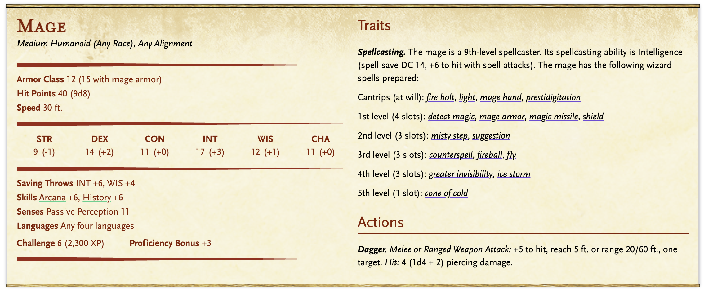
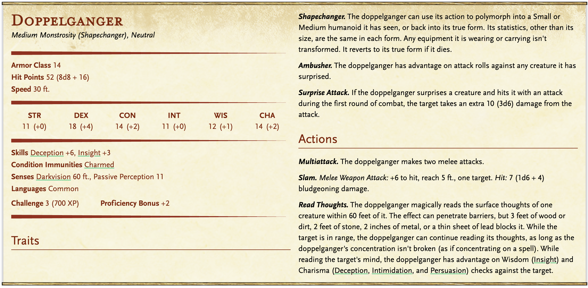
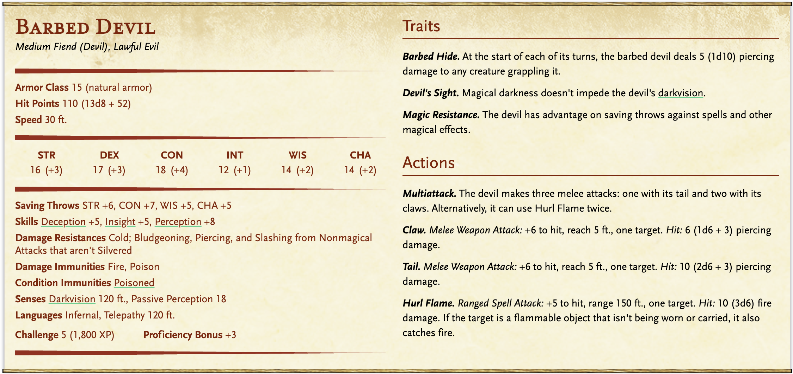

# 5 Tips for Homebrewing Monsters

!!! info "Opinionated Advice"
    This article shares my opinionated advice on how I go about designing and creating homebrew monsters. 5E is an open system and there's room for many different styles of monster design. I encourage you to pick and choose what works best for you and your games!

Tired of vanilla monsters that feel like soggy cardboard in combat? Homebrewing monsters in 5E can turn forgettable encounters into memorable moments, if done right. This guide walks you through five practical tips to design custom monsters that hit hard, act smart, and keep players on their toes. Whether you're building from scratch or tweaking existing statblocks, these ideas will help you create monsters that actually matter.

## A Monster's Primary Threat Is Its Damage

If you just multiattack with the monster, it should present a challenge in its raw damage output. Abilities should then add interesting flavor, unique mechanics, and other tactical effects on top of the raw damage to make combat exciting.

A classic example of this is the 2014 [[Mage]]:

{.masked .padded .blog-image-large}

**The Problem**: It has a completely pointless dagger attack that wastes space and detracts from the quality of the statblock. All of the monster's damage and threat is locked into spells, and you have to know which spell to use because there are a bunch of filler spells on the spell list.

**The Solution**:

[[!Diviner Mage]]

The [Foe Foundry](./index.md){.branding} statblock has several improvements:

- if you just multiattack, the monster will do plenty of damage
- but, if you want to keep it interesting, you can cast one of its spells. And you'll see there are no filler spells on its spell list
- and the monster has a unique and interesting ability

## Monsters Can Be Interesting & Threatening

Foe Foundry monsters often have bonus actions or powerful actions that can replace attacks in the multiattack. This way, your monster will always do something interesting on its turn and still be able to threaten players with damage output.

Let's look at the 2014 **Doppelganger** from the [SRD](https://open5e.com/monsters/doppelganger):

{.masked .padded .blog-image-large}

**The Problem**: the features that make a Doppelganger unique and interesting are its ability to shapeshift and read minds. But, with this statblock these require the Doppelganger to use up its action. So, in order to do something fun and interesting, this monster has to give up doing any damage. Also, its damage output is pitiful. So why would anyone ever run this monster as-is?

**The Solution**: *Read Thoughts* and *Shapechanger* are flavor abilities, and they shouldn't waste the monster's action economy. They should be Bonus Actions or something that triggers automatically without requiring an Action. Also, *Read Thoughts* should provide some additional mechanical benefit to the **Doppelganger**.

Let's fix [[Read Thoughts]]

[[!Read Thoughts]]

By making this ability a *Bonus Action* it no longer competes with the monster's attack, and by tweaking it to have an actual mechanical effect relevant to combat, we can lean more into the flavor of the Doppelganger finding and exploiting the weaknesses of its prey.

## Monsters Don't Need Multiple Repetitive Attacks

No more boring french-vanilla "Bite Claw Claw" monsters. These sorts of attacks waste space on the statblock and make it appear like there is more going on in the statblock than there actually is.

Let's look at the 2014 **Barbed Devil** from the [SRD](https://open5e.com/monsters/barbed-devil):

{.masked .padded .blog-image-large}

**The Problem**: This monster has 3 attacks, which take up the majority of the statblocks. The attacks don't actually do anything besides slightly different amounts of damage, but you have to roll different numbers of dice and use different damage and attack modifiers for each. Why? It's a complete distraction.

**The Solution**: Monsters in Foe Foundry have a default attack that will often get attack modifiers added in (such as [[Weakening Attack]] or [[Frightening Attack]]). Secondary attacks are only added if they actually add something interesting, like the unique mechanic in [[Nullification Maw]].

[[!Nullification Maw]]

## Monsters Should Use Interactive Debuffs

Instead of paralyzing a character, Foe Foundry monsters use new conditions like [**Weakened**](../topics/conditions.md#weakened), [**Shocked**](../topics/conditions.md#shocked), [**Frozen**](../topics/conditions.md#frozen), etc. These conditions take away less player agency and are more interactive than their harsher cousins like **Paralyzed** and **Stunned**.  

**The Problem**: In the 2014 and 2024 Monster Manual, some monster's challenge rating is balanced around the fact that the monster imposes debilitating conditions like **Paralyzed** and **Stunned**. The problem with this design is two-fold:

- If the monster succeeds at stunning or paralyzing a player, they end up losing  a turn, which isn't very engaging for that player.
- The ability is super swingy. If no one ever gets stunned, then the monster will be boring. If everyone gets stunned, it will be super deadly.

**The Solution**: [Foe Foundry](../index.md){.branding} takes a different approach. Rather than relying on swingy debilitating powers, Foe Foundry monsters have effects that apply interactive debuffs. These effects are typically stapled onto the monster's existing abilities or attacks so they don't detract from the monster's damage output, while the effect itself is not nearly as swingy as paralyzing or stunning a creature.

For example, consider the [[Toximancer]] power:

[[!Toximancer]]

## You Don't Have to Brew by Hand

If you build a statblock by hand, you have to worry about fiddling with statblocks, calculating hit modifiers, and scaling damage to be appropriate to CR.  

[Foe Foundry](./index.md){.branding} takes care of all of that for you with a [Monster Generator](../generate.md) and [Over 600 Powers](../powers/all.md) at your fingertips.  

Need a monster for tonight? Get started and summon unforgettable foes instantly, like this [[Diviner Mage]].

[[$Diviner Mage]]

---

## Part 2

[Four More Tips for Homebrewing](./2025_06_19_more_homebrew_monster_tips.md) continues the series with more tips and tricks for homebrewing monsters.

---

[[@Subscribe to the Newsletter]]

---