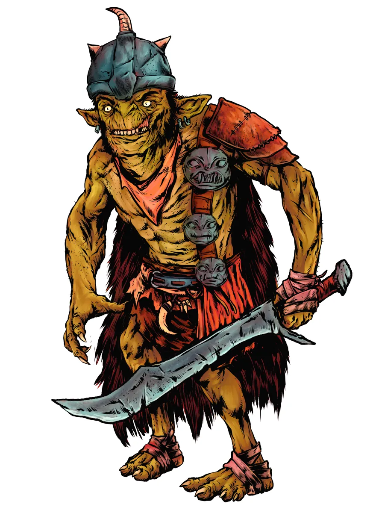
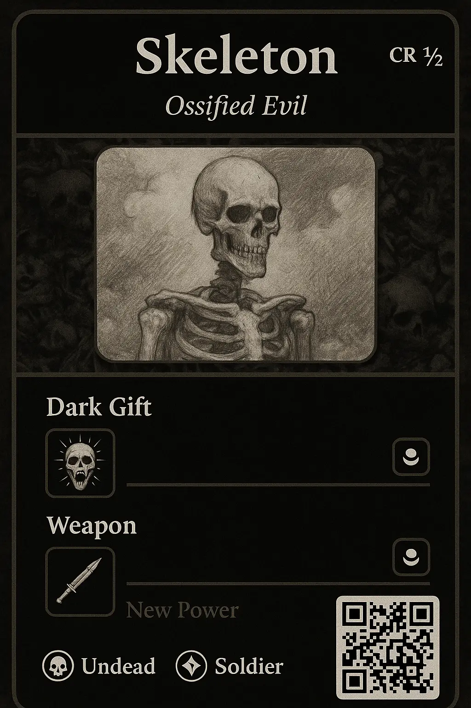

# Dev Diary #2 - Monster Generator Mockup

Welcome to the second Dev Diary for [Foe Foundry](../index.md){.branding}! I’ll be sharing these updates roughly every two weeks.

## Newsletter

I’ve launched a free weekly newsletter packed with GM tips, monster ideas, and site updates.

[[@Join the Foe Foundry Newsletter]]

## New Priests and Cultist Statblocks

Based on Patron Prioritization Poll #1, cultists and priests won out, so here they are in all their fanatic glory.

[Cultists](../monsters/cultist.md):

- 13 different statblocks including a legendary [[Cultist Exarch]] as well as [[Fiend Cultist]], [[Death Cultist]], and [[Aberrant Cultist]] variants
- Lore, encounters, and adventure hooks too!

[Priests](../monsters/priest.md):

- 5 different priest statblocks, including a legendary [[Archpriest Living Saint]]
- Lore, encounters, and adventure hooks that you can drop right into your games

Check out the legendary [[Cultist Exarch]] as an example:

[[!Cultist Exarch]]

## What's Next? Vote in Prioritization Poll 3

The [**Patron Prioritization Poll**](https://www.patreon.com/posts/patron-poll-3-130328668?utm_medium=clipboard_copy&utm_source=copyLink&utm_campaign=postshare_creator&utm_content=join_link) for this week will focus on Goblinoids. Should I be adding Goblins, Bugbears, Ogres, or Hobgoblins to Foe Foundry next?

{.masked .blog-image}

## 5 Tips for Homebrewing Monsters in 5E

The [**Homebrew Monster Tips**](../blog/2025_05_16_homebrew_monster_tips.md) article offers some GM advice when homebrewing monsters for 5E:

- [A Monster's Primary Threat Is Its Damage](../blog/2025_05_16_homebrew_monster_tips.md#a-monsters-primary-threat-is-its-damage)
- [Monsters Can Be Interesting & Threatening](../blog/2025_05_16_homebrew_monster_tips.md#monsters-can-be-interesting--threatening)
- [Monsters Don't Need Multiple Repetitive Attacks](../blog/2025_05_16_homebrew_monster_tips.md#monsters-dont-need-multiple-repetitive-attacks)
- [Monsters Should Use Interactive Debuffs](../blog/2025_05_16_homebrew_monster_tips.md#monsters-should-use-interactive-debuffs)
- [You Don't Have to Brew by Hand](../blog/2025_05_16_homebrew_monster_tips.md#you-dont-have-to-brew-by-hand)

## 10 Powers for Cultists and Fanatics

The [**10 Powers for Cultists and Fanatics**](../blog/2025_05_24_10_powers_for_cultists_and_fanatics.md) article goes into the flavor and design of the unique powers that are available to [Cultists](../monsters/cultist.md) as well as [Priests](../monsters/priest.md).

Here's one unique example:

[[!Pyramid Scheme]]

## 10 Spooky, Stinky, and Shambly Powers for Skeletons and Zombies

Who said [[Skeletons]] and [[Zombies]] have to be bland? With these [unique undead powers for skeletons and zombies](../blog/2025_05_24_10_spooky_stinky_shambly_powers.md) you'll be ready to supercharge your undead.

Here's a teaser:

[[!Severed Limb]]

## Power Icons

I've added icons for all [600+ Unique Powers](../powers/all.md). For example [[Grovel and Beg]] or [[Identify Weakness]]. This is an important step in making monster builder UI available.

## Performance Improvements

Made a bunch of performance optimizations to the site, especially around images, so you should have a smoother experience on mobile.

---

## What's Next?

I'm hard at work on the **Generator** that will allow you to edit monsters by adding powers, removing powers, and smashing two monsters together. Want to create a weird aberrant mind-flayer infested Ogre? When the generator is done, you'll be able to with a couple of clicks

This feature will mark the transition from Alpha to Beta. I wanted to share an update on what the generator will look like.

Here’s a sneak peek at the upcoming **Monster Cards**. These cards will show a summary of the monster and its current powers. Each monster will have a "loadout" of powers. For example, a basic skeleton has two power slots - a **Dark Gift** slot which will be filled by some sort of necromantic power and a **Weapon** slot that will be filled with a martial power.

This is just a wireframe mockup of what a monster card will look like - the design and art are not final!

{.blog-image-large}

From the card, you'll be able to customize the monster by tapping on the selected power in each slot and choosing a different possible power.

For example, a skeleton currently has 6 possible **Dark Gift** powers and 11 possible **Weapon** powers, meaning that with Foe Foundry you'll be able to effortlessly generate 66 different basic [[Skeletons]]. Higher threat monsters will of course have more powers and even more possible variety!

Of course, if you don't want to edit everything by hand you'll be able to re-roll the entire statblock or just roll randomly on a specific loadout.

I hope this gives you a sense of how the generator will allow you to effortlessly craft the perfect foes for your games!

---

I can’t wait to see what you build with Foe Foundry — and I’d love your feedback as the project grows.

Thanks for reading, and thanks for playing.

🧟 [Explore the Monster Library](../monsters/index.md){.blog-image-large}

**– Cordialgerm**