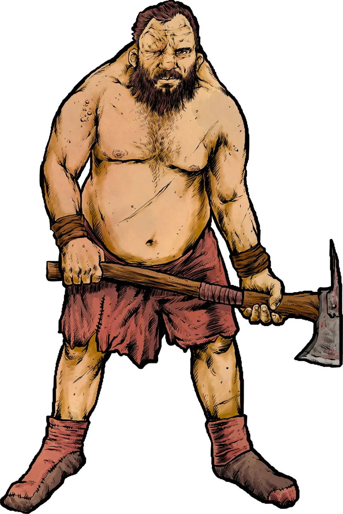

# Meaner and Funnier Ogres for 5E

## Tired of Boring Ogres?

Most [[Ogres]] in 5E are just bags of hit points with clubs.  

They swing once or twice, grunt, and die. That’s not terribly interesting. What if ogres were funny, terrifying, and *actually memorable*?

[Foe Foundry](./index.md){.branding} reimagines ogres from the ground up. These brutes are flavorful, fast to use, and packed with interesting powers and mechanics.

➡️ [See the full ogre collection](../monsters/ogre.md)

{.masked .monster-image}

---

## What Makes a Good Ogre?

Even though Ogres themselves are dumb, it doesn't mean they need to have bland statblocks. Ogre powers and abilities should play up their strengths (massive hulking brutes who love to smash) and also their weaknesses (incredibly dumb).  

Here’s a taste of the ogres you’ll find in Foe Foundry:

- [[Ogre]] – A brutish ravager who fights on hunger and instinct
- [[Ogre Wallsmasha]] – Uses uprooted trees as battering rams and loves to break things
- [[Ogre Burnbelcha]] – Belches flammable sludge mid-battle
- [[Ogre Chaincrakka]] – Nets and whips prey for the stew pot
- [[Ogre Big Brainz]] – A schemer who leads with brains, not brawn

➡️ [See all 5 Ogre statblocks →](../monsters/ogre.md#ogre-statblocks)

---

## Top 5 Unique Ogre Powers

[[!Wallsmasha]]

What's more iconic than an ogre smashing things? [[Wallsmasha]] is a fun power that encourages your ogres to break things left and right. Pair this up with an [[Ogre Wallsmasha]] for some fun times.

[[!Chaincrack]]

The [[Chaincrack]] power adds a bit of controlling elements to the otherwise brutish [[Ogre Chaincrakka]].

[[!Burnbelch]]

With [[Burnbelch]], the [[Ogre Burnbelcha]] can spew up a volatile flaming brew onto a group of enemies and light them on fire.

[[!Big Windup]]

Be sure to telegraph [[Big Windup]] so the PCs have a chance to counter-play, perhaps by distracting the ogre.

[[!Grab and Go]]

[[Grab and Go]] is a fun power where the ogre picks up a nearby foe and swings it around like a club.

➡️ [Discover all their monstrous tricks →](../monsters/ogre.md)

---

## Drop-In Encounter Seeds

Quick scenes you can drop right into your next session:

- An ogre in a mudhole challenges the PCs to a drinking contest
- A tollkeeper ogre guards a pass - pay or get nailed to the signpost
- A Burnbelcha snores in a glade, curled around a half-burnt corpse clutching a magic item

➡️ [More ogre encounters (ready to run) →](../monsters/ogre.md#ogre-encounter-ideas)

---

## Ogre Adventure Hooks

Ogres can do more than hit things. They can shape an entire arc:

- A band of ogres driven out by a hydra wants help reclaiming their lair
- A hamlet vanished after a feast — the ogre ate *everything*
- An orc warlord recruits ogre clans… unless the players stop him

➡️ [Steal a full mini-arc for your campaign →](../monsters/ogre.md#ogre-adventure-ideas)

---

## Why These Ogres Work

- Designed for fast, brutal fights
- Memorable abilities that reward creativity
- Built for storytelling and chaos, not just damage numbers

---

## Try Foe Foundry’s Ogres Tonight

Summon your first monster and see why GMs love Foe Foundry's unique [powers](../powers/all.md) and [monsters](../monsters/index.md).

➡️ [Explore all ogres now →](../monsters/ogre.md)

---

[[@Subscribe to the Foe Foundry Newsletter]]

---