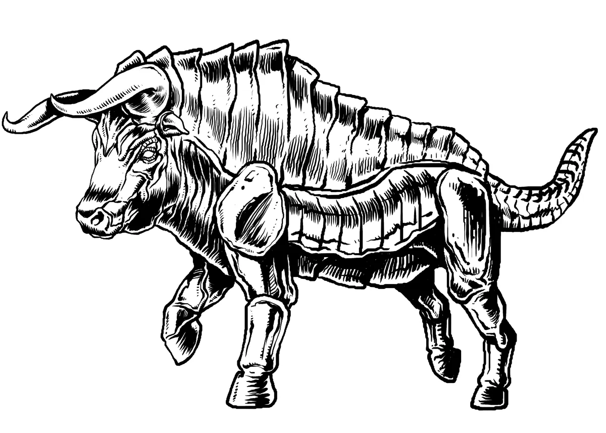
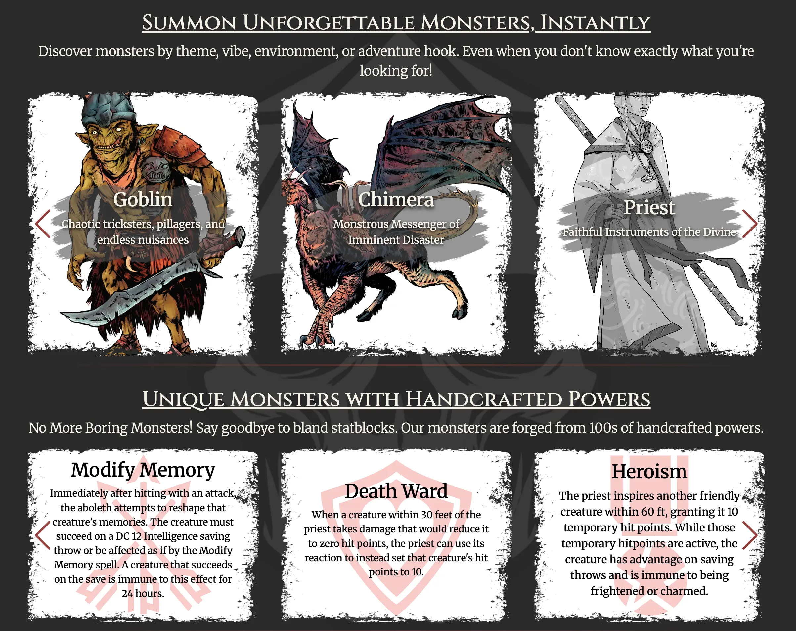

# Dev Diary #3

Welcome to the third Dev Diary for [Foe Foundry](../index.md){.branding}! Normally, I share these updates every two weeks, but I'll be relaxing with the family for Father's Day so I thought I'd get this out a bit earlier.

## Newsletter

The free weekly newsletter packed with GM tips, monster ideas, and site updates keeps growing!

[[@Join the Foe Foundry Newsletter]]

## New Ogre Statblocks

Based on [Patron Prioritization Poll #2](https://www.patreon.com/foefoundry), [**Ogres**](../monsters/ogre.md) won out!  

I had a [lot of fun working on Ogres](../blog/2025_06_08_ogres.md). The Monster Manual ogres are exactly what inspired me to create Foe Foundry. They're just completely bland. Here's an example Foe Foundry [[Ogre Wallsmasha]] with its signature [[Wallsmasha]] power.

[[!Ogre Wallsmasha]]

[[!Wallsmasha]]

## Merrow Statblocks

I did a collab with u/MShades, who has a nice new blog called [**Encounter Every Enemy**](https://encountereveryenemy.wordpress.com/), focused on making the humble [**Merrow**](../blog/2025_06_08_merrow.md) exciting and deadly. If you want a fresh take on monster lore, encounters, and tactics, check out their series!

I decided to take the *plunge* and make [[Merrow]] exciting:

- 4 unique Statblocks ([[Merrow]], [[Merrow Blood-Blessed]], [[Merrow Storm-Blessed]], [[Merrow Abyssal Lord]]) with dozens of variants each
- Lore for [**Thalassant, the Lord of Sacrifice**](../monsters/merrow.md#thallassant-the-lord-of-sacrifice), a legendary lord
- Unique [Merrow Powers](../powers/merrow.md) to give these monsters some fun mechanical differentiation
- Flavorful and table-ready [Merrow Encounter Ideas](../monsters/merrow.md#merrow-encounter-ideas) and [Merrow Adventure Ideas](../monsters/merrow.md#merrow-adventure-ideas) that play to the themes highlighted in [**Encounter Every Enemy**](https://encountereveryenemy.wordpress.com/)

Check out the legendary [[Merrow Abyssal Lord]]:

[[!Merrow Abyssal Lord]]

## What's Next? Vote in Prioritization Poll 4

[Patrons](../support.md) can vote on the new [**Patron Prioritization Poll #4 - Monstrosities**](https://www.patreon.com/posts/131284938) for this week. Should I be adding Basilisks, Gorgons, Medusa, or the much-feared Dire Bunny?

{.masked .monster-image}

---

## Homepage Updates

I'm also working on a redesigned homepage that will focus on showcasing all the cool [monsters](../monsters/index.md) and [powers](../powers/all.md) on Foe Foundry. It's still WIP, but here's a mockup that I'm working towards.

{.blog-image-large}

## Generator Updates

I'm hard at work on the **Generator** that will allow you to edit monsters by adding powers, removing powers, and smashing two monsters together. Want to create a weird aberrant mind-flayer infested Ogre? When the generator is done, you'll be able to with a couple of clicks

This feature will mark the transition from Alpha to Beta. I wanted to share an update on what the generator will look like.

[Last time](../blog/2025_05_30_dev_diary2.md) I shared a mockup of the **Monster Cards** feature, which will allow you to edit monsters via an intuitive card UI. Before I can implement this UI, I need to migrate all the existing monsters to the new generation framework. I'm about 60% done migrating monsters, and the generator UI will be up next.

---

I can’t wait to see what you build with Foe Foundry — and I’d love your feedback as the project grows.

Thanks for reading, and have fun running games for your friends, family, and loed ones!

🧟 [Explore the Monster Library](../monsters/index.md)

**– Cordialgerm**