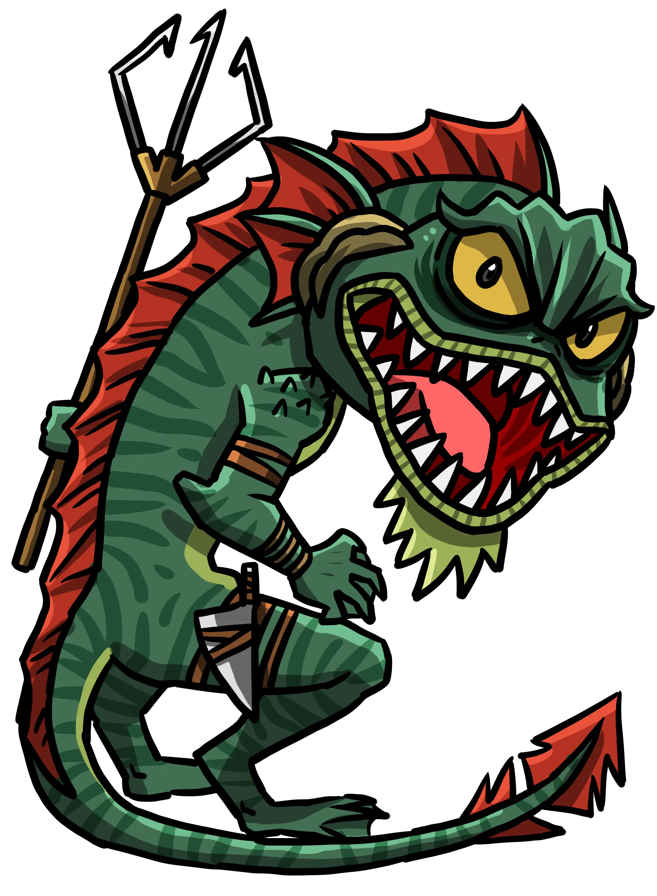

# Four More Tips for Homebrewing Monsters

## Are You Homebrewing Backwards? 

Wondering if your monster is balanced? You might be building it backwards.  

Let's fix that, and make it deadly and memorable in the process.

## Five Original Tips for Homebrewing Monsters

!!! info "Opinionated Advice"
    This article shares my opinionated advice on how I go about designing and creating homebrew monsters. 5E is an open system and there's room for many different styles of monster design. I encourage you to pick and choose what works best for you and your games!

The original article [5 Tips for Homebrewing Monsters](./2025_05_16_homebrew_monster_tips.md) introduces these concepts:

- **A Monster's Primary Threat Is Its Damage**: If you just multiattack with the monster, it should present a challenge in its raw damage output. Abilities should then add interesting flavor, unique mechanics, and other tactical effects on top of the raw damage to make combat exciting.
- **Monsters Can Be Interesting & Threatening**: Foe Foundry monsters often have bonus actions or powerful actions that can replace attacks in the multiattack. This way, your monster will always do something interesting on its turn and still be able to threaten players with damage output.
- **Monsters Don't Need Multiple Repetitive Attacks**: No more boring french-vanilla "Bite Claw Claw" monsters. These sorts of attacks waste space on the statblock and make it appear like there is more going on in the statblock than there actually is.
- **Monsters Should Use Interactive Debuffs**: Instead of paralyzing a character, Foe Foundry monsters use new conditions like [**Weakened**](../topics/conditions.md#weakened), [**Shocked**](../topics/conditions.md#shocked), [**Frozen**](../topics/conditions.md#frozen), etc. These conditions take away less player agency and are more interactive than their harsher cousins like **Paralyzed** and **Stunned**.  
- **You Don't Have to Brew by Hand**: If you build custom monsters by hand, you have to worry about fiddling with statblocks, calculating hit modifiers, and scaling damage to be appropriate to CR. [Foe Foundry](./index.md){.branding} takes care of all of that for you with a [Monster Generator](../generate.md) and [Over 600 Powers](../powers/all.md) at your fingertips.  

Let's expand on that advice with four additional tips for homebrewing your monsters:

- [Choose CR first, then assign stats](#choose-cr-first-then-assign-stats)
- [Choose powers that reinforce the fantasy](#choose-powers-that-reinforce-the-fantasy)
- [Scale powers to CR](#scale-powers-to-cr)
- [Make the standard attack matter](#make-the-standard-attack-matter)

---

## Choose CR First, Then Assign Stats

Homebrew forums, discord channels, and subreddits are full of homebrewers asking "What CR is this?" for their cusomt 5e monsters - but that's the wrong question. It's backwards!

Start with your overall concept and determine the CR based on that concept. Then, the baseline AC, HP, stats, and damage flow naturally from the CR, which you can adjust up or down depending on the specific fantasy of your monster. You can use the [Monster Stats by CR](../topics/design.md#monster-statistic-baselines) table to identify baseline stats, and even to find reference monsters.  

### Example: Choosing CR

For example, let's say we want to create a new [Villain](../families/villains.md) for our campaign. Let's roll up a villain from the handy [Villain Generator](../families/villains.md#villains-foes-and-threats) and homebrew a new statblock. I rolled an 18, "Sahuagin Raiders" for Tier 1. Since we want to create a boss, let's focus on creating a legendary **Sahuagin Prince**.  

Using the [Monster Stats by CR](../topics/design.md#monster-statistic-baselines) table, I can determine that a CR of 7 to 9 would be a good range, as that would place our legendary prince on roughly equal footing with a **Young Black Dragon** or **Young Blue Dragon**. Let's go with CR 7. From the table, we can see we should be aiming for about 130 HP and about 47 damage per round (DPR) as our rough baseline.

### Why Does This Work?

- We don't need to do any calculations
- We know that our monster will be **balanced for its CR**
- There's far fewer ways we can make a major mistake
- Our monster's challenge will have internal consistency, because we chose it based on the challenge of other well-understood threats 

{.monster-image .masked}

---

## Choose Powers That Reinforce the Fantasy

Once we've settled on the high-level concept and determined the CR, the next step is to think about the fantasy of this monster. Here are some questions to consider:

- What makes this monster unique and interesting from a lore perspective?
- What is the [tactical role](../topics/monster_roles.md) of this monster?
- What sort of [powers](../powers/all.md) can reinforce the fantasy of this creature, either mechanically or thematically?
- What is a cool and exciting moment that this monster should lead to?

### Example: Choosing Powers

!!! info "Using Foe Foundry to Choose Powers"
    [Foe Foundry](../index.md){.branding} monsters are designed with many possible powers in mind. You can use the [Generator](../generate.md) to pick and choose the right powers for your monsters.

When I think of a **Sahuagin**, I want to evoke shark-like ferocity, bloodthirst, and hunting prowess. Since this is a legendary prince, I want to evoke themes of command and leadership, while also melding in thematic sea-like powers. It would also be thematic to have some sort of magical trident that can control ocean currents.

Here's how I'd theme his powers:

- **Shark-like brutality**: draw from [Reckless](../powers/reckless.md), [Monstrous](../powers/monstrous.md), [Cruel](../powers/cruel.md), and [Bestial](../powers/bestial.md). [[Mark the Meal]] and [[Opportune Bite]] are standouts
- **Regal Command**: use [Leader](../powers/leader.md) powers to highlight the prince's station. [[Command The Attack]] is a nice aggressive leader power that would fit well.
- **Command the Seas**: [Merrow](../powers/merrow.md), [Icy](../powers/icy.md), or [Storm](../powers/storm.md) powers emphasize the prince's command over the sea itself. In particular, the [[Stormblessed Magic]] power gives some nice nautically-themed powers.

[[!Mark the Meal]]

[[!Opportune Bite]]

[[!Command the Attack]]

[[!Stormblessed Magic]]

### Why Does This Work?

We've chosen our powers and abilities based on the flavor and themes we want the monster to evoke. This gives our monster a strong tops-down design that will resonate with players. Players don't really interact with the *"fiddly bits"* of monster design, but they will remember unique and flavorful abilities.

---

## Scale Powers to CR

Powers that don't scale well can make your monster feel either underwhelming or overpowered. Luckily, we can avoid this by scaling our the damage and saving throws of our powers to the CR we already decided on.  

For damage, you can simply scale the damage as a multiplier of the total DPR of the creature. For example, if we give our prince the [[Tempest Surge]] power, we could choose to scale this at 60% of DPR, so we should target about 28 or so average damage. Since it's a lightning spell, we could go with d6s or d10s, so we could pick 5d10 damage.  

For DCs, we have three possible approaches:

- **Primary Ability Score** - we use the proficiency + primary ability score modifier of the monster. This is appropriate for an ability that's directly tied to the monster's primary stat, like a grapple ability
- **Spellcasting Ability Score** - pick the highest of its INT, WIS, or CHA ability modifiers. This is appropriate for spellcasting powers and abilities that you want to flavor as a spell
- **"Standard" vs "Easy" DCs** - the [Monster Stats by CR](../topics/design.md#monster-statistic-baselines) table includes a DC column, which for CR 7 is DC 15. We can treat this as the "Standard" DC, and for an "Easy" DC we subtract 1 or 2. A good rule of thumb is that if the ability is particularly punishing, then we can use the "Easy" DC, and to otherwise use the "Standard" DC. These DCs are great for abilities or magical effects that are coming from the monster's innate magical nature or physical attributes, like innate magic or poison

Given that our prince isn't a spellcaster himself, we'll use the standard DC of 15.

---

## Make the Standard Attack Matter

In the previous article, I talked about how [a monster should have appropriate threat for its CR just from its multiattack](./2025_05_16_homebrew_monster_tips.md#a-monsters-primary-threat-is-its-damage), and that abilities and powers should add flavor on top of the baseline threat level. So how do we design a good "standard attack"?

- the standard attack should be flavored with an interesting name and secondary damage types where appropriate
- the standard attack needs to meet the DPR guidelines
- the standard attack should do something interesting and flavorful
- only create multiple attacks if they offer a unique mechanical interaction

### Example: Designing the "Stormblessed Trident" Attack

For our sahuagin prince, we talked about how a magically infused trident seems fun and flavorful. Let's start by giving it a flavorful name - **Stormblessed Trident** - and it will deal both piercing and lightning damage.  

For its damage, we're looking to target around 47 DPR with 2 or 3 multiattacks and a +7 to hit with +4 of that coming from STR. This leaves us with either:

- 3 attacks: 9 (1d8 + 4) piercing damage and 7 (2d6) lightning damage
- 2 attacks: 13 (2d8 + 4) piercing damage and 10 (3d6) lightning damage

Let's also make the attack impose an interesting condition. We could either go with [[Shocking Attack]] or [[Grappling Attack]]. My vote is [[Grappling Attack]], which we can flavor as the trident summoning a whirlpool to restrain the target in place.

[[!Grappling Attack]]

---

## Summary

!!! info "Summary"
    Use these principles to make homebrewed monsters flavorful, threatening, and easy to run.
    
    - Choose CR First: Start with challenge rating to lock in damage, HP, and stats. Don't guess backwards.
    - Reinforce the Fantasy with Powers: Pick powers that reflect the monster's role, lore, and narrative themes - not just raw numbers.
    - Scale Powers to CR: Adjust damage and DCs based on CR expectations to stay balanced and deadly.
    - Make the Standard Attack Matter: Give your basic attack a name, flavor, and mechanical hook.

### Want to try it out?

Summon your own monster with the [Foe Foundry Generator](../generate.md), or [browse 600+ handcrafted powers](../powers/all.md) to spice up your next villain.

### Looking for more tips like this?

Subscribe to the newsletter and get fresh monster-making advice delivered straight to your lair.

[[@Subscribe to the Newsletter]]

---