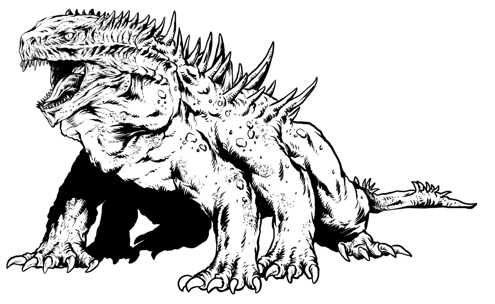

# Dev Diary #4

Welcome to the fourth Dev Diary for [Foe Foundry](../index.md){.branding}, our ever-growing toolkit for 5E GMs and monster-hungry TTRPG fans! It's summer here in the US and it's time for another update before the holidays next week.

- [New Homepage is Live](#new-homepage)
- [Article: Four More Tips for Homebrewing Monsters](../blog/2025_06_19_more_homebrew_monster_tips.md)
- [Basilisk added based on Patron Prioritization Poll #4](#basilisks-added)
- [Patron Prioritization Poll #5 is a Tie! Warriors, Berserkers, and Guards all win](#guards-warriors-and-berserkers-are-next)
- [Patron Prioritization Poll #6 - Underworld NPCs - is live](#prioritization-poll-underworld-npcs)
- What's Next? Alpha Plan Updates

## Newsletter

The free weekly newsletter packed with GM tips, homebrew monster ideas, 5E content, and site updates keeps growing!

[[@Join the Foe Foundry Newsletter]]

## New Homepage

The [New Foe Foundry Homepage](../index.md){.branding} is live! You can use the new homepage to browse all the monsters, powers, and GM tips on the site. It ended up taking a lot longer than I had initially planned, but I'm very pleased with the results.

<video autoplay loop muted playsinline loading="lazy" class="blog-image">
  <source src="/img/blogs/foe_foundry_redesign.webm" type="video/webm" />
  <source src="/img/blogs/foe_foundry_redesign.mp4" type="video/mp4" />
</video>

## Four More Tips for Homebrewing Monsters

[Four More Tips for Homebrewing Monsters](../blog/2025_06_19_more_homebrew_monster_tips.md) continues the [5 Tips for Homebrewing Monsters](../blog/2025_05_16_homebrew_monster_tips.md) series with some new homebrew monster tips for DMs:

- Choose CR first, then assign stats
- Choose powers that reinforce the fantasy
- Scale powers to CR
- Make the standard attack matter

## Basilisks Added

The dreaded [[Basilisk]] was the winner of [Patron Poll #4: Monstrosities](https://www.patreon.com/posts/patron-poll-4-131284938?utm_medium=clipboard_copy&utm_source=copyLink&utm_campaign=postshare_creator&utm_content=join_link). I added multiple variants of the basilisk's iconic petrification abilities ([[Petrifying Gaze]], [[Petrifying Glance]], and [[Petrifying Bite]]) so take your pick for your favorite. Of course there are encounter and adventure ideas included, as well as a spicy [[Basilisk Broodmother]] to feature in some nice adventure hooks about stealing basilisk eggs.

[[!Basilisk]]

{.monster-image .masked}

## Guards, Warriors, and Berserkers are Next

The lovely [Foe Foundry Patrons](../support.md) have voted on [**Patron Prioritization Poll #5 - Fighter NPCs**](https://www.patreon.com/posts/patron-poll-5-131979475?utm_medium=clipboard_copy&utm_source=copyLink&utm_campaign=postshare_creator&utm_content=join_link) and it's a three-way tie between [[Guards]], [[Warriors]], and [[Berserkers]]. I'll be adding all three over the course of the next week.

{.masked .monster-image}

## Prioritization Poll: Underworld NPCs

That means [**Patron Prioritization Poll #6 - Underworld NPCs**](https://www.patreon.com/posts/patron-poll-6-132658467?utm_medium=clipboard_copy&utm_source=copyLink&utm_campaign=postshare_creator&utm_content=join_link) is live for patrons who will choose between Assassins, Bandits, Spies, and Thugs. Vote now to help prioritize what comes next!

{.masked .monster-image}

---

## Alpha Plan Updates

### Generator Updates

I’m hard at work on the Foe Foundry **Monster Generator** - a tool for TTRPG GMs to edit monsters by adding powers, removing powers, and smashing two creatures together.

I've finished migrating all monsters to the new generation framework, which means I'm ready to implement the [intuitive card UI](../blog/2025_05_30_dev_diary2.md). That's coming up next!

### Beta Plans

Once the generator is launched, I will move Foe Foundry from **Alpha** to **Beta**.

So far, I'm planning these enhancements during Beta (subject to change and feedback, of course). These features are designed to make homebrewing and managing monsters for your 5E games even easier:

- **Search Improvements** so you can easily find the monsters you need
- **Markdown Export** so you can drop any of the generated monsters into Notion, Obsidian, etc.
- **PDF Export** for folks who prefer a tried and true format
- **Foe Foundry Accounts**: a login and account system so you can save your monsters
- **Encounter Building**: automatically create challenge-appropriate and thematic encounters with a fun, swipeable UI

---

I can’t wait to see what you build with Foe Foundry — and I’d love your feedback as the project grows.

Thanks for reading, and have fun running games for your friends, family, and loved ones!

🧟 [Explore the Monster Library](../monsters/index.md)

**– Cordialgerm**