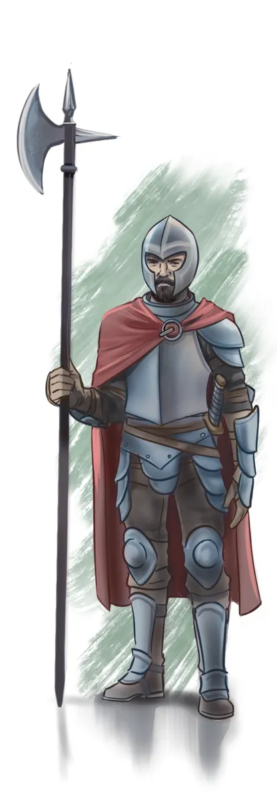
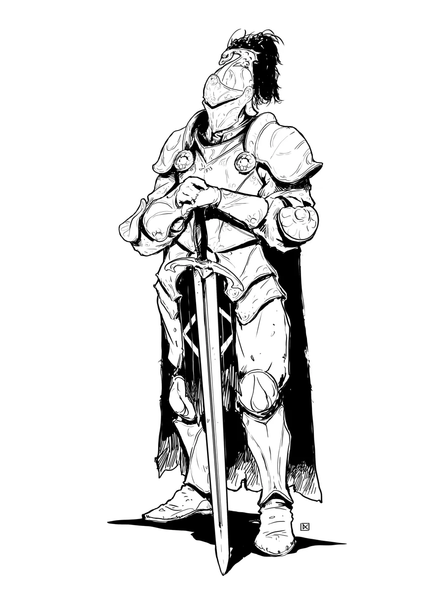

# No More Boring Martial NPCs

The *Monster Manual* martial NPCs in 5E are the definition of "french vanilla" - monsters that offer few interesting or flavorful mechanical abilities.  

That's a shame, because martial NPCs like [[Guards]], [[Knights]], [[Veterans]], and [[Berserkers]] are some of the most useful statblocks for a DM! Shouldn't these commonly-used statblocks also offer fun, flavorful, and interesting mechanics?

Let's fix that with [Foe Foundry](../index.md){.branding}. We've created dozens of flavorful and unique martial NPC statblocks and powers to spice up your battles: from disciplined shock infantry to griffin-riding knights.

## Foe Foundry's Martial NPC Statblocks

| Statblock      | Description | Examples |
|----------------|-------------|----------|
| [Berserkers](../monsters/berserker.md) | *Battle-Frenzied Warriors of Blood and Glory*| [[Berserker]] (CR 2), [[Berserker Veteran]] (CR 4), [[Berserker Legend]] (CR 12) |
| [Guards](../monsters/guard.md) | *Watchful Sentries and Keepers of the Peace*| [[Guard]] (CR 1/8), [[Sergeant of the Watch]] (CR 1), [[Guard Captain]] (CR 4), [[Lord of the Watch]] (CR 8) |
| [Knights](../monsters/knight.md) | *Champions Bound by Armor and Oaths* | [[Knight]] (CR 3), [[Knight of the Realm]] (CR 6), [[Questing Knight]] (CR 12), [[Paragon Knight]] (CR 16) |
| [Warriors](../monsters/warrior.md) | *Disciplined Soldiers of Steel and Strategy* | [[Shock Infantry]] (CR 1/8), [[Line Infantry]] (CR 1/8), [[Shock Infantry Veteran]] (CR 3), [[Line Infantry Veteran]] (CR 3), [[Warrior Commander]] (CR 10), [[Legendary Warrior]] (CR 14) |

---

{.monster-image-xsmall .d-none .d-print-block}

<div class="break-after"></div>

## Berserkers

!!! info "Unleash the Bloodlust"
    See [Berserkers](../monsters/berserker.md) for more statblocks, lore, tactics, and encounters

*Battle-Frenzied Warriors of Blood and Glory*

Berserkers are warriors gripped by a primal fury. Blood-soaked and unrelenting, a berserker is consumed by an adrenaline-fueled recklessness that drives them head-first into the fray.

{.monster-image-small .masked}

This brutal 5E [[Berserker Veteran]] is just one of several blood-soaked variants available in [Foe Foundry](../index.md){.branding} — each one tuned for different tiers, and fully customizable to fit your battlefield.

[[!Berserker Veteran]]

<div class="break-after"></div>

### 5 Interesting Berserker Powers

[[!Reckless Flurry]]

[[Reckless Flurry]] is like a barbarian's take on the classic [[Action Surge]]. It's a great showcase moment for the [[Berserker]]!

[[!Overrun]]

[[Overrun]] creates dramatic moments when the [[Berserker]] punches through the front line and engages the squishy casters in the rear.

[[!Bloodied Rage]]

[[Bloodied Rage]] is a nice little power because it will really ramp up the threat of the bloodied [[Berserker]] without slowing combat down.

<div class="break-after"></div>

[[!Just a Scratch]]

[[Just a Scratch]] is conceptually similar to a Barbarian's Rage ability but just grants temporary hitpoints, so you don't have to remember to halve incoming damage. It also empowers the [[Berserker]] with an advantage boost.

[[!Challenge]]

With [[Challenge]], you can create an interesting duel between the [[Berserker]] and another PC. It's the perfect moment for some "Fight me bro" dialog.

---

<div class="break-after"></div>

### Guards

!!! info "Sound the Alarm"
    See [Guards](../monsters/guard.md) for more statblocks, lore, tactics, and encounters

*Watchful Sentries and Keepers of the Peace*

Guards serve in many positions, including lookouts, bouncers, caravan escorts, or the city watch. What they lack in elite training, they often make up for in numbers and authority. In corrupt cities, a badge is just a license to shake people down. In just ones, guards are the thread that holds society together.

From lowly watchmen to iron-fisted captains, Foe Foundry offers multiple 5E [[Guard]] statblocks built for urban intrigue and infiltration — and each can be tailored to your setting or power level.

[[!Sergeant of the Watch]]

{.monster-image-small .masked}

## 4 Interesting Powers for Guards

[[!Call Reinforcements]]

[[!Sound the Alarm]]

[[Call Reinforcements]] and [[Sound the Alarm]] are great in high-stakes infiltration scenarios, especially if you telegraph that the [[Guard]] is about to reach for a horn or whistle to call for help, and give the PCs a round to try and stop it.

[[!Defensive Formation]]

[[!Protect the Target]]

[[Defensive Formation]] and [[Protect the Target]] gives mechanical advantages for your guards to protect their wards.

---

<div class="break-after"></div>

## Knights

!!! info "Summon the Knights of the Realm"
    See [Knights](../monsters/knight.md) for more statblocks, lore, tactics, and encounters

*Champions Bound by Armor and Oaths*

[[Knights]] are elite warriors sworn to serve a cause greater than themselves. Many serve monarchs, faiths, or noble houses, while others pursue their own ideals. They are trained from youth in the arts of war, steeped in honor, and armored for battle. Whether rallying troops, dueling for glory, or riding into battle under sacred banners, knights blend martial skill with purpose.

The classic [[Knight]] gets a major upgrade here, with powerful variants and oath-driven abilities. [Foe Foundry](../index.md) knights range from noble champions to divine juggernauts.

{.monster-image-small .masked}

```yaml
monster_name: Knight
power_weights:
   Mounted Warrior: 1.0 
```

<div class="break-after"></div>

## 6 Powers for Formidable Knights

[[!Mounted Warrior]]

One of the most frustrating aspects of the *Monster Manual* knight is that it doesn't include any special mounted abilities. [[Mounted Warrior]] is a nod to the fact that knights should be mounted!

[[!Griffin Knight]]

What's cooler than riding a warhorse? How about a **Griffin**? [[Griffin Knight]] is great for high-CR knights like the legendary [[Paragon Knight]].

[[!Interception]]

[[Interception]] creates more dynamic combat and is great if the knight is protecting another NPC.

[[!Taunt]]

[[Taunt]] is a classic ability to allow the knight to "Tank".

[[!Rally the Troops]]

Knights are often leaders, and [[Rally the Troops]] is a nice way to show this off mechanically.

[[!Divine Smite]]

Higher-CR knights have sworn powerful oaths, granting them divine powers like [[Divine Smite]] and [[Oath Adept]].

---

<div class="break-after"></div>

### Warriors

!!! info "Hold the Line"
    See [Warriors](../monsters/warrior.md) for more statblocks, lore, tactics, and encounters

*Disciplined Soldiers of Steel and Strategy*

When war breaks out, it's not dragons or owlbears who hold the line - it's warriors. These trained professionals earn their keep through disciplined combat. Whether hardened conscripts or elite bodyguards, they rely not on magic or miracles, but on discipline, coordination, and experience. Warriors know how to fight together, how to exploit terrain, and how to execute orders under fire.

{.monster-image-small .masked}

Whether you need disciplined infantry or hardened veterans, Foe Foundry's [[Shock Infantry Veteran]] is just one of many modular warrior statblocks ready for tactical combat in your 5E campaign.

[[!Shock Infantry Veteran]]

<div class="break-after"></div>

## 3 Powers for Disciplined Warriors

[[!Phalanx]]

[[!Disciplined]]

[[!Coordinated Strike]]

[[Phalanx]], [[Disciplined]], and [[Coordinated Strike]] all play up the coordination and martial training of [[Warriors]].

<div class="break-after"></div>

---

Looking for more GM tips and tricks?

[[@Sign Up For the Foe Foundry Newsletter]]