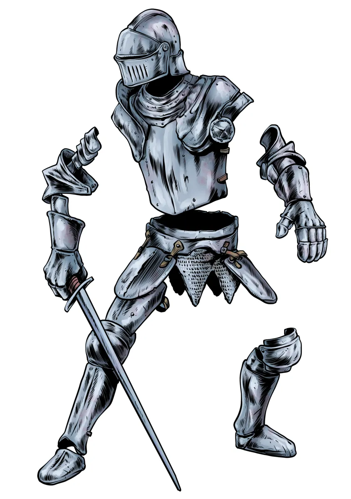

# Dev Diary #5

Welcome to the 5th Dev Diary for [Foe Foundry](../index.md){.branding} the free 5E monster generator! I've been busy forging away at a couple new monsters complete with lore, encounters, and adventure hooks that are ready to drop right into your games.

- [Martial NPCs (Warriors, Guards, Berserkers, Knights) have been added to the Forge](#martial-npcs-guards-warriors-berserkers--knights)
- [Formidable Frost Giants are ready to Freeze your PCs](#formidable-frost-giants)
- [New Prioritization Poll #7 - Constructs](#patron-prioritization-poll-7-constructs) is open
- [Alpha Updates: Monster Cards to power the Generator are coming together](#alpha-plan-updates)

---

## Newsletter

The free weekly newsletter packed with GM tips, homebrew monster ideas, 5E content, and site updates keeps growing!

[[@Join the Foe Foundry Newsletter]]

---

## Martial NPCs: Guards, Warriors, Berserkers, & Knights

Patron Prioritization Poll #5 was a three-way tie between [[Guards]], [[Warriors]], and [[Berserkers]]. For fun, I added [[Knights]] as well!

| Statblock      | Description | Examples |
|----------------|-------------|----------|
| [Berserkers](../monsters/berserker.md) | *Battle-Frenzied Warriors of Blood and Glory*| [[Berserker]] (CR 2), [[Berserker Veteran]] (CR 4), [[Berserker Legend]] (CR 12) |
| [Guards](../monsters/guard.md) | *Watchful Sentries and Keepers of the Peace*| [[Guard]] (CR 1/8), [[Sergeant of the Watch]] (CR 1), [[Guard Captain]] (CR 4), [[Lord of the Watch]] (CR 8) |
| [Knights](../monsters/knight.md) | *Champions Bound by Armor and Oaths* | [[Knight]] (CR 3), [[Knight of the Realm]] (CR 6), [[Questing Knight]] (CR 12), [[Paragon Knight]] (CR 16) |
| [Warriors](../monsters/warrior.md) | *Disciplined Soldiers of Steel and Strategy* | [[Shock Infantry]] (CR 1/8), [[Line Infantry]] (CR 1/8), [[Shock Infantry Veteran]] (CR 3), [[Line Infantry Veteran]] (CR 3), [[Warrior Commander]] (CR 10), [[Legendary Warrior]] (CR 14) |

There's a whole article on [No More Boring Martial NPCs](./2025_07_09_martial_npcs.md) with lots of details, but here's an example [[Knight of the Realm]]:

[[!Knight of the Realm]]

[[$Knight of the Realm]]

{.masked .monster-image}

---

## Formidable Frost Giants

I've added [Frost Giants](../monsters/frost-giant.md), frozen reavers of blood and battle. There's also a dedicated article on the [Forging Formidable Frost Giants](./2025_07_20_frost_giants.md) with additional details. I'll leave you with these teasers:

[[!Frost Giant Reaver]]

[[$Frost Giant Reaver]]

{.monster-image .masked}

---

## Patron Prioritization Poll #7: Constructs

The next [Patron Prioritization Poll](https://www.patreon.com/posts/134519937/) will focus on Constructs. Which magic-imbued creation do you want to see wrought to life next?

- Animated Armor
- Golems (Stone, Iron, Clay, and Flesh)
- Gorgons
- Shield Guardians
- Simulacrum

{.masked .monster-image}

---

## Alpha Plan Updates

### Monster Cards

I'm happy to report that I've made significant progress on the **Monster Generator**. I've been able to create the **Monster Cards** that will be the basis of the editor UI. Here's a quick video showing the card in action. For each monster, you'll see the available powers listed as "loadouts" where you can select the powers from a dropdown, or randomize the whole monster (similar to rolling the dice on the site today). You'll also be able to customize the HP and damage output of the monster.

<video autoplay loop muted playsinline loading="lazy" class="blog-image-large">
  <source src="/img/blogs/monster_card.mp4" type="video/mp4" />
</video>

I still have another week or two of work to hook everything together and make the generator accessible to everyone, but I'm encouraged by the progress I've made of late.

### Beta Plans

Once the generator is launched, I will move Foe Foundry from **Alpha** to **Beta**.

So far, I'm planning these enhancements during Beta (subject to change and feedback, of course). These features are designed to make homebrewing and managing monsters for your 5E games even easier:

- **Search Improvements** so you can easily find the monsters you need
- **Markdown Export** so you can drop any of the generated monsters into Notion, Obsidian, etc.
- **PDF Export** for folks who prefer a tried and true format
- **Foe Foundry Accounts**: a login and account system so you can save your monsters
- **Encounter Building**: automatically create challenge-appropriate and thematic encounters with a fun, swipeable UI

---

I can’t wait to see what you build with Foe Foundry — and I’d love your feedback as the project grows.

Thanks for reading, and have fun running games for your friends, family, and loved ones!

🧟 [Explore the Monster Library](../monsters/index.md)

**– Cordialgerm**