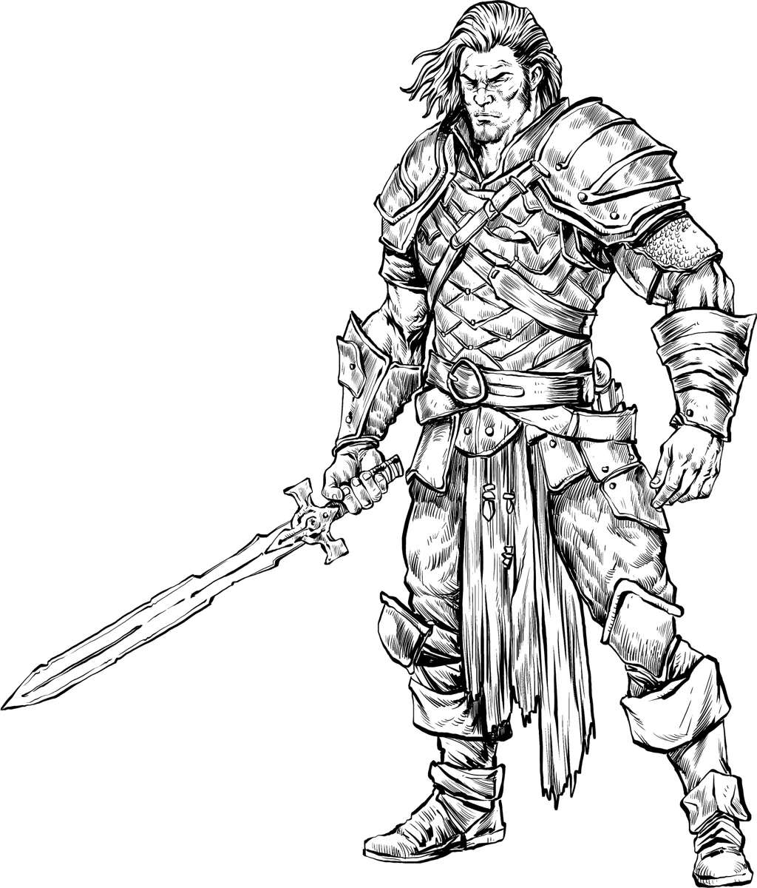

# Dev Diary #5

- Martial NPCs (Warriors, Guards, Berserkers, Knights)
- Frost Giants
- Prioritization Poll
- Alpha Updates

## Newsletter

The free weekly newsletter packed with GM tips, homebrew monster ideas, 5E content, and site updates keeps growing!

[[@Join the Foe Foundry Newsletter]]

## Guards, Warriors, and Berserkers are Next

The lovely [Foe Foundry Patrons](../support.md) have voted on [**Patron Prioritization Poll #5 - Fighter NPCs**](https://www.patreon.com/posts/patron-poll-5-131979475?utm_medium=clipboard_copy&utm_source=copyLink&utm_campaign=postshare_creator&utm_content=join_link) and it's a three-way tie between [[Guards]], [[Warriors]], and [[Berserkers]]. I'll be adding all three over the course of the next week.

{.masked .monster-image}

## Frost Giants

TODO

## Patron Prioritization Poll #6 - Constructs

- Animated Armor
- Golems
- Gorgons
- Shield Guardians
- Simulacrum

{.masked .monster-image}

---

## Alpha Plan Updates

### Monster Cards

I'm happy to report that I've made significant progress on the **Monster Generator**. I've been able to create the **Monster Cards** that will be the basis of the editor UI. I still have another week or two of work to hook everything together and make the generator accessible to everyone, but I'm encouraged by the progress I've made of late.  

Here's 

### Beta Plans

Once the generator is launched, I will move Foe Foundry from **Alpha** to **Beta**.

So far, I'm planning these enhancements during Beta (subject to change and feedback, of course). These features are designed to make homebrewing and managing monsters for your 5E games even easier:

- **Search Improvements** so you can easily find the monsters you need
- **Markdown Export** so you can drop any of the generated monsters into Notion, Obsidian, etc.
- **PDF Export** for folks who prefer a tried and true format
- **Foe Foundry Accounts**: a login and account system so you can save your monsters
- **Encounter Building**: automatically create challenge-appropriate and thematic encounters with a fun, swipeable UI

---

I can’t wait to see what you build with Foe Foundry — and I’d love your feedback as the project grows.

Thanks for reading, and have fun running games for your friends, family, and loved ones!

🧟 [Explore the Monster Library](../monsters/index.md)

**– Cordialgerm**