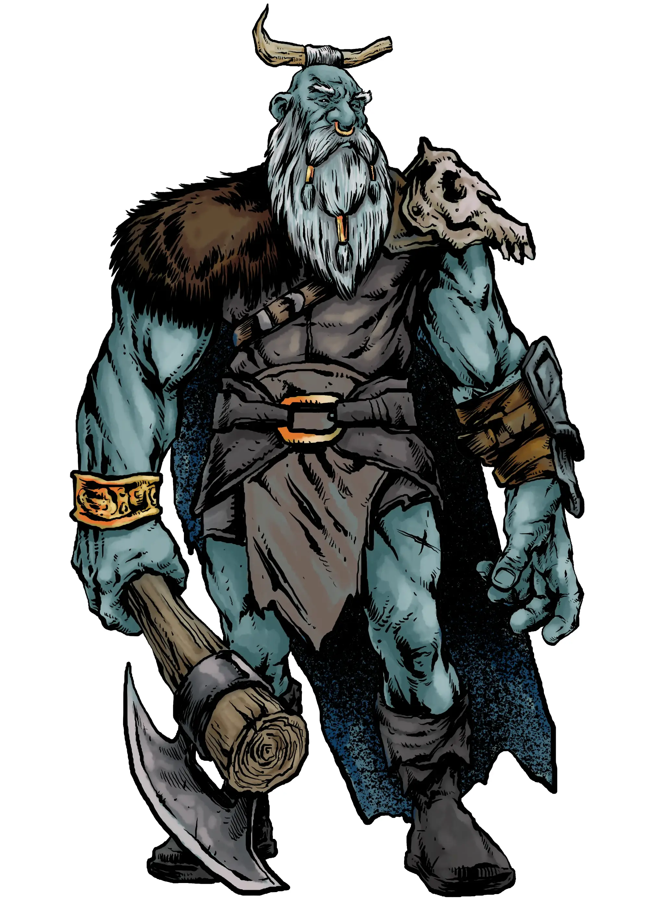

# Frost Giants Title TODO

- Giants should be towering, scary, fearsome
- Fighting them should feel dangerous, like you could be squished at any movement
- The fight should be dynamic, the earth should shake, and PCs should tremble in their boots.

- Most disappointing creatures in 2014 Monster Manual have to be the giants. They were the definition of bland statblocks with just hitpoints and multiattack, with no interesting flavor or mechanics
- 2024 Monster Manual has improved this, but just barely. There's still alot of room to create unique, mechanically interesting, and flavorful giant statblocks
- that's where Foe Foundry comes into play!

| Statblock                    | CR            | Description                                                                     |
|------------------------------|---------------|---------------------------------------------------------------------------------|
| [[Frost Giant Reaver]]       | 8             | A blood-hungry raider who lives for the clash of blades and the roar of storms. |
| [[Frost Giant Challenger]]   | 10            | A towering duelist who seeks worthy foes to crush in ritual combat |
| [[Frost Giant Rimepriest]]   | 12            | A storm-caller and rune-witch who bends wind and ice to her will |
| [[Frost Giant Thane]]        | 16 Legendary  | A legendary warlord, feared and admired by all who march beneath their frosty banner. |

{.monster-image .masked}

## 12 Interesting Frost Giant Powers

### Titanic Powers

[[Avalanche Charge]]

[[Big Windup]]

[[Crush The Insect]]

[[Eartshaker]]

[[Toss]]

[[Grab and Go]]

### Challenger Powers

[[Glory of the Hunt]]

[[Challenge]]

[[Chilling Challenge]]

### Icy Powers

[[Hoarfroast]]

[[Winters Shroud]]

[[Spirit Wolves]]

---

Looking for more GM tips and tricks?

[[@Sign Up For the Foe Foundry Newsletter]]