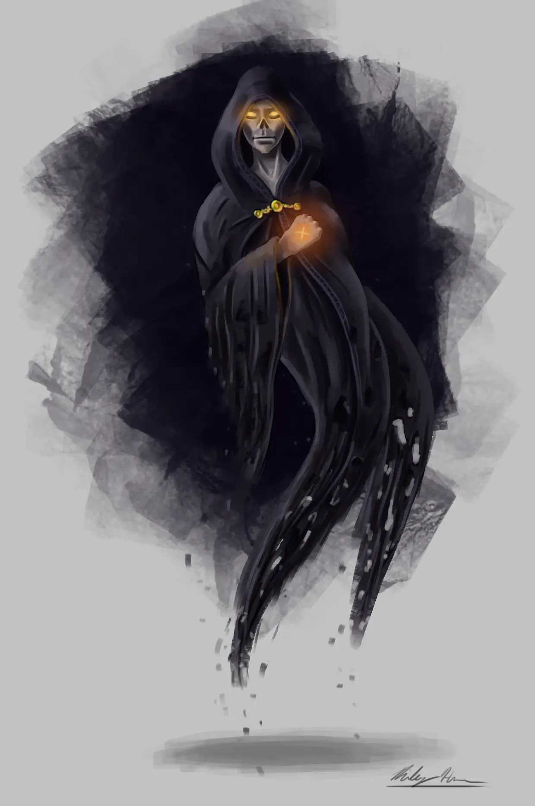

# Clone Wars: Simulacrum Statblocks and Story Hooks


A [[Simulacrum]] is one of the most narratively rich and tactically flexible spells in the game. It lets you create a near-perfect magical copy of a creature, usually to serve as a spy, decoy, or disposable agent. But for GMs, it's also a storytelling goldmine.  

Simulacrums are perfect for:

- Want your party to fight the villain early without killing the real villain?
- Need a morally weird plot twist where two NPCs claim to be the original?
- Want a reason for a mid-tier caster to throw out top-tier spells and vanish in a puff of snow?

Unfortunately, the *Monster Manual* doesn’t offer any simulacrum statblocks — which means you’re left cobbling one together in a rush. That’s where [Foe Foundry](../index.md){.branding} comes in. Our [monster generator](../generate/index.md){.branding} lets you create flavorful simulacra with custom powers, themes, and roles. From sneaky illusionists to unnerving mirror-fighters, we’ve got statblocks that *feel* like shadow-copies instead of just reskinned mages.

## Foe Foundry Simulacrum Statblocks

With [Foe Foundry](./index.md){.branding} you can generate hundreds of different versions of these statblocks by combining unique and interesting powers. These are just a couple examples. With the [Foe Foundry Monster Generator](../generate/index.md){.branding} you can re-forge any of these statblocks with the roll of a die.

| Statblock                  | CR    | Description                                           |
|----------------------------|-------|-------------------------------------------------------|
| [[Simulacrum]]             | 9     | Shadowy copy of a spellcaster useful as an agent      |
| [[Mastercraft Simulacrum]] | 12    | Simulacrum so real it doesn't always know it's a copy |
| [[Simulacrum Mirrorblade]] | 7     | Illusory copy of a notable warrior                    |

---

<div class="break-after"></div>

```yaml
monster_name: Simulacrum
power_weights:
   Illusory Reality: 1.0 
```

[[$Simulacrum]]

{.monster-image-medium .masked}

---

<div class="break-after"></div>

## 6 Interesting Simulacrum Powers

[[!Simulacrum Spellcasting]]

[[Simulacrum Spellcasting]] grants some iconic illusion spells, like *Major Image* and *Greater Invisibility*, and the ***Illusory Nature*** ability which plays up the evasive and only partially real nature of the [[Simulacrum]].

[[!Bend Space]]

[[!Scatter]]

[[Bend Space]] and [[Scatter]] are also teleportation-themed abilities that play up the slightly unnerving nature of a shadow-clone and also are quite useful tactically to keep the simulacrum at a distance, since it is very much a glass cannon statblock.

<div class="break-after"></div>

[[!Illusory Reality]]

This is a fun power that creates an [interactive Token ](../topics/tokens.md) that alters the battlefield with an illusory region that can charm and confuse the simulacrum's foes. Place this in key bottlenecks or chokepoints during the encounter to keep positioning dynamic.

[[!Mirror Image]]

[[!Phantom Mirage]]

Both [[Mirror Image]] and [[Phantom Mirage]] are illusory-themed powers that help extend the survivability of the Simulacrum. One advantage of [[Phantom Mirage]] is that I designed this rules text to be a lot simpler for the DM to remember than the *Mirror Image* rules.

---

<div class="break-after"></div>

## Simulacrum Plot Hooks

Using a [[Simulacrum]] offers some wonderful opportunities for unique and unexpected adventure hooks like these:

- When the party rescues an important NPC that they are seeking, they find the NPC as well as a [[Simulacrum]] copy of the NPC bound together, arguing over which one is the real one
- The PCs are accosted by the [[Simulacrum]] of the [[Archmage]] controlling this region, acting as its agent. The agent demands the customary tribute for entering its masters territory: a magic item or a secret piece of magical lore
- The PCs enter a town entirely populated by [[Simulacrum]] copies of a reclusive [[Archmage]] whose tower is at the center of the strange settlement. The copies all say their master has gone mad after creating a powerful magical artifact one moon ago
- An [[Archmage Primagus]] recently died, and her three [[Mastercraft Simulacrum]] apprentices are at war with each other, each attempting to claim they are the true successor of their master's will. The copies attempt to involve the PCs as pawns in their complex intrigue against each other, offering them valuable information, magic, or treasure for their assistance.

See [Foe Foundry Simulacrum Adventure Ideas](../monsters/simulacrum.md#simulacrum-adventure-ideas) for more table-ready [[Simulacrum]] lore and adventures!

{.monster-image-small .d-none .d-print-block}

---

<div class="break-after"></div>

Looking for more GM tips and tricks?

[[@Sign Up For the Foe Foundry Newsletter]]