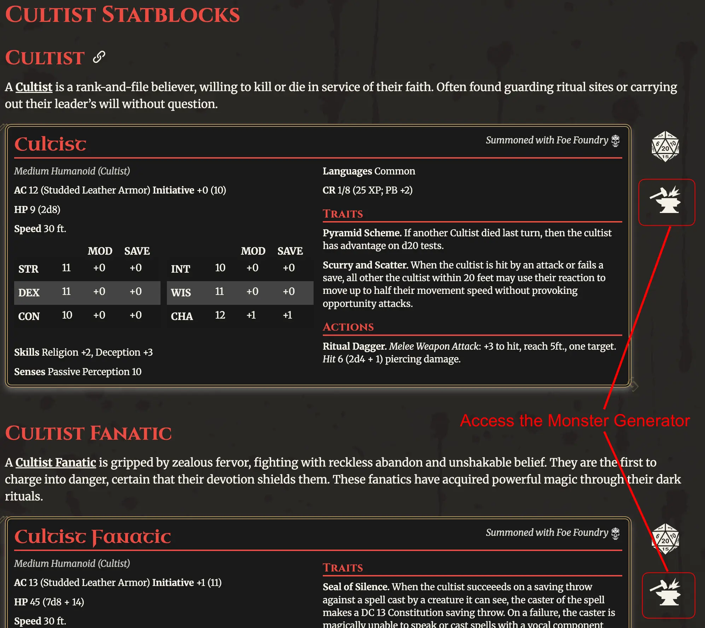

# Announcing the Beta

It's been about three months since I announced the [Foe Foundry Alpha](./2025_04_29_announcement.md){.branding} with the vision of creating a free toolkit for Game Masters who want to create [monsters](../monsters/index.md) that are **powerful, flavorful, and easy to run**.  

Since then, we've created [dozens of new monsters](../monsters/index.md), added [hundreds of unique powers](../powers/all.md), and launched a [GM Tips and Advice Newsletter](https://buttondown.com/cordialgerm).

But, the heart of this whole endeavour has always been the [**Monster Generator**](../generate/index.md).  

Great news - the [**Beta Monster Generator**](../generate/v2.md) is now available for **Desktop**. A mobile-friendly design will come soon, don't worry!

## A New 5E Monster Generator

Sometimes, a picture (or a video), is worth a thousand words.

<video controls playsinline loading="lazy" class="blog-image">
  <source src="/img/blogs/foe-foundry-monster-generator-beta.mp4" type="video/mp4" />
  Your browser does not support the video tag.
</video>

Here are the key features:

- **Customize your monster by choosing powers** from the monster's loadout
- **Randomize individual powers, or re-roll the whole statblock** if you want fresh inspiration
- **Customize the HP and Damage** by changing the hearts and skulls and see the values update instantly
- **Switch between different variants** by choosing the nav pills at the top
- A **Monster Card** showing off the monster's art and powers 

## Accessing the Monster Generator

You can access the new monster generator from the **Forge Icons** that appear next to each statblock.

{.blog-image-large}

## New Showcase Tutorial

There's also a fun new showcase tutorial to show off the generator:

<generator-showcase></generator-showcase>

## What's Next? The Journey Through Beta

With the release of the generator, I'm excited to transition the site from **Alpha** to **Beta**. The focus during **Beta** is going to be making the generator as useful and powerful as possible. Here are the planned enhancements:

- **Generator Mobile Layout** - I'll add a mobile-friendly version of the generator shortly
- **Monster and Power Search** - you should be able to find monsters and powers easily, without having to know in advance what you want to look for
- **Monster Discovery** - an interactive index where you can easily explore all the available [Foe Foundry Monsters](../monsters/index.md) with the ability to sort and filter by type, family, CR, and environment
- **Accounts** - integration with Patreon, Discord, and Google to set up your account
- **Save Monsters** - save your monsters
- **Share Monsters** - share your creations with the world!
- **Integrations & Exports** - export to Markdown, PDF, and FoundryVTT

---

I can’t wait to see what you build with Foe Foundry — and I’d love your feedback as the project grows.

Thanks for reading, and thanks for playing.

**– Cordialgerm**

---

[[@Subscribe to the Newsletter]]