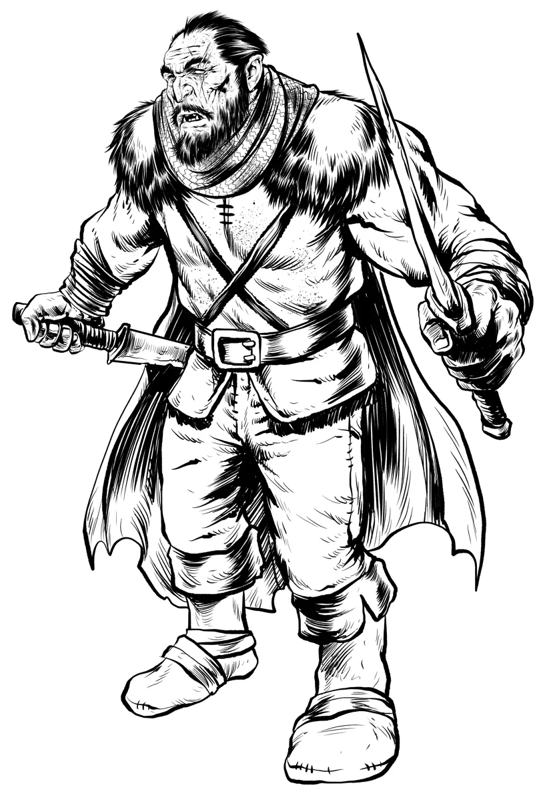

# Bring the Shadows to Life with Criminal NPCs

The criminal underworld is the lifeblood of intrigue, danger, and chaos in any campaign. Whether your party is sneaking through shadowy alleys, negotiating with thieves' guilds, or dodging assassins sent by a vengeful noble, you'll want statblocks that can deliver the fantasy. In official 5E, criminal NPCs are a bit bland and don't have many unique flavorful abilities. But in [Foe Foundry](../index.md){.branding}, criminals are cunning, ruthless, and full of tricks that make every encounter memorable.

## Foe Foundry Criminal Statblocks

With [Foe Foundry](./index.md){.branding} you can generate hundreds of different versions of these statblocks by combining unique and interesting powers. These are just a couple examples. With the [Foe Foundry Monster Generator](../generate/index.md){.branding} you can re-forge any of these statblocks with the roll of a die.

| Family      | Description | Examples |
|-------------|-------------|----------|
| [Assassins](../monsters/assassin.md) | *Deadly Killers and Masters of Poison* | [[Assassin]] (CR 8), [[Contract Killer]] (CR 5), [[Assassin Legend]] (CR 12) |
| [Bandits](../monsters/bandit.md)     | *Sneaky Outlaws and Opportunists*      | [[Bandit]] (CR 1/8), [[Bandit Captain]] (CR 2), [[Bandit Crime Lord]] (CR 7) |
| [Thugs](../monsters/thug.md)         | *Brutal Enforcers and Hired Muscle*    | [[Thug]] (CR 1), [[Elite Thug]] (CR 4), [[Thug Overboss]] (CR 8) |
| [Spies](../monsters/spy.md)          | *Infiltrators and Masters of Deception*| [[Spy]] (CR 1), [[Elite Spy]] (CR 5), [[Spy Master]] (CR 10) |

---

{.monster-image-xsmall .d-none .d-print-block}

<div class="break-after"></div>

## Assassins

*Deadly Killers and Masters of Poison*

[[Assassins]] are highly trained killers who strike from the shadows. Masters of stealth, deception, and toxins, assassins ensure their victim is neutralized before a fight even begins. Some operate alone, while others belong to secretive guilds enforcing strict codes of secrecy.

{.monster-image-small .masked}

```yaml
monster_name: assassin
power_weights:
  deadly ambusher: 1.0
  hard to pin down: 1.0
  toxic poison: 1.0
```

[[$Assassin]]

---

<div class="break-after"></div>

## Bandits

*Sneaky Outlaws and Opportunists*

[[Bandits]] are outlaws who thrive on ambushes, hit-and-run tactics, and fighting dirty. Whether highway robbers, pirates, or freedom fighters, bandits rely on numbers, cunning, and opportunism to survive in a world stacked against them.

{.monster-image-small .masked}

```yaml
monster_name: bandit
power_weights:
  vexing_attack: 1.0
  cheap shot: 1.0
  grovel and beg: 1.0
```

[[$Bandit]]

---

<div class="break-after"></div>

## Thugs

*Brutal Enforcers and Hired Muscle*

[[Thugs]] are the muscle behind the mob. They fight in packs, use overwhelming force, and aren't afraid to get their hands dirty. Whether shaking down shopkeepers or enforcing a crime lord’s will, thugs dominate the battlefield with raw strength and ruthless tactics.

{.monster-image-small .masked}

```yaml
monster_name: thug boss
power_weights:
  mob boss: 1.0
  overrun: 1.0
  exploit the chaos: 1.0
  cleaving attack: 1.0
```

[[$Thug Boss]]

---

<div class="break-after"></div>

## Spies

*Infiltrators and Masters of Deception*

Spies slip past guards, steal secrets, and vanish before anyone knows they were there. Masters of disguise, stealth, and manipulation, spies are perfect for campaigns full of court intrigue, heists, and espionage.

{.monster-image-small .masked}

```yaml
monster_name: spy
power_weights:
   identify weakness: 1.0
   sneaky strike: 1.0
```

[[$Spy]]

---

<div class="break-after"></div>

## 10 Powers for Dangerous Criminals

[[!Exploit the Chaos]]

[[Exploit the Chaos]] is a more interesting variant of [[Pack Tactics]] that highlights the brawl-like aspect of fighting thugs and bandits.

[[!Toxic Poison]]

[[Toxic Poison]] adds a dangerous edge to poison attacks, forcing the party to worry about every scratch or stab. Great for assassins who want to make every hit count.

[[!Smoke Bomb]]

[[Smoke Bomb]] creates a cloud of smoke, granting advantage on Stealth and letting criminals escape or reposition. Bandits and spies use this to make a quick getaway or set up an ambush.

<div class="break-after"></div>

[[!Cheap Shot]]

[[Cheap Shot]] delivers a dirty attack that can catch the PCs unaware. It's a nice flavorful way to show off how criminals don't fight fair.

[[!Vanish]]

[[Vanish]] lets criminals disappear from sight, even in the middle of combat. Spies and assassins use this to escape, reposition, or set up a surprise attack.

[[!Brutal Critical]]

[[Brutal Critical]] turns a critical hit into a devastating blow. Assassins use this to finish off wounded targets and make their presence felt.

[[!Identify Weakness]]

[[Identify Weakness]] is a great way to show off the cunning and guile of your [[Spy]] and [[Assassin]] NPCs.

<div class="break-after"></div>

[[!Sneaky Strike]]

[[Sneaky Strike]] deals extra damage when attacking from stealth or surprise. Spies and assassins use this to punish careless adventurers and reward clever tactics.

[[!Intimidate]]

[[Intimidate]] demoralizes foes, causing disadvantage or forcing a retreat. Mob bosses and bandit leaders use this to break the party’s morale before the fight even starts.

[[!Cunning Action]]

[[Cunning Action]] gives criminals the ability to Dash, Disengage, or Hide as a bonus action. Assassins and spies use this to stay mobile and keep the party guessing. This is an SRD Classic and not innovative in any way, but it's a classic for a reason!

---

<div class="break-after"></div>

## Try It Out

<generator-showcase monster-key="assassin"></generator-showcase>

Looking for more GM tips and tricks?

[[@Sign Up For the Foe Foundry Newsletter]]
