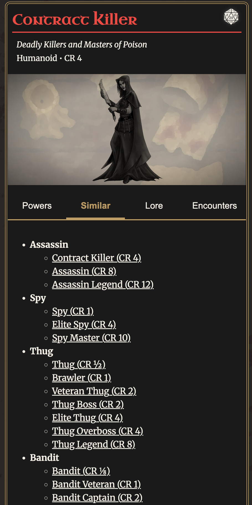
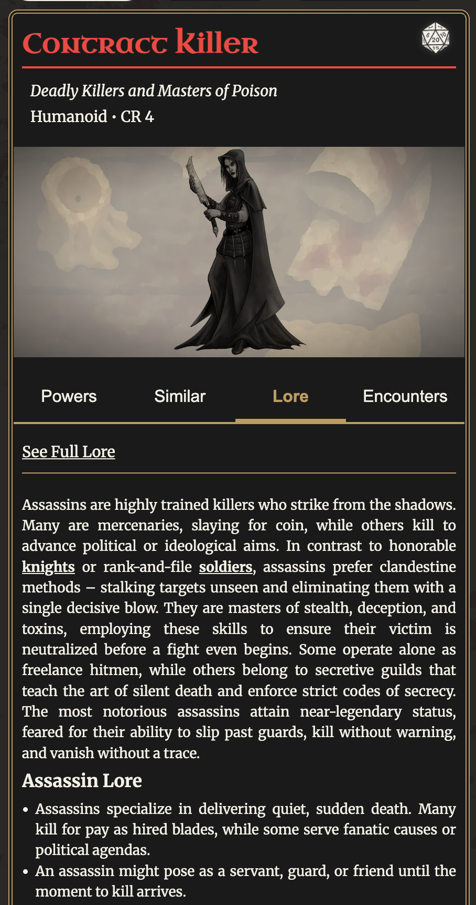
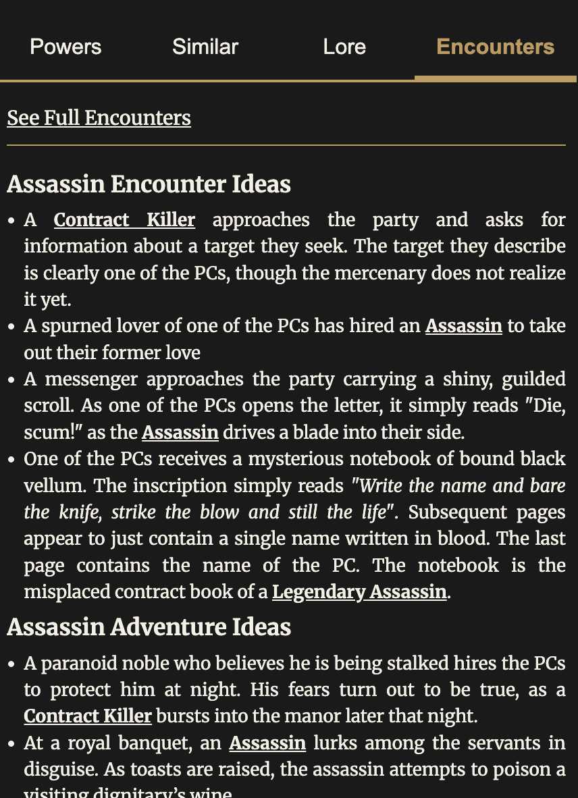

# Dev Diary #7

Welcome to the 7th Dev Diary for [Foe Foundry](../index.md){.branding} the free 5E monster generator!  

## Generator Updates

Since the [Beta Release of the Monster Generator](./2025_08_03_beta_announcement.md) the sparks have been flying and the foundry has been busy spitting out new monsters for you all to enjoy.

### All Hail Gork the Bloody Barbarian

 So far, the top 10 monsters forged are:

- [[Berserker]]
- [[Zombie Ogre]]
- [[Skeleton]]
- [[Mastercraft Simulacrum]]
- [[Berserker Veteran]]
- [[Shadow]]
- [[Iron Golem]]
- [[Acolyte]]
- [[Simulacrum]]

I'll admit, I'm surprised to see the [[Berserker]] on the top of the list, but I'm glad that folks are really leaning into the NPC statblocks! I find them super versatile and useful for any kind of campaign. 

### Mobile Layout Launched!

I'm also excited to announce that the **Mobile Layout** for the generator is live! Developing this really stretched my front-end development skills, but I'm proud of the result. You'll see a swipeable, mobile-friendly UI that lets you swap between the monster card.

A video is worth a thousand words, so check it out!

<video controls playsinline loading="lazy" class="blog-image">
  <source src="/img/blogs/monster-generator-mobile-demo.mp4" type="video/mp4" />
  Your browser does not support the video tag.
</video>

### Related Monsters, Lore, and Encounters Added

I've also added **Related Monsters**, **Lore**, and **Encounters** directly to the generator so that everything you need to run these foes is right there at your fingertips.

{.blog-image}

{.blog-image}

{.blog-image}

---

## Need to Stab Your Players in the Back?

We've all been there. Try to resist, and instead stab their PCs in the back! To help you, I've added a whole line of [Criminal Statblocks](../families/criminals.md), featuring the whole range of [[Spy]], [[Bandit]], [[Thug]], and [[Assassin]] NPC statblocks, and of course there are legendary statblocks as well!

Check out the [[Spy Master]]:

[[!Spy Master]]

---

## Beta Plan Updates

With the release of the generator, the site is in **Beta**. The focus during **Beta** is going to be making the generator as useful and powerful as possible. Here are the planned enhancements:

- **Generator Mobile Layout** - DONE
- **Monster and Power Search** - IN DEVELOPMENT - you should be able to find monsters and powers easily, without having to know in advance what you want to look for
- **Monster Discovery** - DESIGNS COMPLETED - an interactive index where you can easily explore all the available [Foe Foundry Monsters](../monsters/index.md) with the ability to sort and filter by type, family, CR, and environment
- **Accounts** - integration with Patreon, Discord, and Google to set up your account
- **Save Monsters** - save your monsters
- **Share Monsters** - share your creations with the world!
- **Integrations & Exports** - export to Markdown, PDF, and FoundryVTT

---

## Newsletter

The free weekly newsletter packed with GM tips, homebrew monster ideas, 5E content, and site updates keeps growing!

[[@Join the Foe Foundry Newsletter]]

---

I can’t wait to see what you build with Foe Foundry — and I’d love your feedback as the project grows: evan@foefoundry.com

Thanks for reading, and have fun running games for your friends, family, and loved ones!

🧟 [Explore the Monster Library](../index.md)

**– Cordialgerm**