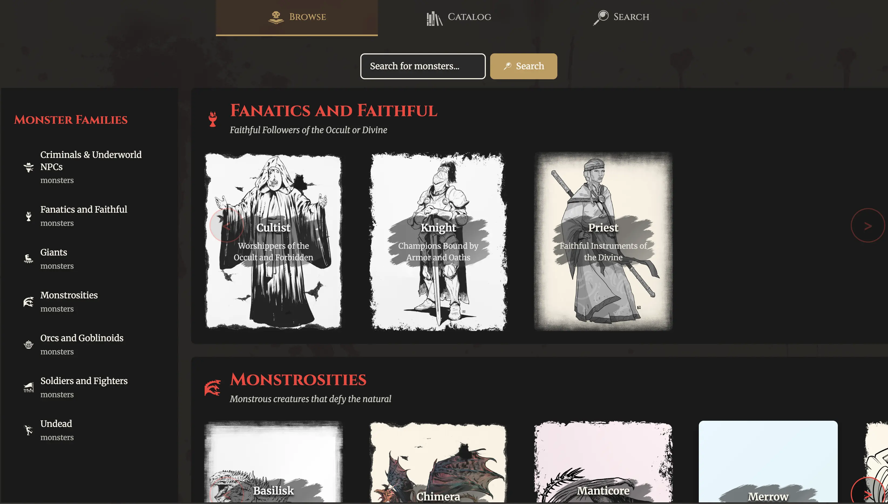
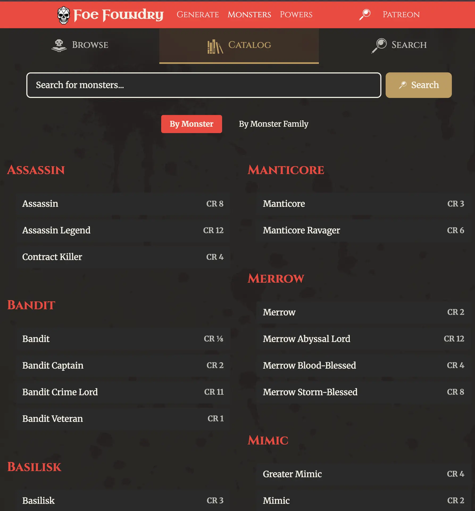
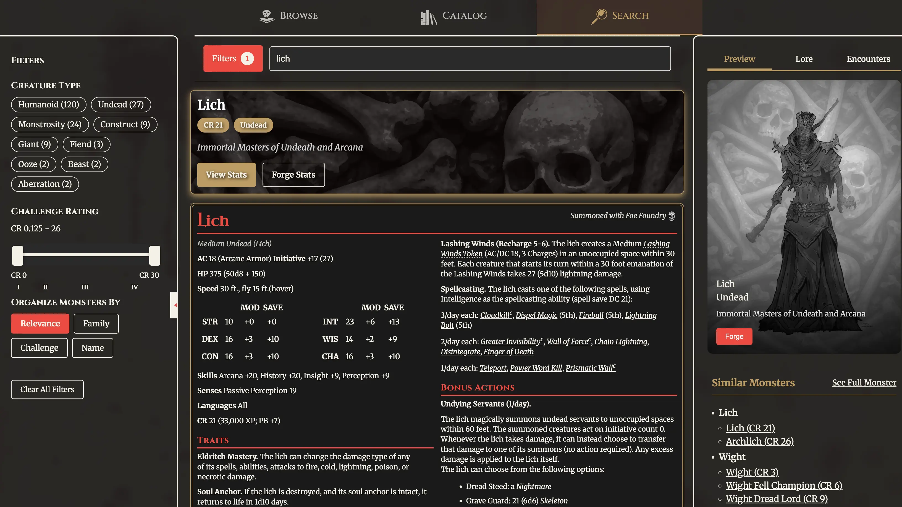
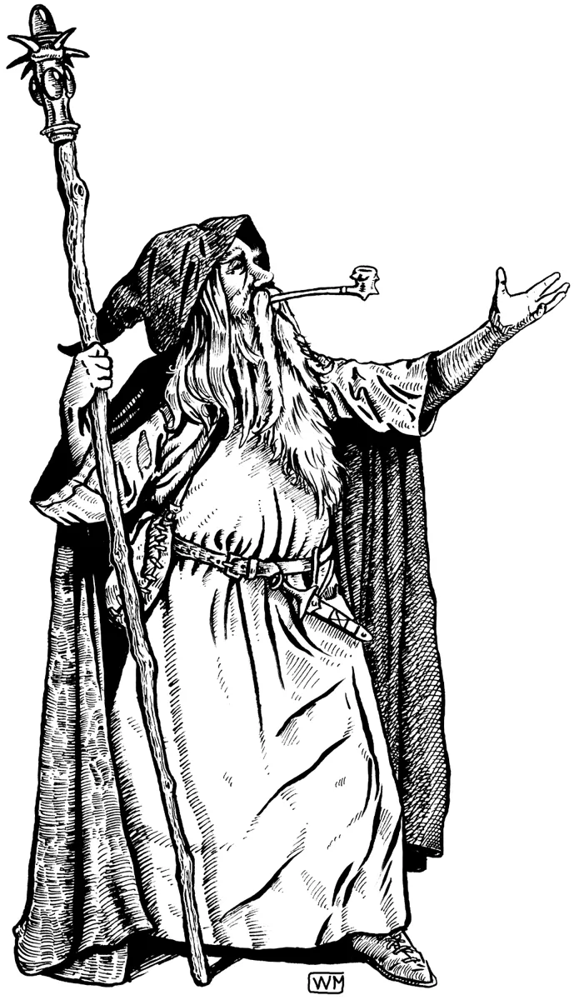

# Dev Diary #8: Monster Codex & Markdown Export

Welcome to the 8th Dev Diary for [Foe Foundry](../index.md){.branding} the free 5E monster generator!  

I've spent the last several weeks working on major improvements to the Foe Foundry application, and I'm excited to share the new features with you.

- [New Monster Codex](#monster-codex)
- [Monster Poll Update](#monster-poll-update)
- [Foe Foundry Accounts Update](#foe-foundry-accounts)
- [Markdown Export Update](#markdown-export)
- [Beta Progress Update](#beta-progress-update)

## Monster Codex

There is a brand new [**Monster Codex**](../codex/index.md) that acts as your one-stop-shop to browse and discover the perfect foe for your next game. Monster Codex makes it easier for dungeon masters to find unique 5E monsters by theme or role, without having to memorize the *Monster Manual*.

The codex has a:

- **Browse Tab** that shows off the monsters in all their glory, to help inspire you to find the right foe for your next session
- **Catalog Tab** that lists out all monsters, grouped by individual monster template or by family of similar monsters
- **Search Tab** that lets you find the perfect foe for your game

I've always felt that monster search tools for DMs have been a bit lackluster. You often need to already know what you're looking for in order to find it. You should be able to search for a monster by **intent** instead of having to memorize obscure demon names! The **Monster Codex** is the first step in closing that gap.

This is just the v1 release - expect more improvements to come. In particular, a **Smart Search** feature will launch after accounts are online that will greatly enhance the search intelligence.

### Browse Tab

The new [**Browse Monsters Tab**](../codex/index.md#browse) is designed to give you maximum inspiration for next session. You'll see a listing of Foe Foundry's monster families on the left, and some gorgeous monster cards on the right.

[{.masked .blog-image-large}](../codex/index.md#browse) 
### Catalog Tab

The new [**Monster Catalog Tab**](../codex/index.md#catalog) lists out all monsters alphabetically, in a style similar to the 2024 Monster Manual. You can also group monsters by family, to find similar monsters (a nice perk over the 2024 MM). 

[{.masked .blog-image-large}](../codex/index.md#catalog)

### Search Tab

On the other hand, if you're trying to find a monster, check out the new [**Search Tab**](../codex/index.md#search). On desktop, you'll get a fullscreen experience with filters, search results, and a preview pane to explore the monster. Clicking on a search result expands to show an example statblock.

On mobile, the filters are collapsed by default, and there is no preview pane, but you'll have the same ability to tap on a result and instantly see the search result.

[{.masked .blog-image-large}](../codex/index.md#search)

### Try It Out

You can try out the new search and codex functionality here:

<generator-showcase></generator-showcase>

---

## Monster Poll Update

The votes are in for [Patron Prioritization Poll 8 - Monstrosities](https://www.patreon.com/posts/prioritization-8-136661973) and the **Remorhaz** is the winner! I'll get to work adding this terrifying foe.  

Our next poll is for [Patron Prioritization Poll 9 - The Wilds](https://www.patreon.com/posts/prioritization-9-138456580?utm_medium=clipboard_copy&utm_source=copyLink&utm_campaign=postshare_creator&utm_content=join_link)

{.masked .monster-image}

---

## Foe Foundry Accounts

I'm working on the account system for Foe Foundry. So far, none of the site's features have required an account. But, I'm planning on adding more advanced features that will necessitate an account, like:

- Save & Share Monsters
- Create custom monsters
- Markdown export
- Generate encounters

I'm initially planning on supporting:

- Patreon
- Google
- Discord

---

## Markdown Export

I've gotten great feedback from [Foe Foundry Patrons](https://www.patreon.com/foefoundry) that **Markdown Export** is super important to GMs. Markdown export helps GMs drop custom monsters into their own notes with tools like Notion or Obsidian, or into third party homebrew platforms like Homebrewery or GM Binder.

Markdown export is nearly here, and soon you’ll be able to paste Foe Foundry monsters straight into GM Binder or Homebrewery. The site will support these markdown formats:

- **"Simple" Markdown** - a basic markdown format similar to this [5E SRD Github repo](https://github.com/BTMorton/dnd-5e-srd/tree/master/markdown)
- **GM Binder Markdown** - markdown matching the GM Binder format, so you can easily paste the statblock right into GM Binder
- **Homebrewery Markdown** - matches the Homebewery v3 format, so you can easily paste the statblock right into Homebrewery
- **Black Flag Markdown** - matches the Black Flag format

I anticipate that this feature will be ready in the next couple of weeks for Foe Foundry accounts.

---

## Beta Progress Update

We keep making steady progress on the **Beta** goals. Here's the roadmap of planned enhancements:

- **Generator Mobile Layout** - DONE
- **Monster Search** - DONE
- **Monster Discovery** - DONE 
- **Markdown Export** - IN PROGRESS
- **Accounts** - IN PROGRESS - integration with Patreon, Discord, and Google to set up your account
- **Save Monsters** - save your monsters
- **Share Monsters** - share your creations with the world!
- **Integrations & Exports** - export to Markdown, PDF, and FoundryVTT

---

## Newsletter

The free weekly newsletter packed with GM tips, homebrew monster ideas, 5E content, and site updates keeps growing!

[[@Join the Foe Foundry Newsletter]]

---

I can’t wait to see what you build with Foe Foundry — and I’d love your [feedback](mailto@cordialgerm87@gmail.com) as the project grows.

Thanks for reading, and have fun running games for your friends, family, and loved ones!

🧟 [Explore the Monster Library](../index.md)

**– Cordialgerm**