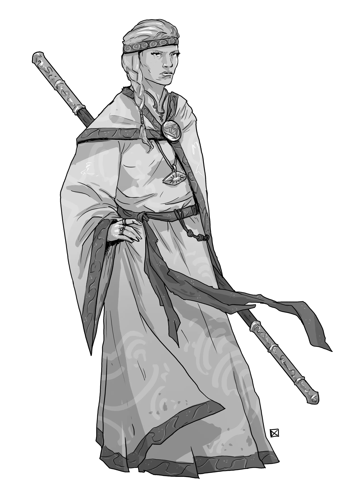

# Fanatics and Faithful

!!! info "Need tips for how to run religion and faith in your RPG?"
    The default lore of Foe Foundry is a [**Low Magic Setting**](../topics/faith.md) where divine beings do not directly communicate with mortals. If you run a setting where the gods are known to exist and actively intervene in the Mortal Realms then you can easily modify the lore to include direct involvement by the Gods. But it is much more difficult to remove the Gods from the Machine, so the lore is presented here with the least assumptions being made about your setting.

| Statblock Type | Description | Examples |
|----------------|-------------|----------|
| [Priests](../monsters/priest.md) | *Faithful Instruments of the Divine* | [[Acolyte]], [[Priest]], [[Archpriest]] |
| [Cultists](../monsters/cultist.md) | *Worshippers of the Occult and Forbidden*| [[Cultist]], [[Cultist Fanatic]], [[Death Cult Grand Master]] |
| [Knights](../monsters/knight.md) | *Champions Bound by Armor and Oaths* | [[Knight]], [[Knight of the Realm]], [[Questing Knight]], [[Paragon Knight]] |

## Priests

*Faithful Instruments of the Divine*

Priests are those rare mortals who find themselves as conduits to the Divine; through faith, perseverance, belief, or unusual circumstances. 

The [Distant Gods are silent and unknowable](../topics/faith.md#distant-gods). Miracles are rare and mysterious. No priest can say for certain the true source of their power. Does it flow from a God, a Saint, or something more mysterious or sinister still?  

What they do know is that their *belief* has power. The devout whispers, prayers, and rituals that Priests dedicate their lives to do sometimes lead to miracles. When the needy cry out, sometimes a light does come to their aid. Most priests find that belief on its own is difficult to wield, and find comfort in a rigid orthodoxy and ideology that enables them to manifest the power of their beliefs into tangible miracles.

There is no single road to becoming a conduit to the divine. Priests may be solitary mystics, village healers, war-chaplains, or archpriests leading massive temples. Some being their journeys with visions, and others with tremendous grief. For some Priests, the divine can be found through meditation, while others find it in compassionate or selfless service.

[Explore priest statblocks and divine lore](../monsters/priest.md) or check out an example priest statblock, the [[Archpriest]].

[[!Archpriest]]

[[$Archpriest]]

{.masked .monster-image}

---

## Cultists

*Worshippers of the Occult and Forbidden*

**Cultists** are driven by devotion. Cults dedicate themselves towards powers or entities deemed unnatural, heretical, taboo, or alien. To others, these beliefs would be considered dangerous and unnatural, but to their own, they are seekers of forbidden truth.  

Where **Priests** seek structure and hedge their prayers in rigid symbols and scripture, **Cultists** plunge headlong into devotion, pledging themselves to their cause.

Cults usually center around a singular leader who commands the absolute loyalty of all its members - a prophet, possessed oracle, or heretical priest. These leaders interpret the will of the cult's enigmatic patron and hold the loyalty of their followers through charisma or manipulation.

Many cultists are driven by ambition. They offer blood, loyalty, or sanity in exchange for power and miracles denied to them by the traditional belief systems. Some genuinely believe they are chosen to herald a great new age, while others simply seek power in exchange for service. Many cultists fall into a cult through desperation or isolation. To them, the cult offers meaning and belonging where society offers none. After all, the [gods are distant and unknowable](../topics/faith.md#distant-gods), so who is to say their faith is misplaced?

Cultists often claim their patrons are no more dangerous than the so-called “saints” of old. They ask: if a priest draws miracles from a silent god, and a cultist draws power from a whispering one, who is the true blasphemer? When power flows, and the gods remain silent, does it matter what name you cry out in the dark?

[Check out more Cultists lore and statblocks](../monsters/cultist.md) or take a look at this example [[Death Cultist]]:

[[!Death Cultist]]

[[$Death Cultist]]

{.masked .monster-image}

---

## Knights

*Champions Bound by Armor and Oaths*

[Knights](../monsters/knight.md) are elite warriors sworn to serve a cause greater than themselves. Many serve monarchs, faiths, or noble houses, while others pursue their own ideals. They are trained from youth in the arts of war, steeped in honor, and armored for battle. Whether rallying troops, dueling for glory, or riding into battle under sacred banners, knights blend martial skill with purpose.

Most are cavalry soldiers, but not all knights ride **Warhorses**. Some fight on foot or from the backs of exotic beasts such as a **Griffon**. A knight may command soldiers, uphold ancient codes, or seek redemption on a perilous quest. At higher ranks, knights swear divine oaths that grant them miraculous powers fueled by faith, conviction, or zeal.

[Discover knight statblocks and tactics](../monsters/knight.md) or check out an example knight statblock, the [[Knight of the Realm]].

[[!Knight of the Realm]]

[[$Knight of the Realm]]

{.masked .monster-image}

