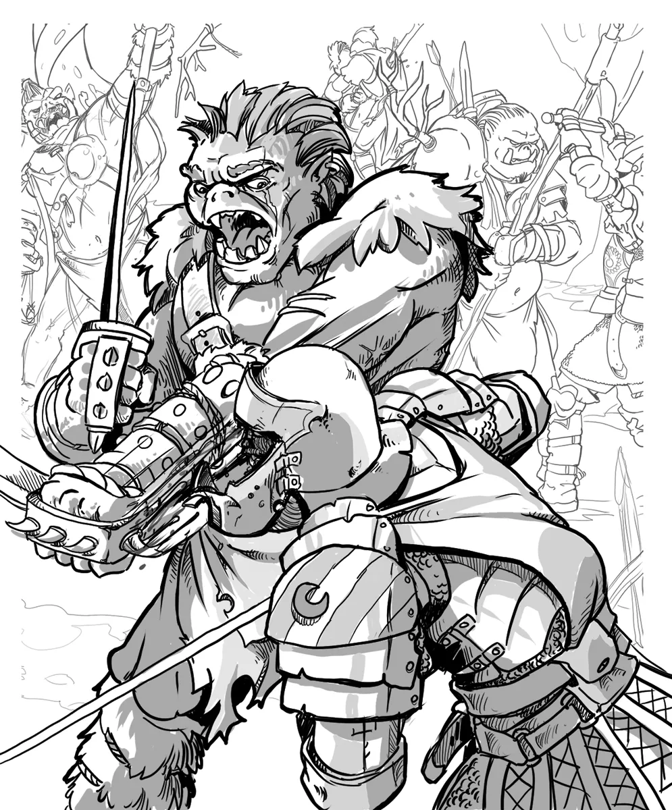

# Orcs and Goblinoids

*Chaotic Warriors Fueled by Bloodrage or Mischief*

[Orcs](../monsters/orc.md) and [Goblins](../monsters/goblin.md) are two branches from divergent roots: one born of blood and conquest, the other of mischief and mayhem. Yet both thrive in the margins of civilization, forming warbands, tribes, and hordes that raid, bicker, and occasionally rise to terrifying prominence.

Orcs are bloodrage-driven warriors descended from exiles who bargained with demons. They revere strength, honor, and ancestral tradition. Goblins, by contrast, slipped into the Mortal Realms from the faerie, bringing with them an unrelenting knack for chaos and improvisational cruelty. They're smaller, meaner, and more numerous - and far more annoying.

Though culturally distinct, orcs and goblins are often found in the same warbands. Mostly, this is because orcs are big enough to make it so. Goblin tribes, when left to their own devices, squabble, scatter, and accidentally set things on fire. But when a strong orc [[Orc Warchief]] arrives, goblins often fall in line (or get kicked into it). Orcs see goblins as disposable scouts, trap-makers, and distractions. Goblins see orcs as terrifying meat walls who keep angry adventurers occupied. It's a dysfunctional alliance, but an effective one.

{.masked .monster-image}

---

## Using Orcs and Goblinoids in Your 5E Campaign

[Foe Foundry](../index.md){.branding} makes it easy to instantly summon ravaging orc and screaming goblin warbands for your TTRPG campaigns. Each creature has rich Lore, Statblocks, Encounters, and Adventure Hooks, designed to keep your prep minimal so you can run that session tonight.

## Example Statblocks

Get started with these example statblocks. Don't worry, there's a lot more where that came from on the [Orcs](../monsters/orc.md) and [Goblins](../monsters/goblin.md) pages.

[[!Goblin Foulhex]]

[[$Goblin Foulhex]] 

[[!Orc Hardened One]]

[[$Orc Hardened One]]

## Example Powers

[Foe Foundry](../index.md){.branding} has over 600 unique [Powers](../powers/all.md) that are used to create monsters. Here's some interesting examples of unique powers that [Orcs](../monsters/orc.md) and [Goblins](../monsters/goblin.md) use.

[[!Fling Filth]]

[[!Grovel and Beg]]

[[!Bloodfury]]

[[!War-Cry of the Bloodied Fang]]

## Orc and Goblin Encounter Ideas

| d8 | Encounter |
|----|-----------|
| 1 | While traveling on a trade road, the PCs encounter a merchant caravan protected by [[Thugs]] that is under siege by [[Orc Soldiers]] and [[Orc Reavers]]. The orcs are incensed the thugs refused to pay the tribute to enter their ancestral lands, but promise to let the PCs pass unscathed if they pay the tithe. The guards, however, beg the PCs to intervene on their behalf. Unbeknownst to the players, the caravan is smuggling illicit goods. |
| 2 | The PCs stumble into a group of young [[Orc Soldiers]] who are attempting an ancient ritual to awaken the latent demonic power of their bloodrage. As the orcs ceremonially pass through fire, the ritual goes wrong. Everyone's shadows (the Orcs and the PCs) writhe and animate as [[Shadows]] that lash out indiscriminately. Then, the flames burn brightly as a [[Vrock]] appears, summoned by the ancient ritual. |
| 3 | Two [[Orc Warchiefs]] are dueling in a sacred circle, surrounded by their chanting retinue of [[Orc Hardened Ones]]. The winner will lead both tribes to a glorious future. One warchief accuses the other of betrayal for inviting the PCs, who are clearly assassins or mercenaries. |
| 4 | The PCs pass through the remains of an ancient battlefield where an ancient Orc legend is said to have slain 100 foes before being slain. An [[Orc Bloodrite Elder Shaman]] and her retinue of [[Orc Reavers]] are busy conducting a ritual to speak with the hero of legend, and don't take kindly to the PCs interrupting. |
| 5 | A nearby barn is burning, but what's more surprising is the gang of [[Goblins]] piling onto the back of panicked farm animals charging straight towards the PCs. |
| 6 | A group of [[Goblin Brutes]] come sledding recklessly down a nearby hill, being chased by an enraged [[Manticore]]. The goblins cackle nonsense about stealing the Manticore's eggs. |
| 7 | The PCs have trespassed into goblin territory. A [[Goblin Boss]] demands they pay tribute or retreat immediately lest his horde of [[Goblins]] will strike from the underbrush. The goblins demand whacky tribute like the all of the party's socks and boots. |
| 8 | The PCs stumble upon a secret black market trading stolen and illicit goods run by a cabal of [[Goblin Foulhexes]]. Violence is forbidden unless someone tells a bad joke. |

## Orc and Goblin Adventure Ideas

| d8 | Adventure Hook |
|----|----------------|
| 1 | A mighty [[Orc Warchief of the Bloody Fang]] is gathering all the orcs in the surrounding region under his Crimson Banner. So far, he has gathered 1d4 of the 5 clans under his sway. The chieftain must be dealt with somehow before the warbands unify, or it spells certain doom for the surrounding region. |
| 2 | An orc warband, led by an [[Orc Bloodrite Shaman]], are making a pilgrimage to an ancient site of significance to their ancestral spirits. Though the orcs are peaceful, the locals are suspicious and want the party to "deal with them". |
| 3 | A well-respected [[Orc Warchief of the Bloody Fang]] is dying and insists on a ritual trial to choose between two rival successors ([[Orc Warchiefs]]). The chief has invited the PCs, who are known for their great strength, to serve as judges to adjudicate. One candidate seeks aggressive expansion of the clan, while the other wishes to focus on internal matters. |
| 4 | A grizzled [[Orc Bloodrite Elder Shaman]] has had a vision and believes that the curse of the bloodrage on his clan can be broken, if only the [[Balor]] who the ancestors made a pact with can be forced into breaking the pact. The shaman has located a relic that can be used to summon the foul demon and asks the party for help, offering ancient armaments under his care as a reward. |
| 5 | An [[Orc Warchief]] has enslaved several goblin tribes after slaying the former leaders. A [[Goblin Foulhex]] and a contingent of loyalists approach the party with an offer to team up and take down the warlord, promising a portion of the treasure in return. |
| 6 | A village near a swamp is being harassed by [[Goblins]] who claim the land is their ancient birthright, gifted by a Hag. The PCs have been hired as negotiators to resolve the dispute and are authorized to buy the goblins out or eliminate the threat entirely. |
| 7 | The PCs have been tasked with recruiting a goblin [[Legendary Warrior]] who now runs a secret coliseum in the sunken ruins of a lost outpost. The warrior will only entertain the PC's request if the PCs first defeat his champions. |
| 8 | A frustrated merchant has hired the PCs to deal with a tribe of goblins that have cornered the market on a hallucinnogenic mushroom. The tribe is led by a council of [[Goblin Shamans]] who have partaken in a few too many of the mushrooms themselves. |