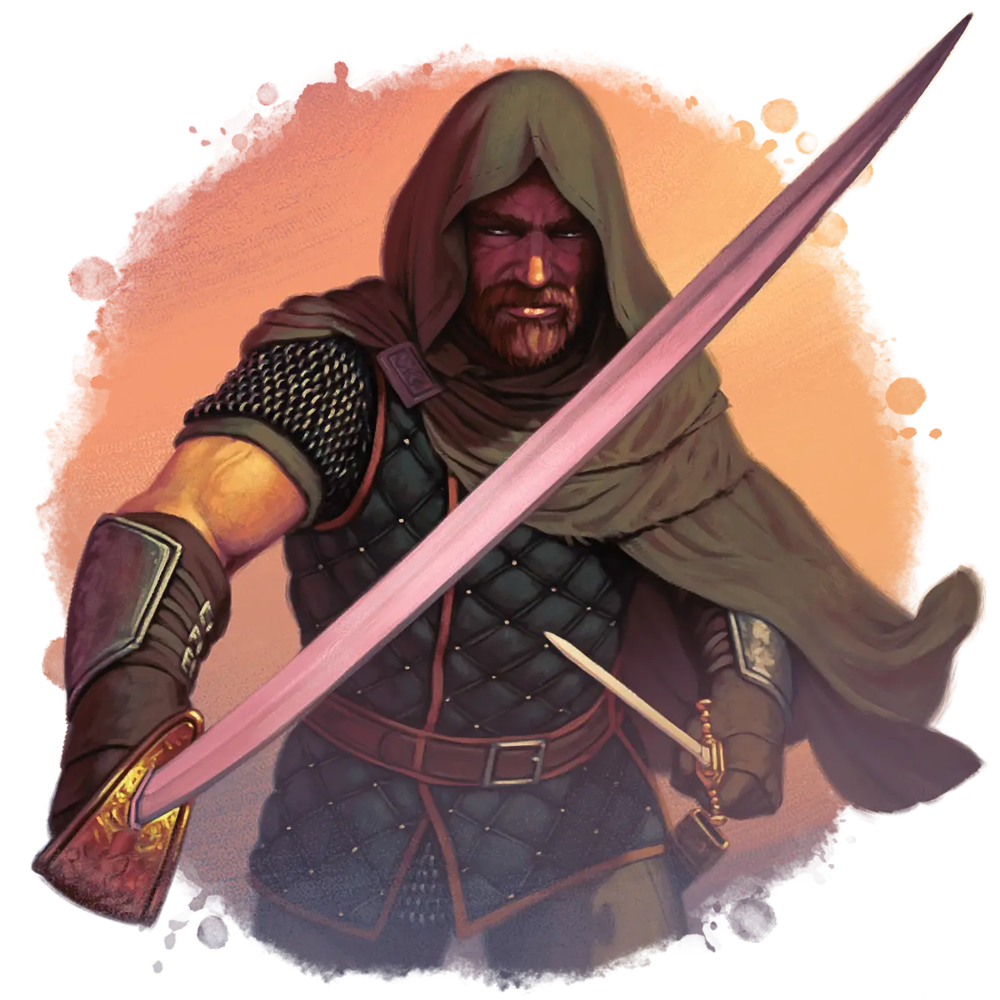

# The Ultimate Guide to Rival Adventuring Parties

Looking to spice up your game? Introducing a group of **Rivals** is a fun and player-agency-positive way to add unique and interesting characters and story possibilities.  

What you'll find inside:

- Pre-made [Rival Parties](#rival-adventuring-party-statblocks-for-dd-5e) with easy-to-use [Rival Introductions](#how-to-introduce-rivals-to-your-campaign)
- [Rival Adventure Hooks](#adventure-hooks-for-rival-adventuring-parties-in-dd-5e) ranging from wagers to team-ups to integrate rivals directly into your campaign
- Ways to [Link Rivals](#linking-rival-npc-parties-with-your-campaign-villains) to your campaign's [Villains](villains.md)
- [Rival Party Statblocks](#rival-adventuring-party-statblocks-for-dd-5e) that you can fully customize with the [Foe Foundry Generator](../generate/index.md)

Whether you're building your campaign from scratch, scrambling to prep for a game tonight, or running a pre-written module, <a href="https://foefoundry.com" class="branding">Foe Foundry</a> gives you everything you need to create a unique rival adventuring party to interact with your PCs.  

Check out the [Rivals Blog Post](../blog/2025_05_09_build_rival_npcs.md) to see these tables in action!

{.monster-image}

## Build a Rival Party Your Players Will Love To Hate

Rivals are more open-ended than [Villains](villains.md). Here are a couple ways your party might encounter or interact with rivals over the course of a campaing:

> _The four of you, exhausted from an arduous trip into the Cursed Catacombs, wearily make your way to the Salty Sailor for a well-deserved round. As you stumble into your favorite watering hole, you’re greeted by a familiar sight. The scarred members of The Unbroken are lounging in your booth... again... As you approach, their leader tosses back a flagon of ale and jeers “Look who the cat dragged in!”_  

---

> _As the ancient stone walls tremble and start to crumble, you hear the sound of hurried footsteps and catch a glimpse of movement through the dust and debris. Emerging from the gloom, the Silent Oath appear, their expressions grim but determined. Their leader, a tall elf with a horribly scarred throat, gestures urgently, pointing towards a passageway obscured by fallen rubble. Without words, they begin clearing the debris. The elf looks at you expectantly..._  

---

> _At the bustling fair, laughter and music fill the air as townsfolk cheer on various contests of skill and strength. As you head to the archery range, you spot the haughty Lady Meris and her lackeys from the Iron Pact. She catches sight of you and smirks. "Well, well, if it isn’t our illustrious competition. Care to test your mettle? We’ve already bested the local champions, but perhaps you’ll provide a real challenge. Loser has to sing a song praising the winner each noon in the town square for the next. What do you say?”_  

---

> _Deep within the darkened crypt, the air grows colder as the you approach the lich's lair. The Black Company's leader, a grizzled veteran named Korvus, exchanges a knowing glance with his comrades. "We’ve got your back," he says, unsheathing his black blade. But as the final seal on the lich's chamber is broken, the Black Company suddenly turns on you, weapons drawn. "Nothing personal," Korvus sneers, "but the bounty on your heads will make us richer than any treasure in this tomb.”_  

## Why Use Rival Adventuring Parties in Your Campaign?

Using a rival adventuring party is an excellent way to add exciting and dynamic interactions to your campaign. Depending on how your players interact with the rivals, you can create memorable stories of betrayal or former rivals turned to fierce friends. The relationships between the PCs and Rivals is fluid and can change throughout the course of your campaign based on the player’s choices. This really empowers the players to take the driver’s seat and leads to a lot of emergent stories and depth. Unlike [Villains](villains.md), who your party will almost always despise, Rivals are much more open-ended. Your players may hate them, or they might end up loving their former rivals.  

NPC rivals work best when they are first introduced in social settings where there isn’t an immediate expectation that the PCs have to fight the rivals to the death. In fact, there should be reasons for the players to engage with the rivals outside of combat, at first. Once you’ve introduced the rivals, look for opportunities to incorporate them across multiple story arcs and see how the player’s relationship with the rivals grows and evolves over time. This may very well lead to an epic showdown, or perhaps the rivals will become staunch allies over the course of the campaign!

## 12 Ready-to-Use Rival Parties for Your Campaign

Looking to drop a Rival Adventuring Party directly into your 5E or TTRPG campaign? This table gives you 12 table-ready interesting NPC parties.

|d12|Rival Party|Goal|Unique Aspect|
|---|---|---|---|
|1|The Unforgiven|Vengeance|Members swear a dread oath of bloody vengeance|
|2|Dawnbringers|Trying to save the world|Members are all questing paladins|
|3|Iron Pact|Political influence|Members are all second sons looking to carve out their place in the world|
|4|Demon Hammers|Slay a fabled monster|Wield cursed hammers containing fragments of slain fiends|
|5|Silent Oath|Avenge a past humiliation|Members have sworn an oath of silence until a past wrong is righted|
|6|Danse Macabre|Forbidden or lost knowledge|Each member died at one point and has been resurrected|
|7|Black Company|Wealth|Betrayal is repaid ten-fold|
|8|The Immortals|Conquest|Members souls are bound together. None can truly die until all are slain|
|9|Path of the Seekers|Questing for lost artifact of legend|Guided by a mystical compass|
|10|Silver Aegis|Dutifully serving their liege|Members wear enchanted silver armor wearable only by those deemed worthy by their liege|
|11|The Unbroken|Seeking glory and renown|Members fight to the death|
|12|Hallowed Flame|Zealots for a cause|Members carry an ember of eternal flame that burns brighter with each act of zeal|

## How to Introduce Rivals to Your Campaign

It’s often a good idea to introduce the rivals very early on in a D&D campaign. This way, the relationship between the PCs and the Rivals has the opportunity to grow and evolve. It’s also a good idea to introduce the rivals in a way where the players aren’t immediately expecting that they “have to” fight the rivals. Of course, the players should always have that choice, but when roleplaying the rivals it’s best not to have them attack first - at least not in the early interactions.

If you’re planning a brand new 5E campaign, or introducing new characters to an existing campaign, consider incorporating the rivals directly into the backstories of one or more characters. This shared history will increase the the player’s engagement with the rivals.

### d6 Rival Introductions

|d6|Rival Introduction|
|---|---|
|1|At a boisterous tavern, celebrating their most recent job with lots of drink|
|2|Bump into them at the nearest job board|
|3|Onlookers cheer on as the rival party beats up some local thugs|
|4|Rival party bursts through the door of the dungeon the PCs are exploring|
|5|Rival party is meeting with an important NPC right before or after the PCs|
|6|Coming out of the dungeon the PCs are heading to. The rivals just cleared it…|

### d6 Previous Connections to PCs

|d6|Rival Connections to PCs|
|---|---|
|1|Completed an important job together successfully in the past|
|2|One of the PCs once made the rival’s leader look like a fool, or vice versa|
|3|One of the PCs used to date someone important to one of the rivals, or vice versa|
|4|One of the PCs once drank the rival’s leader under the table, or vice versa|
|5|The rivals previously stole a lucrative job from the PCs, or vice versa|
|6|The PCs once disastrously interfered in the rival’s important job, or vice versa|

## How to Use a Rival Adventuring Party as a Recurring Arc in 5E

Once you’ve introduced the rivals, you’ll want to gradually build and escalate the rivalry. One way to do this is to think of the rivalry as its own subplot or arc within the campaign. You can break this arc down into a variety of stages. Here’s an example:

- **Initial Encounter**: Use the **Introducing Rivals** section above to have a tense but non-lethal initial introduction. See how the party interacts with the rivals so you can build on this dynamic in the future.
- **Escalate Tensions:** Use the **Rival Adventure Hooks** section below to creature potential situations for the PCs and rivals to interact and compete.
- **Make it Personal:** As tensions rise, look for ways to make the rivalry personal. This should tie into the shared bonds and connections of the party. Perhaps the rivals kidnap a beloved NPC or get involved with the campaign’s main villains (see **Linking Rivals and Villains**).
- **Major Confrontation**: Build up to a climactic encounter where the rivalry comes to a head. This could be a battle, a critical negotiation, or a race to claim a valuable treasure. Both sides put everything on the line.
- **Resolution**: After the major confrontation, the rivalry should be resolved. Either the rivals or PCs are dead or defeated, or the rivalry has transformed in some way. Perhaps the former rivals now have a grudging respect for the PCs. Let your player’s actions dictate how this plays out.

## Adventure Hooks for Rival Adventuring Parties in D&D 5E

Use these Adventure Hooks to integrate a rival adventuring party into your campaign.

| d10 | Rival Adventure Hook |
|---|---|
|1|**Wager -** the Rivals challenge the PCs to a contest|
|2|**Competition** - the rivals have been hired to complete the same task and the race is on. Who will get the job done first?|
|3|**Team Up** - the rivals approach the PCs and offer to team up for a difficult objective|
|4|**Trapped Together** - the rivals end up trapped with the PCs. Will the two groups be able to work together to survive?|
|5|**Hired Help** - the rivals have been hired by the same quest-giver as the PCs to work together on an important mission|
|6|**Scratch Each Other’s Back** - the rivals have something the PCs need, but are unwilling to give it up without something in return|
|7|**Tense Negotiation** - the PCs and the rivals have been hired to resolve a dispute between two feuding patrons|
|8|**Rat Race** - the PCs have been hired to infiltrate a heavily guarded location. Unfortunately, the rivals got their first.|
|9|**Blackmail** - the rivals have sensitive information about one of the PCs or an important NPC ally. They threaten to reveal it unless the PCs carry out a dangerous task for them|
|10|**Framed** - the rivals accuse the PCs of a crime they didn’t commit, forcing them to stand trial before a local magistrate|

### Wager

The rival group challenges the PCs to a contest of skill. The winning group gets some sort of prize or wins the wager.

|d6|Challenge|
|---|---|
|1|Drinking Contest at local Tavern|
|2|Boastful recounting of exploits to be judged by 3rd party|
|3|Perform a daring deed to be judged by 3rd party|
|4|Contest of strength, cunning, or skill|
|5|Steal a valuable item from an unpopular nobleman|
|6|Slay the biggest monster in a week|

|d6|Wager|
|---|---|
|1|The loser sings the praises of the winner in public for a week|
|2|Gold or valuable gemstones|
|3|The loser gives up rights to the next mission to the winner|
|4|The loser forfeits their best magic item to the winner|
|5|The loser performs a favor for the winner|
|6|The loser introduces the winner to an important 3rd party|

### Competition

The rival group has been hired to accomplish the same task as the PCs. This could be because the quest-giver is hedging their bets, or a rival to the quest-giver is after the same goal and has hired the rivals to perform the task. Will the PCs beat their rivals to the punch, or will they instead let the rivals do the dirty work and steal their lunch?

### Team Up

The rivals approach the PCs and offer to team up to take down a powerful enemy or complete a difficult objective. However, the rival group may have their own ulterior motives or try to betray the PCs once the objective is completed.

|d4|Rival Ulterior Motives|
|---|---|
|1|**Sabotage**: the rivals secretly plan to sabotage the PCs efforts|
|2|**Betrayal**: the rivals secretly plan to betray the PCs to either kill them or accomplish the mission for themselves|
|3|**Spying**: the rivals have been hired to spy on the PCs and the joint mission is a cover|
|4|**Frame**: the rivals have been hired to frame the PCs for a dastardly deed|

### Trapped Together

The two groups end up trapped in a dungeon or other dangerous location together, and must work together to escape or survive. How will they split the valuable loot discovered on the way out?

|d4|The Rivals and PCs are trapped together due to a…|
|---|---|
|1|**Disaster**: A flood, earthquake, magic storm, blizzard, fire, etc. has trapped the PCs and rivals in the same location. They must work together to survive the disaster|
|2|**Collapse**: A section of a dungeon or other building has collapsed and trapped the PCs with the rivals. They must work together to escape the dangerous environment and the monsters that infest it|
|3|**Magical Trap**: the PCs and rivals have been caught in a magical trap such as a time loop, alternate reality, or pocket dimension. They must work together to escape|
|4|**Maze**: the PCs and rivals have gotten hopelessly lost in a dungeon or the wilderness and must work together to find their way to safety|

### Hired Help

The two groups have been hired by the same quest-giver to work together on an important mission. However, tensions may still run high between the groups even as they work together.

|d4|Rival|
|---|---|
|1|The PCs are being paid notably more or less than the Rivals for the same job|
|2|The rivals resent the presence of the PCs, seeing it as a lack of trust in their capabilities|
|3|The rivals don’t want to work with the PCs and suggest a wager for which group can finish the job first (see above)|
|4|The rivals are grateful for the assistance - they were worried they were in over their head|

### Scratch Each Other’s Back

The rivals have information, expertise, or connections that the PCs need to progress in their quest, but they are unwilling to part with it without some sort of compensation or exchange.

### Tense Negotiation

The PCs and the rivals have been hired to resolve a dispute between two feuding patrons

|d4|Feud|
|---|---|
|1|Local noble houses engaged in a territorial dispute|
|2|Two Thieves Guilds involved in an illicit gang war|
|3|Two Ancient Dragons resolving a difference via a “gentleman’s agreement”|
|4|Two Archmagi arguing over whose esoteric theory is correct|

### Rat Race

The PCs have been hired to infiltrate a heavily guarded location. Unfortunately, the rivals got their first.

|d4|Heist Objective|
|---|---|
|1|Extract a valuable painting from a heavily guarded and opulent manor house|
|2|Extract an important witness to a crime from a corrupt noble’s dungeon|
|3|Liberate a valuable artifact from a heavily enchanted magical emporium|
|4|Find a tome of esoteric knowledge from a mage’s personal collection|

### Blackmail

The rivals have sensitive information about one of the PCs or an important NPC ally. They threaten to reveal it unless the PCs carry out a dangerous task for them

### Framed

The rivals accuse the PCs of a crime they didn’t commit, forcing them to stand trial before a local magistrate

## Linking Rival NPC Parties with Your Campaign Villains

As the rivalry escalates, you might consider linking the rivals with your campaign’s main [villains](villains.md). This is especially effective if the PC’s actions have driven the rivals to team up with the villain in out of desperation, or if a clever villain recruits the rivals to help against the pesky PCs.

|d4|Villain Connections|
|---|---|
|1|**Desire for Revenge** - The Rivals approach the Villain to team up and deal with the PCs out of a desire for revenge (or vice versa)|
|5|**True Believers** - The Rivals have been swayed by the Villain and have joined their cause willingly|
|3|**Hired Help** - The Rivals have been hired by the Villain but are indifferent to the Villain’s cause|
|4|**Blackmailed** - The Rivals are being blackmailed and forced to help the Villain against their will|
|5|**Unwitting Pawns** - The Rivals are being used as pawns by the Villain without realizing|
|6|**Double Agents** - The Rivals discover that they are working for the Villain and are considering switching sides|

## Rival Adventuring Party Statblocks for D&D 5E

These encounters are designed to be **Hard** to **Deadly** for 4 reasonably optimized PCs using the [“Lazy Combat Encounter Benchmark”](https://slyflourish.com/lazy_gm_resource_document.html#lazycombatencounterbuilding). If your party punches above its weight, you can choose from the next level. Note there is a big jump in power between Tier 1 and Tier 2 rivals.

### Tier 1 Rivals

|Role    |Level 2    |Level 3            |Level 4|
|--------|-----------|-------------------|-------|
|Leader  |**Thug**   |**Bandit Veteran** |**Veteran Thug**|
|Brute   |**Orc**    |**Orc**            |**Orc**|
|Ambusher|**Scout**  |**Spy**            |**Spy**|
|Support |**Acolyte**|**Acolyte**        |**Acolyte**|
|Pet     |**Wolf**   |**Wolf**           |**Wolf**|

### Tier 2 Rivals

|Role    |Level 5           |Level 6            |Level 7|Level 8|Level 9|
|--------|------------------|-------------------|-------|-------|-------|
|Leader  |**Thug Overboss** |**Thug Overboss**  |**Thug Overboss**|**Thug Overboss**| **Knight of the Realm**|
|Brute   |**Orc Reaver**    |**Orc Reaver**     |**Ogre**     |**Ogre Chaincrakka**|**Ogre Chaincrakka**|
|Ambusher|**Spy**           |**Contract Killer**|**Contract Killer**|**Contract Killer**|**Contract Killer**|
|Support |**Priest**        |**Priest**         |**Priest**         |**Priest**|**Priest Anointed One**|
|Pet     |**Dire Wolf**     |**Dire Wolf**      |**Winter Wolf**    |**Winter Wolf**|**Winter Wolf**|
### Tier 3 Rivals

|Role|Level 10|Level 11|Level 12|Level 13|Level 14|
|------|---|---|---|---|---|
|Leader  |**Knight of the Realm**|**Knight of the Realm**|**Questing Knight**|**Questing Knight**|**Questing Knight**|
|Brute   |**Berserker Veteran**|**Berserker Veteran**|**Berserker Veteran**|**Berserker Veteran**| 2 **Berserker Veteran** twins |
|Ambusher|**Contract Killer**|**Assassin**|**Assassin**|**Assassin**|**Assassin**|
|Support  |**Priest Anointed One**|**Priest Anointed One**|**Priest Anointed One**|**Priest Anointed One**| **Priest Anointed One**|
|Pet      |**Savage Owlbear**|**Savage Owlbear**|**Owlbear**|**Savage Owlbear**|**Manticore Ravager**|

### Encounter Twists for Rival Adventuring Parties

You can use these interesting twists to spice up encounters with the rivals.

|d6|Interesting Encounter Twists|
|---|---|
|1|The Brute and/or Pet smashes through a wall and surprises the party from the rear|
|2|When the Brute and/or Pet hit an enemy with a melee attack, that enemy must make a DC 12/15/18 Strength save or be grappled, knocked prone, or pushed up to 10 feet away|
|3|The Leader and/or Support can use a bonus action to read a scroll of _Grease_, _Entangle_, _Spike Growth_, _Web_, or _Cloudkill_|
|4|The rivals have set up a variety of deadly traps such as pit traps, snares, or falling boulders|
|5|The rivals each carry a _Potion of Healing_, _Potion of Greater Healing_, or _Potion of Invisibility_ that they can drink as a bonus action|
|6|The Leader has used a scroll of _Major Image_ or _Hallucinatory Terrain_ to set up a deadly ambush|

### Legendary-Style Actions for Rival Adventuring Parties

You can also grant the entire rival party **Rival Party Actions**. These are similar to **Legendary Actions**, except that they are shared amongst the entire rival party.

The rival party can take 3 rival party actions, choosing from the options below. Only one rival party action option can be used at a time and only at the end of another creature’s turn. The rival party regains spent rival party actions at the start of a new round.

- _**Barked Command.**_ The Leader barks a command to an ally within 60 feet. As a reaction, the ally may move up to its movement speed without provoking opportunity attacks or may make a melee attack.
- _**Charge.**_ The Brute moves up to their speed in a straight line. Any hostile creature within 5 feet of the line must make a DC 12/15/18 Strength save or be knocked Prone.
- _**Faithful Defense.**_ The Pet moves up to their movement speed without provoking opportunity attacks. Until the end of the pet’s next turn, attacks targeting any ally within 5 feet of the Pet are made at disadvantage.
- _**Assistance**_ (2 actions). The Support chooses a friendly creature within 5 feet and casts _Cure Wounds_ (1st/3rd/5th) or _Lesser/Greater Restoration_
- _**Ruthless Attack**_ (2 actions). The Ambusher makes an attack at advantage.