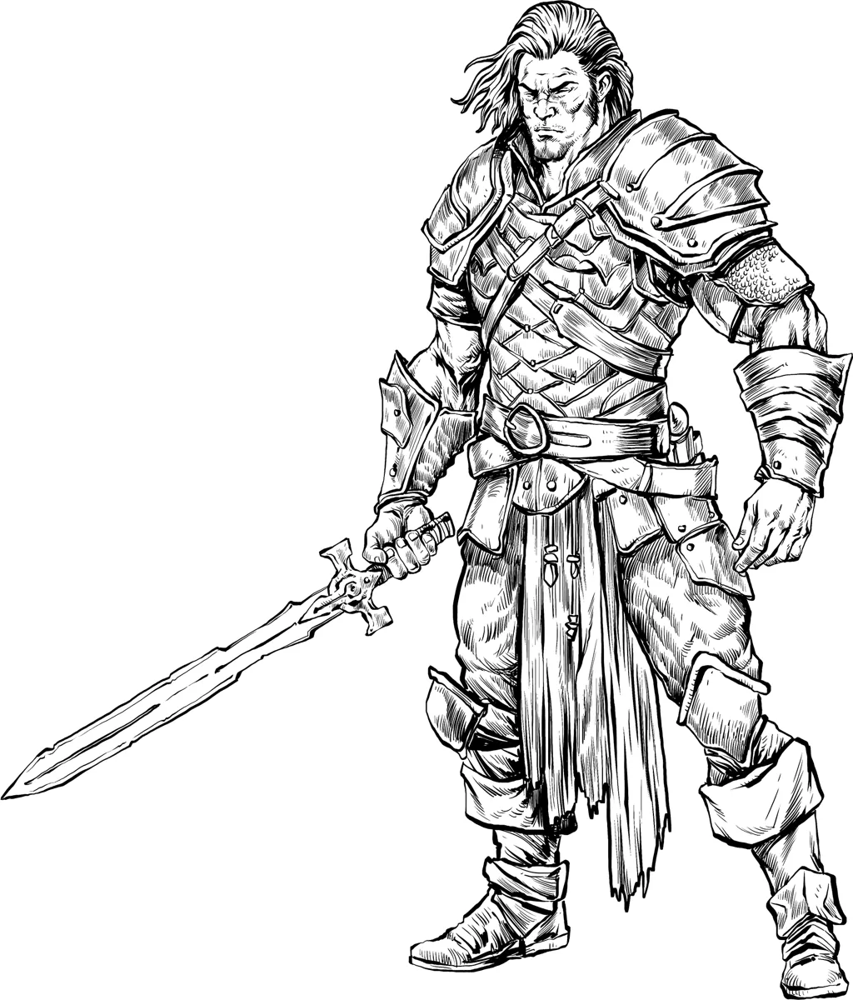

# Soldiers & Fighters

| Statblock      | Description | Examples |
|----------------|-------------|----------|
| [Warriors](../monsters/warrior.md) | *Disciplined Soldiers of Steel and Strategy* | [[Shock Infantry]] (CR 1/8), [[Line Infantry]] (CR 1/8), [[Shock Infantry Veteran]] (CR 3), [[Line Infantry Veteran]] (CR 3), [[Warrior Commander]] (CR 10), [[Legendary Warrior]] (CR 14) |
| [Berserkers](../monsters/berserker.md) | *Battle-Frenzied Warriors of Blood and Glory*| [[Berserker]] (CR 2), [[Berserker Veteran]] (CR 4), [[Berserker Legend]] (CR 12) |
| [Guards](../monsters/guard.md) | *Watchful Sentries and Keepers of the Peace*| [[Guard]] (CR 1/8), [[Sergeant of the Watch]] (CR 1), [[Guard Captain]] (CR 4), [[Lord of the Watch]] (CR 8) |

## What are Soldiers and Fighter Statblocks?

Soldiers and fighters are martial NPCs who rely on steel, strategy, and resolve - not spells or sorcery. They are the backbone of armies, mercenary bands, and city watch patrols, bringing structure, discipline, or brute strength to every encounter.

Whether you need elite infantry for a war campaign, blood-mad berserkers to storm the gates, or guards to complicate a stealth mission, these statblocks offer flexible martial foes for every tier of play. Unlike monsters or mages, these foes think like warriors - fighting in formation, holding chokepoints, and executing tactical orders under pressure.

Use these statblocks to bring martial realism and grounded combat drama to your 5E adventures.

---

## Warriors

*Disciplined Soldiers of Steel and Strategy*

When war breaks out, it's not dragons or owlbears who hold the line - it's warriors. These trained professionals earn their keep through disciplined combat. Whether hardened conscripts or elite bodyguards, they rely not on magic or miracles, but on discipline, coordination, and experience. Warriors know how to fight together, how to exploit terrain, and how to execute orders under fire.

They are the backbone of armies, mercenary bands, and noble retinues. Some serve their liege proudly, while others sell their blades to the highest bidder. From shield-bearing infantry to field commanders, warriors exemplify martial discipline honed by battle.

[Explore warrior statblocks and tactics](../monsters/warrior.md) or check out an example warrior statblock, the [[Shock Infantry Veteran]].

[[!Shock Infantry Veteran]]

[[$Shock Infantry Veteran]]

{.monster-image .masked}

---

## Berserkers

*Battle-Frenzied Warriors of Blood and Glory*

Berserkers are warriors gripped by a primal fury. Blood-soaked and unrelenting, a berserker is consumed by an adrenaline-fueled recklessness that drives them head-first into the fray.

Unlike disciplined soldier NPCs such as [[Warriors]] or [[Guards]], [[Berserkers]] don't march or form ranks. They crash into battle as howling shock troops, disrupting formations and challenging the strongest enemy they can find. Their armor is light, their weapons heavy, and their bravado is absolute. 

Some fight for personal glory, others out of grief, vengeance, or sheer bloodlust. Many serve in tribal warbands led by [[Berserker Commanders]] - scarred veterans who inspire their kin with primal chants, brutal rituals, and the promise of a glorious death. These commanders channel strange rites and primal magic that heightens their prowess and binds their followers to them.

To a berserker, a good death is the only kind worth having. To fall in battle, weapon in hand, is the highest calling and the only way to earn a place amongst the storied heroes of old.

[Discover raging Berserker statblocks and lore](../monsters/berserker.md) or take a look at this example [[Berserker Veteran]]:

[[!Berserker Veteran]]

[[$Berserker Veteran]]

{.monster-image .masked}

---

## Guards

*Watchful Sentries and Keepers of the Peace*

Guards protect people, places, and posessions. Sometimes for coin, sometimes out of duty, and sometimes because it’s the only job in town. They're not elite warriors, but they are trained to be observant and to act quickly when trouble starts.  

Guards serve in many positions, including lookouts, bouncers, caravan escorts, or the city watch. What they lack in elite training, they often make up for in numbers and authority. In corrupt cities, a badge is just a license to shake people down. In just ones, guards are the thread that holds society together.  

Whether manning a city gate or shadowing a suspicious group of mercenaries, guards are omnipresent in the lives of adventurers, and often the first line of defense when plans go sideways.  

---

## Martial Encounters for 5E

These 5E martial encounter ideas are designed to bring grounded, gritty realism to your urban campaigns, military missions, and war-torn adventures. Whether you need tension at the city gates or battlefield chaos, these plot seeds showcase how martial NPCs like [[Warriors]], [[Guards]], and [[Berserkers]] complicate the lives of adventurers.

!!! info "More Encounters"
    See [Warrior Encounters](../monsters/warrior.md#warrior-encounter-ideas), [Berserker Encounters](../monsters/berserker.md#berserker-encounters), and [Guard Encounters](../monsters/guard.md#guard-encounter-ideas) for more martial NPC encounter ideas for your 5E campaign.

| d6 | Martial Encounter |
|----|------|
| 1  | A citizen points and yells "There they are, those are the murderers!" to a nearby [[Sergeant of the Watch]] and her patrol of [[Guards]]. |
| 2  | The PCs are framed for a noble's murder by **Doppelgangers** and are pursued through the city by a vengeful [[Lord of the Watch]]. To clear their names, they must unearth the conspiracy behind the false accusation. |
| 3  | The only bridge over a dangerous chasm is guarded by a [[Berserker Legend]] who will only let worthy combatants pass. She took a vow to never let a coward pass. |
| 4  | A [[Death Cultist Grand Master]] and his cult have robbed the grave of a [[Berserker Legend]] to resurrect the warrior as an undead servant. The party must retrieve his relic weapons from feuding war-chieftains before the cult completes the ritual. |
| 5  | A [rival adventuring party](../families/rivals.md) led by a [[Warrior Commander]] interrupts the PCs’ next job — they've been hired to complete it as well! |
| 6  | A disbanded regiment has turned to banditry, led by a bitter [[Legendary Warrior]] who believes their kingdom betrayed them after not paying the soldier's backpay. |