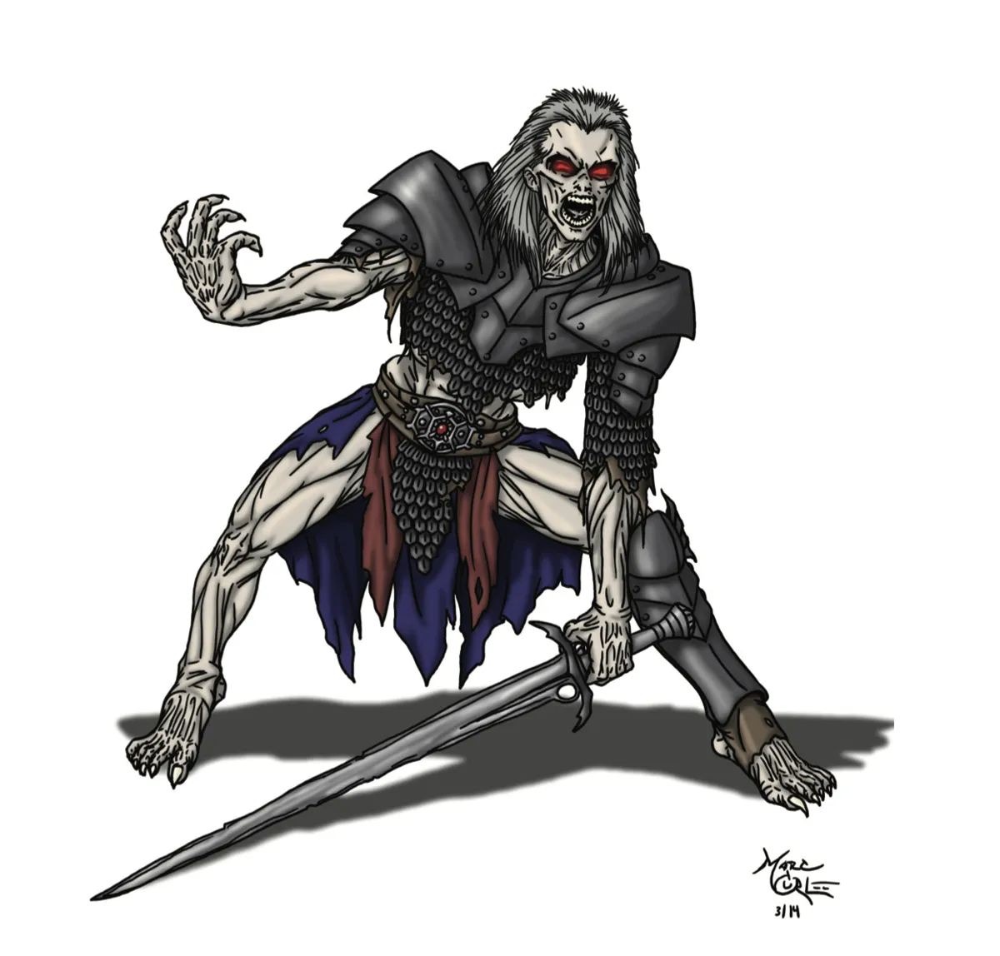

# Undead

*Twisted Mockeries of Life*

{.monster-image}

Undead creatures are the echoes and remnants of life, cursed to linger in defiance of the natural order. There are many types of Undead, including the reanimated dead (such as **Zombies**, **Skeletons**, and **Mummies**), as well as lingering spirits like **Ghosts** and **Wraiths**. Some were raised by fell mortal magic. Others clawed their way back to life battling the biting currents of the Styx, while some endure cursed existences.

Many serve as mindless thralls under a mortal or once-mortal master's control, such as a **Necromancer Mage**. Others arise spontaneously in places where the veil between life and death has thinned: fields soaked in blood, crypts of cursed kings, or battlefields steeped in sorrow. A rare few choose undeath, willingly binding themselves to deathless hunger or forgotten oaths.

---

## Using Undead in Your Campaign

Each [Foe Foundry](https://foefoundry.com) monster has **Lore**, **Tactics**, **Encounters**, and **Adventures** so that you can drop them right into your campaign!

If you're looking for other monsters, browse our catalog of [Foe Foundry Monsters](../monsters/index.md) to find the perfect monster for your game tonight.

### Encounters

Foe Foundry helps Game Masters summon chilling undead encounters instantly, with flavorful creatures like wraiths, banshees, and skeletal champions — all scaled to your party’s level and ready to haunt your RPG sessions without hours of prep. Each encounter is a fun, table-ready situation packed with open-ended choices, designed for low-prep RPG sessions, keeping your players engaged and your story moving.

Here are 20 unforgettable undead encounters ready for your next RPG session. Explore each monster’s unique abilities, lore, and tactics to bring your adventures to life!

| d20 | Encounter |
|-----|-----------|
| 1 | A single, unusually articulate **Skeletal Grave Guard** (INT 10, speaks Common) blocks a crumbling stairway. It demands a password which no one living knows, and otherwise speaks courteously and even offers dry warnings about nearby dangers. |
| 2 | A narrow stone bridge over a vast chasm is guarded by a **Burning Skeletal Champion** and a **Freezing Skeletal Champion**. They demand the PCs answer ancient riddles of death and loyalty to pass. |
| 3 | A patrol of 10 (3d6) **Skeletons** led by a **Burning Skeleton**, **Freezing Skeleton**, or **Skeletal Grave Guard** escort a caravan of rare goods and arcana being transported to the grim lair of a nearby **Necromancer Mage** |
| 4 | A horde of loosely dispersed **Zombies** (at least 30) drifts aimlessly across the landscape, blocking progress for the PCs |
| 5 | 20 (6d6) **Zombies** batter at a barricaded door where a wounded **Priest** and **Scout** make a desperate final stand, shouting for help as the dead break through. |
| 6 | A loud noise or disruption, such as a shouted spell, a ringing bell, or a dropped item, awakens a hidden cluster of **Zombies** buried beneath the mud, snow, or rubble. |
| 7 | A **Necromancer Adept** and her 10 **Zombie** minions battle a group of 3 **Ogres**, seeking to slaughter and reanimate the brutes as stronger undead servants. |
| 8 | A trail of stripped and half-eaten corpses leads the party to hidden lair of **Ghouls** waiting to strike from shallow graves and crumbling cairns |
| 9 | A voracious pack of **Ghouls** (at least 1 per PC in Tier 1, 2 **Ghouls** per PC led by 1d4 **Ghasts** in Tier 2) stalk the party across the countryside, waiting to feast |
| 10 | The party stumbles on a pack of **Ghouls** mid-feast. Two competing **Ghasts** are squabbling over who gets to devour the last captive, a rich **Noble** who begs for the party to free her |
| 11 | A feverish victim of a ghoul stumbles forward, infected by a wasting disease. The adventurer promises the PCs half the loot if they can help him eliminate the **Ghouls** that attacked his camp three nights ago. |
| 12 | A stone plinth floats midair in a field of frozen, dead grass. Upon it, a perfectly preserved **Wight Fell Champion** intones the dread decrees of a **Lich**, its ancient undead master who rules from afar, to a group of local villagers. The herald is flanked by incorporeal **Wraiths** and **Specters** |
| 13 | A black-iron cage covered in powerful runic wards dangles from a twisted tree. An emaciated **Questing Knight** who dared to defy a **Lich** has been trapped inside for a week |
| 14 | The players stumble upon a caravan frozen mid-flight, its horses and drivers dead, yet unnaturally preserved. In the center lies a black scroll carrying a cursed decree from a **Lich** |
| 15 | A black-plated **Iron Golem** blocks the road, demanding a toll. Travelers must sacrifice a cherished secret to its unseen master. If provoked, a **Lich** speaks through the construct in a voice like cracking ice, warning that some debts are not so easily escaped |
| 16 | A torch sputters in a narrow hallway as the party's shadows stretch and split. One or more of them peel off the wall as a **Shadow** and attack their sources. |
| 17 | The party finds a wounded guard calling for help. If healed or aided, the figure flickers and reveals it is a **Specter** repeating its death throes. The act of kindness awakens its fragmented mind, and it lashes out in panic unless calmed. |
| 18 | In a ruined bedchamber, a **Banshee** cradles a bundle of bones in a broken cradle. She demands the party sing her child back to sleep. |
| 19 | A **Ghost** blocks the only path forward, whispering “I must not be forgotten.” The spirit demands someone speak its name in order to pass. |
| 20 | The air grows thin and cold as the party enters a forgotten tomb. One of them stumbles, but their **Shadow** doesn’t get up, rising instead as the herald of the **Wraith** within. The herald demands a blood sacrifice for its master. |

### Adventures

Foe Foundry makes it easy for GMs to unleash unforgettable undead adventure hooks, featuring chilling creatures like wraiths, specters, and ghostly knights — all crafted to fit seamlessly into any fantasy campaign. Whether you need a haunted ruin, a cursed battlefield, or a restless spirit seeking vengeance, these undead story hooks offer open-ended, multi-session adventures that spark intrigue and challenge your players without hours of prep.

Here are 10 unforgettable undead adventure hooks designed to weave seamlessly into any RPG campaign — explore each monster’s lore, powers, and story seeds to inspire multi-session adventures packed with danger and discovery!

| d20 | Adventure |
|-----|-----------|
| 1 | Fifty years ago, during a desperate winter, villagers resorted to cannibalism to survive. Their descendants became cursed and transform into **Ghasts** during the winter months. Someone important to the PCs has gone missing in this town, which has since become prosperous, despite its dark secret. |
| 2 | A hidden ghoul cult thrives in a major city. The **Death Cultist Initiate** and his loyal **Cultists** worship a **Ghoul Gravecaller** and kidnap victims to curry favor. |
| 3 | A **Ghast** approaches the PCs about teaming up to destroy the **Necromancer Mage** that enslaved it. The cunning creature wishes to devour its former master and ascend to a **Ghast Gravelord** |
| 4 | A well-respected **Knight** carries a dark secret. In his last campaign, his company was besieged for months on end. Starving, they resorted to cannibalism and the survivors were all cursed as **Ghasts**. The knight begs the PCs to find an end to the curse that afflicts him and the veterans of his campaign. |
| 5 | An aging powerful ruler (**Legendary Warrior**) seeks immortality by performing horrible atrocities to curry favor with a dread **Lich** |
| 6 | Various **Nobles** keep turning into statues. It turns out these are the former loved ones (family, friends, ex-lovers) of an exiled **Necromancer Primagus** who must sacrifice their love in order to craft the soul anchor they require to become a **Lich** |
| 7 | Two competing **Liches** are engaged in a proxy war by hiring competing adventuring parties to acquire a long-lost relic |
| 8 | A spectral library appears once a century, in a catacomb deep beneath a ruined city infested with undead. It is said the **Lich** who crafted the library will grant one *Wish* to any mortal champion who can brave the horrors of the dungeon |
| 9 | Deep beneath an abandoned fortress, an ancient company of **Skeleton** soldiers still patrols, unaware the war ended centuries ago. Their sealed armory contains relics of immense value, but the dead will not relinquish their treasures easily. |
| 10 | A derelict coliseum hosts an eerie reenactment of an ancient tournament. Teams of **Skeletons** led by a **Burning Skeletal Champion**, **Freezing Skeletal Champion**, and **Skeletal Grave Guard** compete in never-ending battles to win an ancient prize. |
| 11 | A poor and desperate village has recently agreed to supply a **Necromancer Adept** with supplies in return for labor from his semi-intelligent **Skeletons**. Worringly, the skeletal laborers grow stranger with each passing day and rumors spread of whispered commands no living master gave. |
| 12 | A **Skeletal Grave Guard** who once swore loyalty to a forgotten **Vampire** queen now stalks a desecrated barrow. It seeks new oaths of fealty from any who enter, binding them magically to its endless service unless they defeat it or find a way to lift its ancient command. |
| 13 | A nearby lake contains a shrine guarding ancient artifacts maintained by **Knights** of a holy order. Once pristine, the lake now stinks of rot. Villagers and creatures buried nearby have begun to rise as reanimated dead **Zombies** |
| 14 | The village **Priest** begs the PCs to lift a curse haunting her temple. On the 13th day of the month, at 1:13am, the bell of the temple rings discordantly 13 times, and the bodies of the saints interred below begin to stir as **Zombies** risen by dark magic. |
| 15 | The ancient warding stones atop a burial mound have crumbled. A **Wight** stirs beneath the earth, gathering lost travelers and fallen beasts to create an undead horde of **Zombie** thralls. |
| 16 | A traveling peddler (a **Necromancer Mage** in disguise) sold “miracle charms” to the desperate. The charms bring fleeting fortune... followed by sudden, fatal misfortune. Now the dead rise as **Zombies**, drawn toward the peddler’s last known camp. |
| 17 | The last monk of an ancient priestly order tasked with protecting a holy site asks the party for help. The holy site is a vault of powerful cursed relics protected by holy flames. The flames are about to fail, and when they do, waves of **Shadow**s will seize the cursed relics. |
| 18 | A collapsed mining town lies silent beneath a blanket of ash. At night, the wind carries faint cries and the dying breaths of trapped workers. The **Specter**s below won’t rest until they are named and buried, but the local baron insists the disaster never happened. The party is approached by the widows of the dead miners asking for help putting their slain kin to rest. |
| 19 | For the last twelve full moons, a **Banshee** has let out a terrible, prophetic wail. And each morning, someone in the hamlet is discovered dead. The local village chief implores the party to put an end to her village's curse. |
| 20 | A wealthy merchant hires the party to clear a curse from an inherited estate that he needs to sell immediately to cover some debts. Each year, on the anniversary of her betrayal, a **Banshee** manifests and wails about her betrayal, forcing the **Ghost** of the lover who spurned her to beg forgiveness for hours on end. The anniversary is in three days... |

---

## Undead Lore and Origins

### The River Styx

When mortals die, their souls descend into the Shadowlands. Through this borderland realm of mist and half-light, the River Styx winds endlessly through forgotten shores. Its swift and freezing waters carry the dead toward the Great Beyond. To enter the Styx is to feel its chill and pull. Most souls lie passive in the current, lulled into forgetfulness as the spirit prepares for the Great Beyond. The longer they drift, the more they lose their memories, shape, and even the ability to speak, until oblivion and the Great Beyond beckons.

Yet not all go quietly.

Some souls claw at the banks, dragging themselves toward life once more. Others are consumed and twisted by darker things lurking in the river’s depth: twisted spirits that devour the weak to preserve their own fading essence. The further downstream a soul is drawn, the more perilous the river becomes: its waters colder, the mist heavier, and the predators bolder. Stranger things than spirits drift in its deeper waters, and not even Necromancers dare name them.

The veil between the Mortal Realms and the Shadowlands is not always firm. It thins near moments of recent death, in places of great violence, or where blood has been freshly spilled. In such places, the dead may cross more easily and the living may find themselves too close to the pull of the river.

### Origin of Necromancy

Long ago, a prideful sorcerer-king named Karklaz was the first to discover a dark truth - that life beyond death was possible for those with the power and will to take it. He became the first **Necromancer Archmage**, mages who specialize in creating and binding undead spirits to their service. Eventually, he uncovered blasphemous magicks that allowed him to anchor his soul to the mortal plane at great cost, becoming the first **Lich**. To his lieutenants he gifted his immortal blood, and thus was born the dark blessing and curse of Vampirism. Those who embraced the blood-curse became vile predators, while those who resisted became little more than thralls to their hunger.

## Lesser Undead

{.monster-image .masked .white-background}

Lesser Undead are the dregs of death: fragments of souls, half-formed shadows, and shattered remnants of once-living minds. Most were frozen and fractured in the River Styx, then cast loose into the Mortal Realm through a tear in the veil, often near cursed ground or a site of recent slaughter. Others are summoned deliberately by mortal Necromancers, using dark heretical magic to bind the spirits to their control as tools, guards, or fodder. Lesser Undead lack true sentience. The soul that once animated them has been splintered or damaged beyond recognition. What remains is instinctual hunger, hatred, or a dim echo of old purpose.

Lesser undead creatures like **Skeletons** and **Zombies** are the most common reanimated dead encountered in RPG campaigns.

### Zombies

**Zombies** are lumbering, rotting corpses animated by the splintered fragments of undead souls. Common in cursed graveyards, battlefields, and the ruins of forgotten temples, these relentless horrors have escaped the pull of the Styx. Many are created by **Necromancers** or Greater Undead who lash subservient souls to rotting flesh with dark magic, while some Zombies rise when death and corruption heighten the Styx's influence on the Mortal Realm.

[[$Zombie]]

### Skeletons

**Skeletons** are fragments of a soul bound to bleached bones stripped of flesh, given a grim mockery of life through necromantic power. They are among the most common of the Lesser Undead. Some **Skeletons** rise spontaneously near mass graves and blood-soaked fields. Others are deliberately summoned by mortal **Necromancers**, their battered souls shackled to ruined bodies to serve as tireless guardians, soldiers, or laborers.

[[$Skeleton]]

### Ghouls

**Ghouls** are a ravenous abomination - a twisted combination of life and death. For in the heart of a Ghoul lies the twisted fragment of an Undead soul. Some **Ghouls** were once mortal humanoids who, in moments of unspeakable desperation or ritualistic depravity, consumed the flesh of their kin. In doing so, they opened themselves to the fractured currents of the [River Styx](../families/undead.md#the-river-styx), allowing splinters of lost, tormented spirits to slip inside them. Others are the work of **Necromancers** and foul rites that forcibly bind undead souls to living bodies and birth these voracious predators.

Neither fully living nor fully dead, ghouls are undead scavengers cursed with an insatiable hunger for mortal flesh. Their minds teeter on the brink of madness, driven by both the dim instincts of the soul shard within and the fading echoes of the mortal mind they once possessed.

[[$Ghoul]]

---

## Lesser Undead Spirits

{.monster-image .masked .white-background}

Spirits, or incorporeal undead, are the echoes and imprints of the deceased that refuse to pass due to unbearable grief, unfinished purpose, or wrathful vengeance. A Spirit forms when a soul is anchored to the Mortal Realm by dreadful purpose, rather than being carried peacefully upon the Styx to the Great Beyond. Existing neither truly in death nor in life, the spirit is a hollow echo of its former self. Spirits are classified according to strength of will of the deceased and the forcefulness of the anguish that binds the soul to the mortal plane.

### Shadows

A **Shadow** is the cast-off remnant of a soul too vile to pass cleanly into death. While the rest of the spirit is swept down the Styx, the Shadow lingers behind like a stain - alive with jealousy, hunger, and spite. Shadows are drawn to extinguish warmth, light, and life, which they revile above all.

[[$Shadow]]

### Specters

A **Specter** is a soul fragment, splintered by violence or unendurable pain. Lacking the memory of a **Ghost** or the malignant will of a **Wraith**, it drifts through the world in spasms of confusion and malice.

[[$Specter]]

### Ghosts

**Ghosts** are spirits that died with memories too painful to release. They are not held by hatred or vengeance, but by the sorrowful weight of what they recall. Lives cut too short, loved ones left behind, and truths unsaid. These souls haunt the world not because they won’t move on, but because their memories won’t let them.

[[$Ghost]]

### Banshees

A **Banshee** is a mournful spirit borne of overwhelming tragedy, sorrow, and betrayal. In life, the spirit loved too deeply and lost too dearly. Many Banshees are spirits of women who were betrayed by a loved one, though not exclusively. The mournful wail of a banshee is often enough to drag the souls of the weak-willed directly into death and chill the minds of even the strong-of-heart.

[[$Banshee]]

---

## Greater Undead

{.monster-image .masked}

Greater Undead are powerful spirits that refused to yield to the Styx. These powerful undead creatures have clawed their way back from the deepest recesses of the Shadowlands, twisted and corrupted by the warping and freezing currents. Many have consumed weaker souls to strengthen their own essence, while others have become bound to dark and forgotten powers to sustain their hateful existence. Each one is a malignant spirit bound by ambition and hatred. Unlike their lesser kin, Greater Undead retain shards of identity. Their minds remain intact, though warped beyond mortal reasoning. They command dreadful power, plot with purpose, and often bend Lesser Undead to their service.

### Wights

Wights are the dead and frozen corpses of wicked champions of bygone eras whose evil deeds persist into undeath. Their piercing blue eyes instill terror while their freezing blades of ice rend armor and flesh alike. They are Greater Undead who maintain the goals, memories, and ambitions that drove their wicked spirits. The bitter cold of the Styx surrounds them, and their chilling touch can freeze the hearts of even the bravest warriors. The souls of those slain by a Wight are cast deep into the freezing currents of the Styx while their bodies rise as undead servants of the wight.

[[$Wight]]

### Revenants

A **Revenant** is a soul fueled not by sorrow, but by rage. It rises not to haunt the world, but to correct a single, searing injustice. It remembers how it died and who is to blame, and will not rest until vengeance is taken. Revenants are not mindless: they are deliberate, relentless, and terrifyingly lucid. If their quarry is powerful, Revenants are known to assemble a posse of lesser undead to support their relentless quest.

[[$Revenant]]

### Wraiths

When a soul steeped in malice dies, it may resist the pull of the Styx. Caught in the cold eddies of that underworld current, its will festers. Twisting and swelling, it draws in the remnants of other damned spirits. Layer by layer, a powerful **Wraith** forms: a cursed vortex of souls too vile to cross over.

Unlike the scattered fragments of a **Specter** or **Shadow**, a **Wraith** is cohesive and cunning. Its presence dims light, drains warmth, and enslaves lesser spirits to serve as extensions of its will.

[[$Wraith]]

### Mummies

**Mummies** are spirits ritually bound into their own dried, desiccated remains as grim protectors or deathless tyrants.

---

## Necromancers and Once-Mortal Masters

{.monster-image .masked}

Many Undead are bound in service to mortal, or once-mortal masters.

### Necromancers: Masters of Undeath

**Necromancers** are mortal mages who use dark and heretical magicks to bind spirits to their will. They are masters of death magic and bind throngs of reanimated dead to their will.

[[$Necromancer Mage]]

### Vampires

**Vampires** are mortals infected with a blood curse that grants immense power and vitality but carries with it insatiable hunger for blood.

### Liches

**Liches** are mortal necromancers who defied death, binding their souls to the Mortal Realm through dark rituals and dreadful will. Rather than accept the inevitability of death, they craft soul anchors that lash their spirit in defiance of the natural order. The dark arts necessary to craft such a soul anchor are unique to each twisted soul that contemplates the heinous act, but in each case it involves unspeakably evil acts and cruel sacrifices. Countless aspiring liches have failed, but those who succeed attain unspeakable power.

[[$Lich]]

