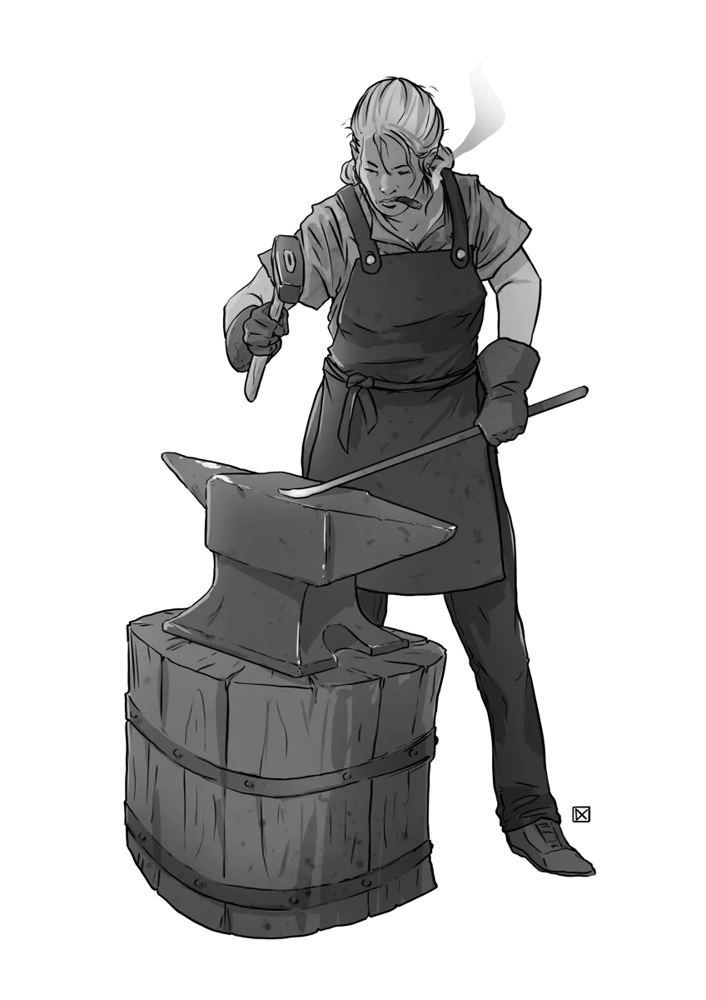

# Monster Generator

*The anvil is hot, the sparks are flying, and we're hammering the code into shape.*

{.monster-image-small .masked}

---

[[@Get Notified When The Generator Launches!]]

## A Monster Generator for 5E and Fantasy TTRPGs

Foe Foundry’s upcoming monster generator is designed for game masters running 5E TTRPGs. Whether you need a deadly boss, thematic minions, or just a spark of inspiration, this tool will help you summon something unforgettable.  

The monster generator isn't ready yet, but when it's complete, you'll be able to:

- Instantly create custom monsters packed with flavor and firepower.
- Scale creatures to match your party's level.
- Browse by theme, vibe, or environment.
- Save and share your creations with ease.

If you got some value from this completely free project, please consider [Supporting Foe Foe Foundry!](support.md)

## While You Wait

Check out the [**All Monsters Index**](monsters/index.md) to see Foe Foundry monsters in action while the generator is under construction.  

You can also be inspired by [**More than 600 Monster Powers**](powers/all.md) that you can easly drop onto any monsters! These are the same powers that the generator will let you pick and choose from when it's ready!
