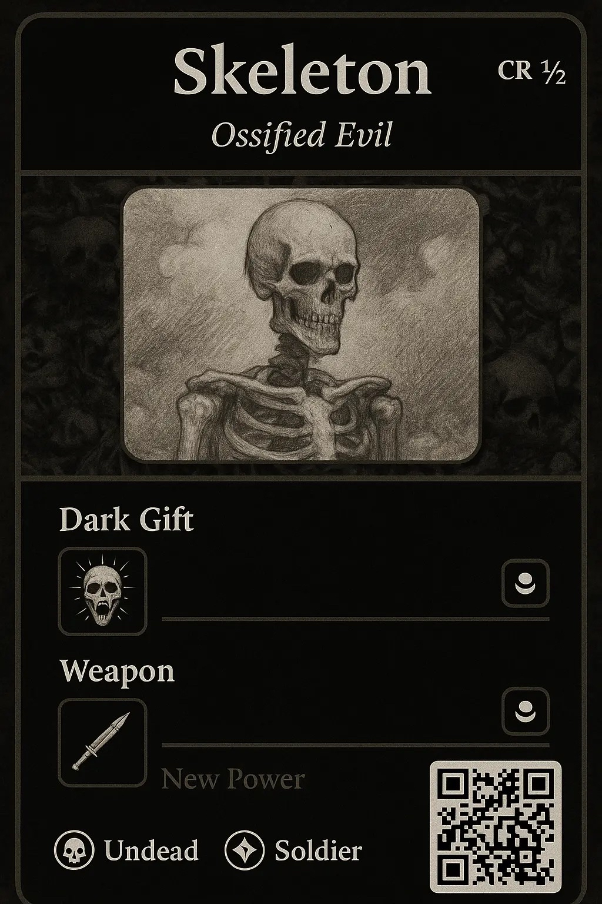

# 🧱 Foe Foundry Monster Generator UI — Design Notes & Implementation Tips

This document summarizes the UI/UX design strategy, mobile layout decisions, power editing interactions, and implementation tricks for the Foe Foundry monster generator.

---

## Overview

The goal of the monster generator is to allow users to customize D&D Statblocks. Each monster has the usual statblock information, as well as a **Monster Template**. This template includes a list of **Power Loadouts** that define the available **Powers** that the monster has.

Foe Foundry generates a monster by randomly choosing 1 power from each power loadout. These powers are then combined together and applied to the base statblock generated by the template, which then results in the final statblock.

The goal of the **Generator UI** is to allow the end user to choose which powers from the template to use (or to re-roll specific powers).

The user should be able to:

- see the monster at a glance (name, tag line, basic stats, monster image)
- see the available power loadouts and which powers are currently selected
- click (or tap) on the currently selected power in a loadout and see the other available options
- change the selected power in a loadout
- randomly re-roll the power in a loadout
- randomly re-roll all powers on the monster

## Monster Card Example

The overall UI has two major components:

- **Monster Card** - this is the editor that allows the user to see an overview of the monster and choose specific powers
  - called a "Card" because the design should take inspiration from a Magic the Gathering card
  - the design should also take inspiration from RPG video game design where you have a character sheet "paper doll" and various "item slots" that you can drop an item in. Instead of items, the "slots" are the power loadouts and the "items" are the powers that are selected
- **Statblock** - this is the rendered D&D 5E statblock representing the monster



## 🧭 Layout Strategy

### 🖥️ Desktop
- **Two-Pane Layout**:
  - **Left:** Monster Card (art, powers, tags, etc.)
  - **Right:** Statblock (updates live as powers change)
- Immediate visual feedback as users interact with powers

### 📱 Mobile
- **Tabbed Layout (Recommended)**:
  - Tab 1: `Card` — for editing and power interaction
  - Tab 2: `Statblock` — for reading the full monster details
- Prevents scroll disconnect by separating interaction (Card) from view (Statblock)
- Enables structured, clean interaction with mobile-appropriate spacing

---

## 🔁 Power Interaction UX

### Popup Tray (for selecting powers)
- Opens beneath clicked power slot on desktop
- Opens as **bottom sheet or modal** on mobile
- Includes:
  - List of available powers for that slot
  - 🎲 Randomize button
  - Optional tooltips or tags

### Toast + Auto-Switch (Hybrid Flow)
- After a power is changed:
  - Show a **toast** at bottom of screen:
    > 💀 *Dark Gift* changed to *Grave Touch*.  
    > Switching to statblock in 3...
  - Includes a visual countdown or progress bar
  - Auto-switches to the **Statblock** tab when the countdown ends
  - Optional: `Stay Here` or `Undo` button to cancel switch

---

## 📦 API & Data Strategy

### Updated API Response
Ensure API returns both:
- **Rendered HTML** (for the statblock)
- **Selected Power Metadata**, e.g.:

~~~json
{
  "html": "<div class='statblock'>...</div>",
  "selected_powers": {
    "dark_gift": {
      "name": "Grave Touch",
      "id": "power-grave-touch"
    },
    "weapon": {
      "name": "Rustblade",
      "id": "power-rustblade"
    }
  }
}
~~~

### Tag Power Spans in HTML
Enhance statblock HTML with `data-power-id` attributes:

~~~html
<div class="monster-ability" data-power-id="power-grave-touch">
  <strong>Grave Touch.</strong> The creature's attack deals necrotic damage...
</div>
~~~

---

## ✨ Highlight Changed Powers in Statblock

### CSS
```css
@keyframes flash {
  0%   { background-color: #444; }
  50%  { background-color: #888; }
  100% { background-color: transparent; }
}

.power-highlight {
  animation: flash 1.5s ease-in-out;
}
```

### JS
```js
function highlightPower(powerId) {
  const el = document.querySelector(`[data-power-id="${powerId}"]`);
  if (el) {
    el.classList.add("power-highlight");
    setTimeout(() => el.classList.remove("power-highlight"), 2000);
  }
}
```

---

## 📍 Anchoring the Power Tray

### JS Positioning
```js
function openPopup(anchorEl) {
  const popup = document.getElementById("popup-tray");
  const rect = anchorEl.getBoundingClientRect();

  popup.style.position = "absolute";
  popup.style.top = `${rect.bottom + window.scrollY + 6}px`;
  popup.style.left = `${rect.left + window.scrollX}px`;
  popup.style.display = "block";
}
```

### Click Outside to Close
```js
document.addEventListener("click", function(event) {
  const popup = document.getElementById("popup-tray");
  const isClickInside = popup.contains(event.target) || event.target.closest('.power-slot');

  if (!isClickInside) popup.style.display = "none";
});
```

---

## 🧩 Optional UI Enhancements

- Animate tab switch with sliding transitions
- Allow swipe gesture to switch between tabs (optional)
- Add toast log or undo history (for power changes)
- Use skeleton loading animation when statblock is updating
- Highlight statblock updates with glowing border or pulse

---

## 🛠 Component Summary

| Component        | Purpose                             |
|------------------|--------------------------------------|
| Card View        | Editable monster card UI             |
| Statblock View   | Readable statblock with highlights   |
| Power Tray       | Swap or roll new power               |
| Toast            | Confirm change, auto-switch to stat  |
| Tabbed Layout    | Switch between views cleanly          |
| API Enhancements | Allow structured power tracking      |
| JS Highlighting  | Visual feedback on power change      |
