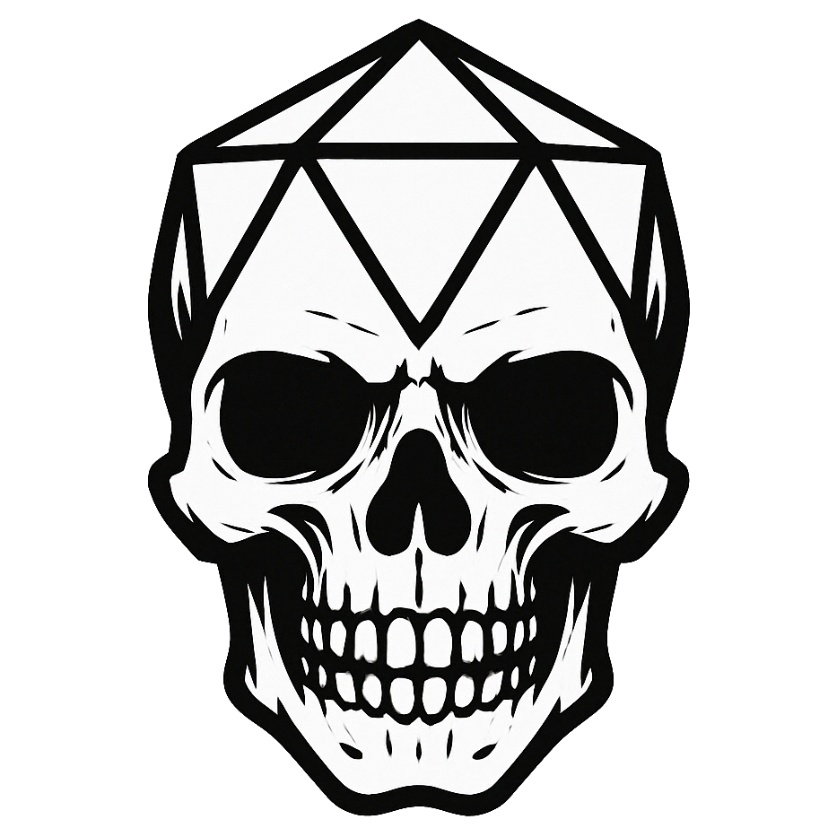

# Foe Foundry

{.brand-hero-image}

## Summon Unforgettable Monsters - Instantly!

- **Build Unique Monsters Instantly**: Create exciting, flavorful [Monsters](./monsters/index.md) in minutes. You're ready for that session tonight!
- **No More Boring Monsters**: Say goodbye to bland statblocks. [Foe Foundry](https://foefoundry.com) has hundreds of handcrafted powers.
- **Flavor AND Firepower**: Summon challenging foes that hit hard and ooze flavor. Only some are *actually* oozes!
- **Find Exactly What You Need** (Coming Soon): Discover monsters by theme, vibe, environment, or adventure hook - even when you don't know exactly what you're looking for!
- **Create the Perfect Encounter** (Coming Soon): Instantly generate balanced encounters based on terrain, themes, and adventure prompts.

---

## Try it out!

Here's a [[Lich]]. Check back again later, and it'll change!  

[Foe Foundry](https://foefoundry.com) monsters are built from a catalog of hundreds of powers and you'll always be able to find something new or interesting.  

[[!Lich]]  

 

[[$Lich]]  

 

Here's a [[Hydra]]. It's got even more possible powers than heads!  

[[!Hydra]]  

 

[[$Hydra]]  

 

---

## Handcrafted Powers. Endless Inspiration. 

[Foe Foundry](https://foefoundry.com) gives GMs the tools to create exciting, unique monsters without the grind. Summon foes packed with flavorful abilities, scale them instantly to your party's level, and get back to what matters - having fun and thrilling your players.

With a growing library of hundreds of handcrafted monster powers and templates, Foe Foundry makes monster creation fast, fun, and unforgettable.

---

## Built by a GM, for GMs

- **Human Designed, Procedurally Generated**. All Foe Foundry monsters are created from unique handcrafted powers that are intelligently combined to create the perfect monster. No AI art. No AI slop. Just monsters your players will love to hate!
- **Monsters should be threatening AND fun**. Foe Foundry monsters are guaranteed to pack a punch and still have narrative and mechanically interesting abilities
- **Built by a GM for GMs** to make your life easier and to be fun to run. No more bland "Bite, Claw, Claw" monsters.