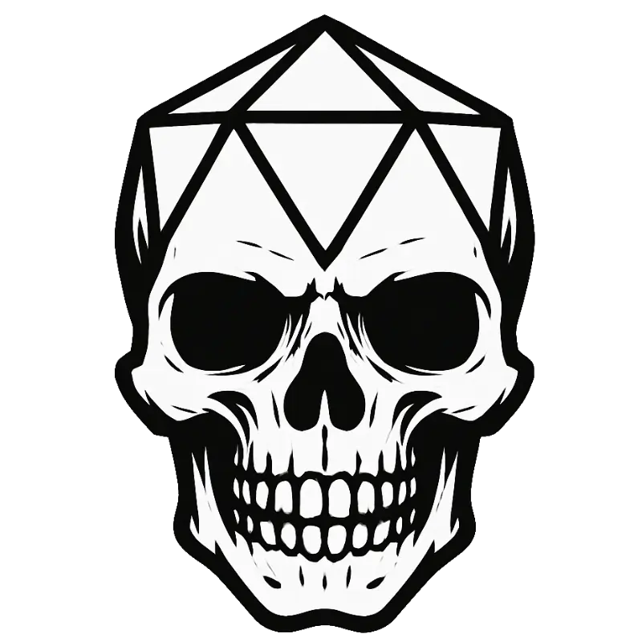

# Foe Foundry

{.brand-hero-image}

## Summon Unforgettable Monsters - Instantly!

- **Build Unique Monsters Instantly**: [Generate exciting, flavorful Monsters in minutes](generate.md). You're ready for that session tonight!
- **No More Boring Monsters**: Say goodbye to bland statblocks. Foe Foundry monsters are forged from [hundreds of handcrafted powers](./powers/all.md).
- **Flavor AND Firepower**: Our [monster library](./monsters/index.md) is full of challenging foes that hit hard and ooze flavor. Only some are *actually* oozes!
- **Find Exactly What You Need** (Coming Soon): Discover monsters by theme, vibe, environment, or adventure hook - even when you don't know exactly what you're looking for!
- **Create the Perfect Encounter** (Coming Soon): Instantly generate balanced encounters based on terrain, themes, and adventure prompts.

---

[[@Subscribe to the Newsletter]]

---

## Try it out!

Here's a [[Lich]]. Roll the die to generate a new one!  

[[!Lich]]  

 

[[$Lich]]  

 

Here's a [[Hydra]]. It's got even more possible powers than heads!  

[[!Hydra]]  

 

[[$Hydra]]  

 

Browse our growing [Monster Catalog](./monsters/index.md) and see monsters built from [hundreds of unique monster powers](./powers/all.md). You'll always be able to find something new or interesting.  

---

## Handcrafted Powers. Endless Inspiration. 

[Foe Foundry](https://foefoundry.com) gives GMs the tools to create exciting, [unique monsters](./monsters/index.md) without the grind. Summon foes packed with flavorful abilities, scale them instantly to your party's level, and get back to what matters - having fun and thrilling your players.

With a growing [library of 600+ of handcrafted monster powers](./powers/all.md) and templates, Foe Foundry makes monster creation fast, fun, and unforgettable.

---

## Built by a GM, for GMs

- **Human Designed, Procedurally Generated**. All Foe Foundry monsters are created from unique [handcrafted powers](./powers/all.md) that are intelligently combined to create the perfect monster. No AI art. No AI slop. Just monsters your players will love to hate!
- **Monsters should be threatening AND fun**. Foe Foundry monsters are guaranteed to pack a punch and still have narrative and mechanically interesting abilities
- **Built by a GM for GMs** to make your life easier and to be fun to run. No more bland "Bite, Claw, Claw" monsters.

---

[[@Subscribe to the Newsletter]]