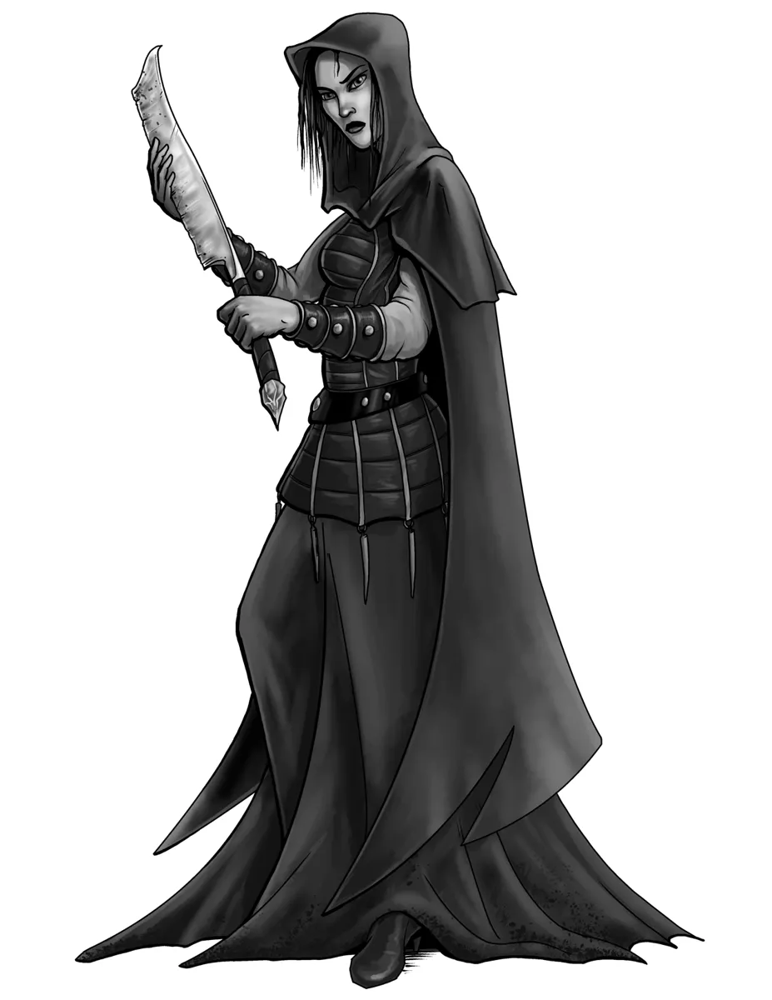

# Assassins

*Deadly Killers and Masters of Poison*

Assassins are highly trained killers who strike from the shadows. Many are mercenaries, slaying for coin, while others kill to advance political or ideological aims. In contrast to honorable [[knights]] or rank-and-file [[soldiers]], assassins prefer clandestine methods – stalking targets unseen and eliminating them with a single decisive blow. They are masters of stealth, deception, and toxins, employing these skills to ensure their victim is neutralized before a fight even begins. Some operate alone as freelance hitmen, while others belong to secretive guilds that teach the art of silent death and enforce strict codes of secrecy. The most notorious assassins attain near-legendary status, feared for their ability to slip past guards, kill without warning, and vanish without a trace.

{.monster-image .masked}

## Assassin Lore

- Assassins specialize in delivering quiet, sudden death. Many kill for pay as hired blades, while some serve fanatic causes or political agendas.
- An assassin might pose as a servant, guard, or friend until the moment to kill arrives.
- Elite assassins employ deadly poisons that can slay even the heartiest foe
- Legends say that shadowy organizations employ assassins to enforce their will through fear and targeted killing.

## Assassin Tactics

Assassins are [ambusher NPCs](../topics/monster_roles.md#ambusher) built for burst damage and swift escapes rather than prolonged battles. They excel at eliminating key targets in a single strike and withdrawing before they can be pinned down. Assassins often:

- Strike first and strike hard: They almost always attack from surprise or before their prey can react, utilizing abilities like [[Deadly Ambusher]] and [[Brutal Critical]] to dispatch their foes
- Utilize [[Toxic Poison]], [[Poisoned Attack]], or [[Weakening Poison]] to debilitate their foes
- Avoid being pinned down with [[Cunning Action]] and abilities like [[Hard to Pin Down]] and [[Nimble Reaction]]
- Exploit their opponent's weaknesses with [[Identify Weakness]] and [[Focus Shot]]

## Assassin Statblocks

[Foe Foundry](../index.md){.branding} provides a range of assassin statblocks from a mid-level [[Contract Killer]] up to an infamous [[Legendary Assassin]]. These NPCs are perfect for urban intrigue, political treachery, or any scenario where a blade in the dark threatens the heroes.

### Contract Killer

A mid-tier hired blade adept at striking from cover with poison and climbing into vantage points. [[Contract Killers]] often work for thieves' guilds, crime bosses, or corrupt nobles, eliminating inconvenient targets quietly.

[[!Contract Killer]]

[[$Contract Killer]]

## Assassin

An elite shadow operative trained to take out well-guarded targets with swift precision. They plan meticulously, strike when the moment is right, and use every trick (poisons, disguises, crossbows) to ensure the kill. Many assassins of this caliber are guild members or personal enforcers for powerful villains.

[[!Assassin]]

[[$Assassin]]

## Assassin Legend

A near-mythical master of assassination whose name is whispered in fear. An [[Assassin Legend]] is preternaturally skilled and equipped with special tools: they might employ explosive poison bombs or other deadly gadgets. This is the assassin who can single-handedly challenge an entire party and slip away to tell the tale.

[[!Assassin Legend]]

[[$Assassin Legend]]

## Assassin Encounter Ideas

These assassin-themed encounter ideas can inject intrigue and peril into any campaign, especially ones featuring espionage, betrayal, or stealth missions. Use them to challenge players with cunning enemies who don't fight fair:

- A [[Contract Killer]] approaches the party and asks for information about a target they seek. The target they describe is clearly one of the PCs, though the mercenary does not realize it yet.
- A spurned lover of one of the PCs has hired an [[Assassin]] to take out their former love
- A messenger approaches the party carrying a shiny, guilded scroll. As one of the PCs opens the letter, it simply reads "Die, scum!" as the [[Assassin]] drives a blade into their side.
- One of the PCs receives a mysterious notebook of bound black vellum. The inscription simply reads *"Write the name and bare the knife, strike the blow and still the life"*. Subsequent pages appear to just contain a single name written in blood. The last page contains the name of the PC. The notebook is the misplaced contract book of a [[Legendary Assassin]].

## Assassin Adventure Ideas

For a longer arc or campaign subplot, these adventure hooks involve assassins at the center of the story. Each idea features high stakes, morally gray choices, and opportunities for both stealth and combat as the PCs deal with lethal killers and their employers:

- A paranoid noble who believes he is being stalked hires the PCs to protect him at night. His fears turn out to be true, as a [[Contract Killer]] bursts into the manor later that night.
- At a royal banquet, an [[Assassin]] lurks among the servants in disguise. As toasts are raised, the assassin attempts to poison a visiting dignitary’s wine.
- A beautiful woman begs the heroes to help protect her from a ruthless [[Assassin]] that stalks her at night. Her tale is only half lies, as it turns out *she* is the assassin and the party her prey.
- A fanatic cult has hired a [[Legendary Assassin]] to kill all the leaders of each temple in the capital with a cursed black blade. So far, three of the four [[Priests]] have been slain. The fourth temple hires the PCs to protect their [[Archpriest]]