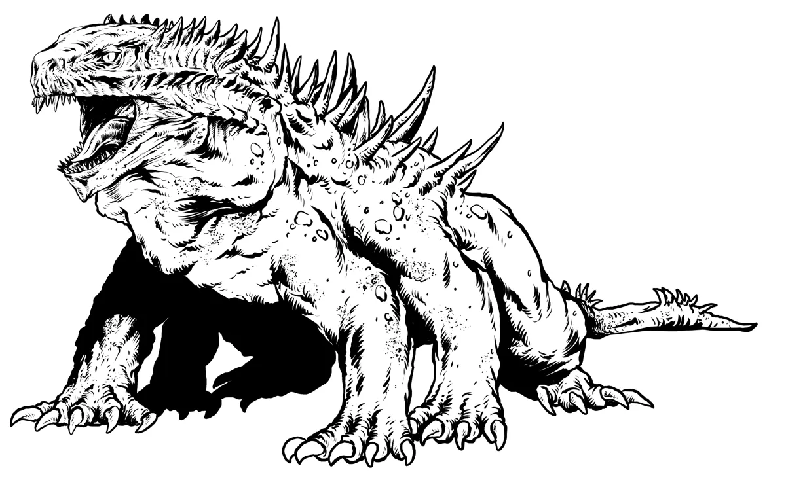

# Basilisks

*Reptilian Predators with Petrifying Gaze and Venomous Bite*

Basilisks are eight-legged reptilian monsters whose deadly gaze turns their victims to stone. They consider the petrified flesh of humanoids a particular delicacy. Newly hatched basilisks are often born amid fields of stone - their eggs laid among petrified victims to ensure a ready feast.

As a basilisk matures, minerals drawn from consumed petrified flesh crystallize along its spine and form jagged crystalline growths. These crystals glow warm when interacting with latent magical energy. For this reason, basilisks are particularly fond of regions with strong natural magical energies, and are known to be stubbornly territorial of their nesting grounds. Wizened hags and mad mages occasionally employ basilisk guardians for this very reason.  

A basilisk's bite delivers a potent venom that is lethal to the living; but paradoxically, it softens stone flesh, allowing the creature to devour its petrified prey. A skilled alchemist can transform the venom into an elixir that can reverse the petrification process. 

{.monster-image .masked}

## Lore

- The gaze of a basilisk is dangerous and turns its victims to stone
- Basilisks were created by a powerful curse from an Arch-Hag who desired fierce protectors for her lair
- Because basilisks enjoy eating petrified flesh, their venom can thaw the petrification process

## Tactics

The basilisk uses its [[Petrifying Glance]] or [[Petrifying Gaze]], focusing on creatures that have intruded on its territory or alternatively creatures that appear to be the easiest targets for a meal.

## Statblocks

### Basilisk

A [[Basilisk]] is a dangerous foe, with its venomous bite and petrifying gaze.

[[!Basilisk]]

### Basilisk Broodmother

As the matron of a pack, the [[Basilisk Broodmother]] is frequently surrounded by potential suitors and mates who rush to protect her. She fiercely and viciously guards her young.

[[!Basilisk Broodmother]]

## Basilisk Encounter Ideas

- A battered [[Veteran]] stumbles forward, begging the party to help as he turns to stone in front of the PC's eyes. 1d4 angry [[Basilisks]] are not far behind, infuriated by the intruders encroaching on their territory
- The PCs discover a toppled statue of an [[Owlbear]] with its entire hindquarters missing in a clearing. Many lizard-like tracks lead to and from the [[Basilisk]] feeding grounds. Something stirs in the underbrush nearby...
- The PCs hear the cracking and crunching of stone as a nearby [[Basilisk]] eats pieces of the statues of a petrified family that fell victim to its gaze. One of the statues of a young child appears to not be fully petrified
- A carriage made from a giant pumpkin drawn by 4 [[Basilisks]] barrels down the road. The cackling laughter of a **Hag** tumbles forth. She's late for her gala that begins at midnight.

## Basilisk Adventure Ideas

- A [[Bandit Crime Lord]] has put out a bounty for any who can retrieve a priceless ruby that a [[Basilisk Broodmother]] has mistaken for one of her eggs
- A secretive [[Druid]] hires the PCs to steal [[Basilisk]] eggs. She secretly wishes to raise a clutch of basilisks as protectors of a nearby wood that is being heavily hunted by the villagers
- An important NPC connected to the PCs has gone missing, turned to stone by an unfortunate encounter with a [[Basilisk]]
- A [[Hydra]] encroaches on the territory of a clutch of [[Basilisks]], enraging them. The conflict wreaks such havoc that the [[Priest]] of a nearby village begs the party to put an end to the wanton destruction. He can't offer much, but he does have a holy relic of a saint he is willing to offer.