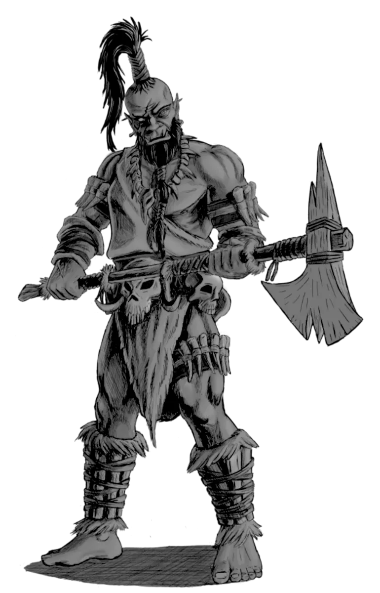

# Berserkers

*Battle-Frenzied Warriors of Blood and Glory*

- [Jump to Berserker Statblocks](#berserker-statblocks)
- [Jump to Berserker Encounters](#berserker-encounters)
- [Jump to Berserker Adventures](#berserker-adventures)

Berserkers are warriors gripped by a primal fury. Blood-soaked and unrelenting, a berserker is consumed by an adrenaline-fueled recklessness that drives them head-first into the fray.

Unlike disciplined soldiers such as [[Warriors]] or [[Guards]], [[Berserkers]] don't march or form ranks. They crash into battle as howling shock troops, disrupting formations and challenging the strongest enemy they can find. Their armor is light, their weapons heavy, and their bravado is absolute. 

Some fight for personal glory, others out of grief, vengeance, or sheer bloodlust. Many serve in tribal warbands led by [[Berserker Commanders]] - scarred veterans who inspire their kin with primal chants, brutal rituals, and the promise of a glorious death. These commanders channel strange rites and primal magic that heightens their prowess and binds their followers to them.

To a berserker, a good death is the only kind worth having. To fall in battle, weapon in hand, is the highest calling and the only way to earn a place amongst the storied heroes of old.

{.monster-image .masked}

## Berserker Lore

- Berserkers are lightly-armored, heavily-armed shock troops driven by rage and instinct
- They prefer charges and duels to formations and tactics
- Some are pit fighters or raiders; others are grief-stricken or zealously devoted to battle
- Berserkers rarely flee, for combat is both their purpose and calling

## Berserker Tactics

Berserkers are the classic [5E Bruiser](../topics/monster_roles.md#bruiser). They aren't mindless idiots, but they are also straightforward and aggressive in their approach:

- Berserkers rush vulnerable foes, ignoring formations to break lines and sow chaos
- They trade defense for offense, using powers like [[Reckless Flurry]] and [[Overrun]] to maximize damage output.
- Berserkers stay in the fight longer than expected, leveraging [[Bloodied Rage]] or [[Just a Scratch]] to push through wounds.
- They often call out the party’s fiercest warrior to a duel, using abilities like [[Challenge]], forcing high-stakes 1v1s to test their might.

---

## Berserker Statblocks

!!! info "More Martial NPC Statblocks"
    See [Soldiers and Fighters](../families/soldiers_and_fighters.md) for more martial NPC statblocks.

### Berserker

A [[Berserker]] is a frenzied warrior who charges headlong into danger, wielding brute strength and wild fury with no regard for defense.

[[!Berserker]]

### Berserker Veteran

A seasoned veteran of a hundred battles, the [[Berserker Veteran]] channels their rage with ruthless precision.

[[!Berserker Veteran]]

### Berserker Legend

Wherever they walk, battle follows. The [[Berserker Legend]] is myth made flesh, fighting as if to impress Death himself.

[[!Berserker Legend]]

---

## Berserker Encounters

Looking for berserker encounter ideas for 5E? These dynamic combat scenes drop your players into duels, last stands, and blood-soaked challenges against furious warriors.

- The PCs stumble across the corpse of a great monster (such as a [[Chimera]]) freshly killed and surrounded by the bodies of fallen [[Berserkers]]. A single warrior clings to life, waiting to pass on the saga of the fallen
- A dwindling band of [[Berserkers]] makes a heroic last stand against an overwhelming squad of **Hobgoblins**. Despite being outnumbered, they refuse to break.
- The PCs interrupt two [[Berserker Veterans]] engaged in ritual combat. The two rivals meet each day at noon to continue their decade-long feud.
- The only bridge over a dangerous chasm is guarded by a [[Berserker Legend]] who will only let worthy combatants pass. She took a vow to never let a coward pass.

## Berserker Adventures

These berserker-themed 5E adventure hooks add emotional depth, deadly rivalries, and mythic stakes to your next sessions and are perfect for one-shots or ongoing campaigns.

- A [[Berserker Veteran]] has been exiled for the one crime their kind cannot forgive - cowardice in battle. In truth, another warrior fled the field and cast blame to preserve their own honor, and now sings songs of false victory. Hunted and disgraced, the veteran seeks the party's help to lure the traitor into a formal duel to reclaim their honor.
- A beautiful but desperate woman hires the party to free her former lover, a captured warrior now forced to fight as a [[Berserker]] in brutal gladiatorial matches. Once a proud soldier, he's become a blood-soaked spectacle and is convinced she betrayed him. In truth, she tried to ransom him after his capture, but her payment was intercepted by a rival **Noble** who intends to see him die in the pit.
- The party is hired to stop a duel between Lorentz, a grieving tribal chieftain ([[Berserker Veteran]]), and Julen, a **Noble** heir. At first, it seems like a political feud, until the party learns that Julen and Lorentz’s sister Romara were secret lovers, and her recent death in childbirth is the spark for this blood feud.
- A [[Death Cultist Grand Master]] and his cult have robbed the grave of a [[Berserker Legend]] as part of a foul plot to resurrect the warrior as an undead slave to their cause. To do so, they must collect two of his three famed weapons. Each relic was entrusted to one of the legend’s proteges, now war-chieftains locked in a brutal three-way feud. The party must navigate their rivalries before the cult claims the blades and unleashes the legend’s fury against the living.

---

## FAQ: Berserkers in 5E

**What is the CR and XP for a standard Berserker in 5E?**  
The baseline Berserker is Challenge Rating 2 and awards 450 XP. Foe Foundry offers tougher variants like the [[Berserker Veteran]] and [[Berserker Legend]] for higher-tier encounters.

**What makes Berserkers different from other melee monsters?**  
Berserkers are reckless shock troops who rush into combat without fear. They favor raw aggression over tactics, often using powers like [[Reckless Flurry]], [[Wild Cleave]], and [[Bloodied Rage]].

**Is this the same as the “Path of the Berserker” barbarian subclass?**  
No. *Path of the Berserker* is a player-facing subclass for barbarians. Berserker monsters are NPC enemies with their own statblocks and behaviors, though they share similar themes of rage and fearlessness.

**How do I roleplay or describe a Berserker in combat?**  
Berserkers scream war cries, taunt foes into duels, and seem to welcome death. Some fight for honor or grief, others for glory or sheer bloodlust.

**Can Berserkers be used as allies or party NPCs?**  
Yes. A berserker might serve as a bodyguard, rival, or tragic companion — especially if the party respects their code of honor or helps them reclaim lost glory.

**What environments or cultures do Berserkers come from?**  
Berserkers often hail from tribal warbands, remote frontiers, or warrior cults. They're common in harsh climates, contested borderlands, or anywhere honor and battle are sacred.

**How do Berserkers interact with fear, charm, or mind control?**  
All [Foe Foundry](../index.md){.branding} [[Berserkers]] are immune to being *Frightened*. The [[Berserker Legend]] is also immune to being *Charmed*. This is due to their sheer ferocity overpowering any foreign mental influence.

**What’s the best level for a Berserker encounter?**  
A single berserker (CR 2) with 4 [[Shock Infantry]] fits well against a level 4 party. Veterans and Legends are suitable for mid to high-tier play and can be used as solo minibosses or elite skirmishers.

**How are Berserkers different from barbarians in 5E?**  
Barbarians are player characters with custom class features like Rage and Reckless Attack. Berserkers are monsters — often simpler, but built to deliver high-risk melee pressure in combat.

**Can Berserkers use magic or rituals?**  
Some can. [Foe Foundry's](../index.md){.branding}  [[Berserker Legends]] wield minor rites, war chants, or battlefield blessings to inspire allies and invoke ancient pacts before battle.