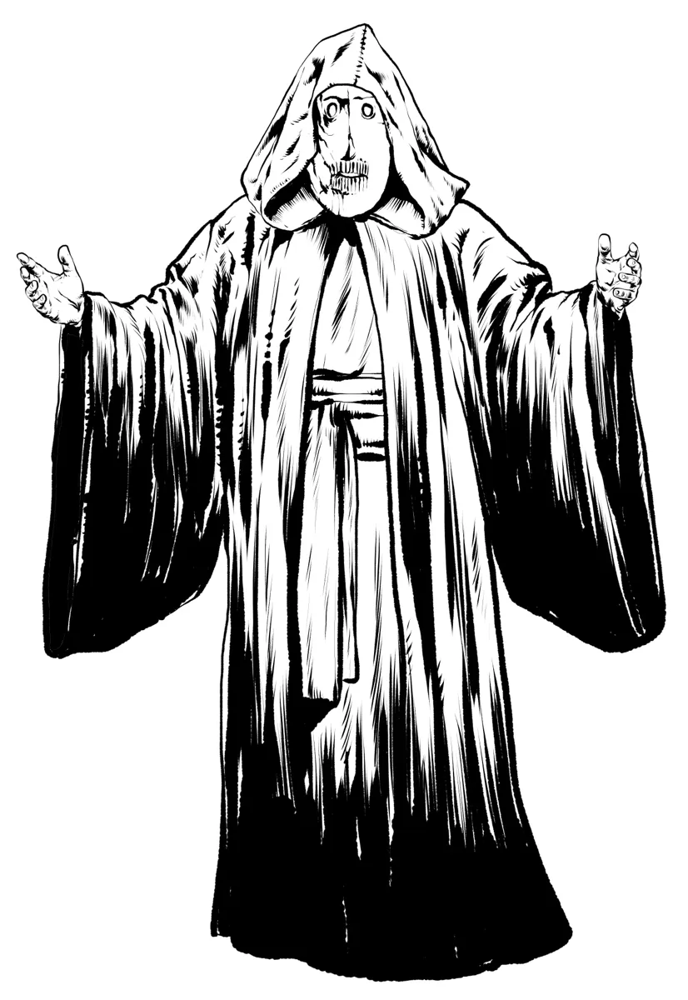

# Cultists

*Worshippers of the Occult and Forbidden*

**Cultists** are driven by devotion. Cults dedicate themselves towards powers or entities deemed unnatural, heretical, taboo, or alien. To others, these beliefs would be considered dangerous and unnatural, but to their own, they are seekers of forbidden truth.  

Where **Priests** seek structure and hedge their prayers in rigid symbols and scripture, **Cultists** plunge headlong into devotion, pledging themselves to their cause.

Cults usually center around a singular leader who commands the absolute loyalty of all its members - a prophet, possessed oracle, or heretical priest. These leaders interpret the will of the cult's enigmatic patron and hold the loyalty of their followers through charisma or manipulation.

Many cultists are driven by ambition. They offer blood, loyalty, or sanity in exchange for power and miracles denied to them by the traditional belief systems. Some genuinely believe they are chosen to herald a great new age, while others simply seek power in exchange for service. Many cultists fall into a cult through desperation or isolation. To them, the cult offers meaning and belonging where society offers none. After all, the [gods are distant and unknowable](../topics/faith.md#distant-gods), so who is to say their faith is misplaced?

Cultists often claim their patrons are no more dangerous than the so-called “saints” of old. They ask: if a priest draws miracles from a silent god, and a cultist draws power from a whispering one, who is the true blasphemer? When power flows, and the gods remain silent, does it matter what name you cry out in the dark?

{.masked .monster-image}

## Cult Archetypes

While united by structure and secrecy, cults differ widely in their beliefs and patrons. [Aberrant cults](#aberrant-cultist-statblocks) serve ancient things beyond reason. [Death cults](#death-cultist-statblocks) venerate entropy and the veil beyond. [Fiend cults](#fiend-cultist-statblocks) bargain with demonic powers for mortal gain. Each shapes its rites and hierarchy according to its dark revelations.

## Cultist Statblocks

### Cultist

A [[Cultist]] is a rank-and-file believer, willing to kill or die in service of their faith. Often found guarding ritual sites or carrying out their leader’s will without question.

[[!Cultist]]

### Cultist Fanatic

A [[Cultist Fanatic]] is gripped by zealous fervor, fighting with reckless abandon and unshakable belief. They are the first to charge into danger, certain that their devotion shields them. These fanatics have acquired powerful magic through their dark rituals.

[[!Cultist Fanatic]]

### Cultist Grand Master

The [[Cultist Grand Master]] is the leader of a local cult chapter. Charismatic, narcissistic, and absolutely ruthless, they command forbidden rituals and throngs of slavish followers with terrifying authority.

[[!Cultist Grand Master]]

### Cultist Exarch

The [[Cultist Exarch]] is a rare and powerful cultist who has transcended flesh or sanity in service of their patron. Their body is merely a vessel for the will of something far greater.

[[!Cultist Exarch]]

## Aberrant Cultist Statblocks

Aberrant cultists worship entities of madness, the void, and impossible geometry. Their minds have been touched by alien truths, and their rituals twist the very fabric of reality.

### Aberrant Cultist Initiate

An [[Aberrant Cultist Initiate]] is a novice touched by the aberrant. They may stammer nonsense or speak in tongues, but beneath their madness lies an unsettling clarity.

[[!Aberrant Cultist Initiate]]

### Aberrant Cultist

The [[Aberrant Cultist]] wields psionic abilities or summons impossible entities that should not exist.

[[!Aberrant Cultist]]

### Aberrant Cultist Grand Master

Warped by eldritch powers beyond the Mortal Realm, the [[Aberrant Cultist Grand Master]]'s sanity has long since abandoned them.

[[!Aberrant Cultist Grand Master]]

## Death Cultist Statblocks

Death cults venerate entropy, undeath, or the annihilation of all things.

### Death Cultist Initiate

A grim-faced [[Death Cult Initiate]] studies the veil between life and death. Their rituals often involve bloodletting, bone charms, and whispered funerary chants.

[[!Death Cult Initiate]]

### Death Cultist

A [[Death Cultist]] is fully inducted into the ranks once they have shepharded at least five souls into death in the name of the cult.

[[!Death Cultist]]

### Death Cultist Grand Master

The [[Death Cultist Grand Master]] is in direct service to a [Greater Undead](../families/undead.md#greater-undead), perhaps hoping to learn the secrets to [Lichdom](../monsters/lich.md).

[[!Death Cultist Grand Master]]

## Fiend Cultist Statblocks

Fiend cultists have made infernal bargains with devils or demons, trading their souls for mortal power.

### Fiend Cultist Initiate

Eager to prove their worth, these initiates may bear the mark of infernal pacts and speak the names of demons in prayer.

[[!Fiend Cultist Initiate]]

### Fiend Cultist

A warlock in all but name, drawing flame, shadow, or corruption from their patron. They often serve as shock troops in infernal cults.

[[!Fiend Cultist]]

### Fiend Cultist Grand Master

This leader speaks directly with their fiendish master and bears infernal blessings—claws, wings, or worse. Their ambition burns as hot as the hellfire they wield.

[[!Fiend Cultist Grand Master]]

## Encounter Ideas

Explore dark cultist encounter ideas for 5E, perfect for dropping into any campaign featuring forbidden rituals, infernal pacts, or eldritch horror.

- A kind, well-dressed traveler joins the party's caravan. The [[Cultist Fanatic]] wears strange jewelry, speaks of an imminent "new age", and invites the party to a meeting being held soon.
- The party enters an ancient sealed chamber to find a perfectly intact ruin with a [[Death Cult Grand Master]] meditating, surrounded by the bones of other failed cultists. The cultist offers the party the secret to eternal life if they join in her meditation.
- An eerie melody drifts over a completely still lake, punctuated with cries for help - the mind-altering songs of a group of [[Aberrant Cultists]] preparing to ritually sacrifice a victim
- The party discovers a hidden bazaar where [[Fiend Cultists]] run a black market, trading years of your life for magic, luck, or vengeance. The cult patron's seal ensures the deals are binding.

## Adventure Ideas

Dive into cult-themed adventure ideas for fantasy TTRPGs, featuring sinister plots, hidden cabals, and high-stakes missions against death cults, aberrant prophets, and fiendish conspiracies.

- The PCs spend the night in a suspiciously well-off town, surrounded by famine and war. During the night, the [[Fiend Cultist]] townsfolk attempt to kidnap one of the PCs to sacrifice to the fiendish patron protecting the town.
- The PCs are offered a handsome reward to compete in team gladiatorial combat. The competition is secretly being run by an [[Aberrant Cultist Grand Master]] who plans on sacrificing the winners to the cult's eldritch patron
- A distressed **Noble** tearfully begs the PCs to hunt down the blasphemous [[Death Cultists]] who disinterred the body of his recently deceased wife.
- A [[Cultist Fanatic]] regrets the pact they swore and offers to help the PCs take down the cult from within, if they can find a way to break the hold that the [[Cultist Grand Master]] has on them