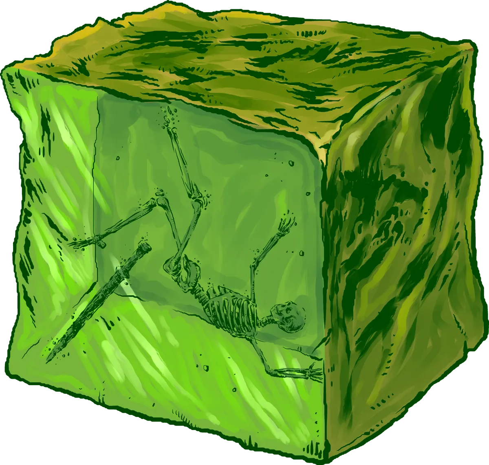

# Gelatinous Cubes

*Acidic, Nigh-Invisible Dungeon Cleaner*

A Gelatinous Cube is a silent, quivering mass of acidic goo that dissolves any organic material unfortunate enough to get caught inside. These cubes glide slowly and silently through dungeons, caverns, and other forgotten caverns, with eerie purpose, as if some deeper instinct compels their mindless patrol.

Unless it's recently dined, a gelatinous cube is nearly invisible. Many a would-be hero has walked directly into one, only to add their gear to the cube's collection. Over decades, cubes expand to fill available space, with some ancient cubes reaching tremendous sizes.

From classic D&D dungeons to modern 5E campaigns, Gelatinous Cubes remain a deadly, near-invisible menace waiting to engulf unwary adventurers.

## Gelatinous Cube Lore

- Gelatinous Cubes glide toward their prey without hesitation, as if guided by some deeper mysterious instinct
- Once engulfed, escape is rare. The cube immediately begins digesting its prey
- The contents of a cube often include more than bones: half-dissolved scrolls, rusted crowns, or the final relics of an unlucky party.
- **Gelatinous Cubes** are often classified as distant relations to **Ochre Jellies** and **Black Puddings** by adventurers due to their similar ooze-like consistency, but many scholars believe these specimens to only have superficial similarities

## Gelatinous Cube Tactics

Gelatinous Cubes are mindless entities driven to absorb any organic matter in their path. The cube simple dashes towards the largest concentration of foes that it can sense.

{.monster-image .masked}

---

## Gelatinous Cube Statblocks

### Gelatinous Cube

[[!Gelatinous Cube]]

[[$Gelatinous Cube]]

### Ancient Gelatinous Cube

An **Ancient Gelatinous Cube** has absorbed so much organic material that it has swollen to tremendous size. Some are rumored to contain entire treasure hoards from the assortment of misfortunate adventurers they have absorbed over the decades.

[[!Ancient Gelatinous Cube]]

[[$Ancient Gelatinous Cube]]

## Gelatinous Cube Encounter Ideas

- A panicked NPC barrels past the party, screaming about something hunting them. Before anyone can react, they run headfirst into what looks like empty space and vanish mid-sprint into a **Gelatinous Cube**.
- A gleaming sword glows softly as it floats toward the party, gripped by the skeletal hand of a long-dead adventurer. It’s only when the bones bob and twist that the party notices the faint shimmer. The sword (and its former owner) are suspended inside a **Gelatinous Cube**.
- An ancient **Revenant** is forever trapped inside a **Gelatinous Cube**. Half disolved, it reaches toward the party and implores with gestures to be freed. It wishes only to continue its quest to hunt down those that wronged it.
- A droplet hits a character’s cheek with a soft hiss. Above them, the ceiling glistens and begins to descend. One or more **Gelatinous Cubes** cling to the ceiling, melting downward like slow, acidic raindrops.

## Gelatinous Cube Adventure Ideas

- A fast-talking **Mage** hires the party to capture a **Gelatinous Cube** alive — "For purely academic reasons, of course." She provides a suspiciously unstable containment field and dubious advice like "Try not to get engulfed."
- A wealthy **Noble** hires the party to rescue his daughter’s rookie adventuring group from a nearby dungeon. Inside, the halls are strangely clean with just a faint acidic scent revealing the work of one or more **Gelatinous Cube**. The daughter's bracelet floats, undisolved, inside one of the cubes.
- An overconfident alchemist hires the party to "field-test" a new Ooze-Dissolving Draught™. When thrown at the **Gelatinous Cube**, it causes it to bubble, shimmer, and suddenly grow in size and transform into an **Ancient Gelatinous Cube**
- The party has been hired to recover lost treasure of an eccentric mage. The mage created a special vault and enchanted an **Ancient Gelatinous Cube** to store the treasure within its gloopy body.