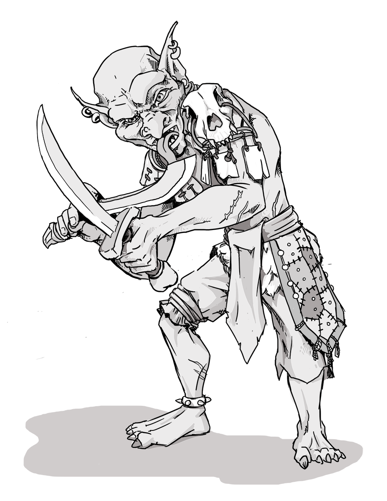

# Goblins

*Chaotic tricksters, pillagers, and endless nuisances*

Though goblins are small in stature, they are mighty in mayhem. Long ago, the ancestors of modern goblins slipped into the Mortal Realms from the faerie and simply never left. What began as chaotic mischief soon turned into centuries of shrieking raids, barn burnings, and general unpleasantness, much to the exasperation of neighboring settlements.  

Goblin society is the embodiment of noise, chaos, and pilfered loot. Though goblins thrive in chaos, they paradoxically have a complex hierarchy which allows high status goblins to bully and belittle those of lower status. What defines status can vary from week to week. Some highlights include strongest odor, most number of sheep stolen, and most inventive insults hurled. Occasionally, a goblin raised outside this chaotic environment might find a different path. Goblins aren't inherently evil, but put a few together and trouble surely follows.  

Though goblins are cunning and inventive, they are also notorious cowards. They only strike when the odds are incredibly stacked in their favor and swarm from the shadows in overwhelming numbers before melting back into the underbrush with unsettling speed.  

Goblin warrens are often found in forgotten ruins, winding cave complexes, and anywhere decent folk would rather avoid. When not being kicked into line by the loudest and most reckless leaders, goblins often fall under the sway of more powerful orc or hobgoblin warlords, where they are treated as expendable cannon fodder. This has led some scholars to incorrectly lump goblins as relatives of [Orcs](./orc.md).

## Goblin Lore

- "For every goblin you see, there's two more you don't. And a third cowering in a corner" - old saying
- Scholars believe goblins once came from The Faerie but decided the Mortal Realms were ripe for more mayhem
- Goblins don't fight fair. They're equally happy to sneak, ambush, or fight loudly screaming profanities.
- Goblins are often under the sway of more powerful [Orc](orc.md) and Hobgoblin warleaders.

### d6 Goblin Titles

| d6 | Goblin Title              |
|----|---------------------------|
| 1  | Grand Bug Squisher        |
| 2  | Yeller-in-Chief           |
| 3  | Ratbait Deluxe            |  
| 4  | Duke of Shiniez           |
| 5  | Official Screamster       |
| 6  | Assistant to the Stab King|

### Numanoids or Fey?

In Foe Foundry, Goblins count as **both** Humanoids or Fey. This means that any ability that targets or requires either a Humanoid or Fey will work on a Goblin. Why make this change? The 2024 Monster Manual categorizes all goblins completely as fey, which hoses a variety of abilities that work specifically on humanoids. Goblins have a long tradition of being humanoid, and many GMs even allow players to play as goblins.

## Goblin Tactics

Use these tips to run goblins as fast-paced, memorable chaos-monsters in your 5E combat.

Goblins never fight fair and never fight alone. They strike only when they outnumber their foes, using ambushes, traps, and terrain to their advantage. A goblin would rather shoot from hiding and run than trade blows face to face. In battle, they’re loud, mobile, and infuriatingly slippery. Unless a stronger leader is barking orders, goblins scatter the moment things turn against them.

## Goblin Statblocks

These goblin statblocks are ready to drop into your next 5E TTRPG session. Each statblock is designed to capture the mayhem and mischief that goblins embody.

### Goblin Lickspittle

The smallest and weakest goblins are known as [[Goblin Lickspittles]], often serving as minions to more powerful goblins or as scouts and foragers. Lickspittles are often sent in first ("for funsies") to scout or check for traps.

[[!Goblin Lickspittle]]

### Goblin

[[Goblin]] warriors attack with overwhelming numbers and withdraw before their enemies can retaliate. They're also fond of setting ambushes.

[[!Goblin]]

### Goblin Brute

[[Goblin Brutes]] are larger and stronger than their kin, and they wield heavy weapons to crush their foes.

[[!Goblin Brute]]

### Goblin Foulhex

A [[Goblin Foulhex]] has mastered the art of channeling the power of mischievous gods and spirits into a stream of foul language. They often serve as apprentices to a slightly more reverent [[Goblin Shaman]].

[[!Goblin Foulhex]]

### Goblin Shaman

[[Goblin Shamans]] have learned to supplement their mischievous magic with a stronger connection to the elemental and ancestral spirits. This makes them seem quite wise to the traditional goblin.

[[!Goblin Shaman]]

### Goblin Boss

[[Goblin Bosses]] are larger and stronger than their kin, and they have a knack for inspiring their fellows to fight harder. Usually, by kicking their smaller and weaker subordinates.

[[!Goblin Boss]]

### Goblin Warchief

A [[Goblin Warchief]] has managed to collect multiple other subservient [[Goblin Bosses]] into a single, chaotic horde.

[[!Goblin Warchief]]

### Goblin Encounter Ideas 

These goblin encounter ideas for 5E are table-ready, open-ended, and designed to drop your players into chaotic, memorable situations. Each prompt sets the stage for mayhem, negotiation, or total disaster.

- A nearby barn is burning, but what's more surprising is the gang of [[Goblins]] piling onto the back of panicked farm animals charging straight towards the PCs.
- A group of [[Goblin Brutes]] come sledding recklessly down a nearby hill, being chased by an enraged [[Manticore]]. The goblins cackle nonsense about stealing the Manticore's eggs.
- The PCs have trespassed into goblin territory. A [[Goblin Boss]] demands they pay tribute or retreat immediately lest his horde of [[Goblins]] will strike from the underbrush. The goblins demand whacky tribute like the all of the party's socks and boots.
- The PCs stumble upon a secret black market trading stolen and illicit goods run by a cabal of [[Goblin Foulhexes]]. Violence is forbidden unless someone tells a bad joke.

## Goblin Adventure Ideas

These goblin adventure ideas for 5E are designed to spark multi-session story arcs filled with chaos, negotiation, and unexpected alliances. Each hook introduces a situation that can spiral into a full-blown campaign thread. These adventure hooks are perfect for GMs who want goblins to be more than random encounter fodder.

- An [[Orc Warchief]] has enslaved several goblin tribes after slaying the former leaders. A [[Goblin Foulhex]] and a contingent of loyalists approach the party with an offer to team up and take down the warlord, promising a portion of the treasure in return.
- A village near a swamp is being harassed by [[Goblins]] who claim the land is their ancient birthright, gifted by a Hag. The PCs have been hired as negotiators to resolve the dispute and are authorized to buy the goblins out or eliminate the threat entirely.
- The PCs have been tasked with recruiting a goblin [[Legendary Warrior]] who now runs a secret coliseum in the sunken ruins of a lost outpost. The warrior will only entertain the PC's request if the PCs first defeat his champions.
- A frustrated merchant has hired the PCs to deal with a tribe of goblins that have cornered the market on a hallucinnogenic mushroom. The tribe is led by a council of [[Goblin Shamans]] who have partaken in a few too many of the mushrooms themselves.

---

## FAQ

### Are goblins fey or humanoid in 5E?

In Foe Foundry, goblins count as both Humanoids and Fey, combining their classic identity with the newer 2024 Monster Manual classification. This allows spells and abilities that affect either type to work on goblins, increasing both tactical flexibility and flavor.

### What are some fun goblin adventure hooks for D&D 5E?

Goblin adventures don't have to be simple ambushes. Foe Foundry’s [goblin hooks](#goblin-adventure-ideas) include mushroom cartels, coliseum bosses, and chaotic negotiations with fey-claimed swamp tribes—perfect for sparking multi-session arcs full of surprises.

### Why do goblins love socks so much?

It’s unclear, but some say it’s the texture. Others say it's just to make you uncomfortable. Try asking the next goblin you capture.