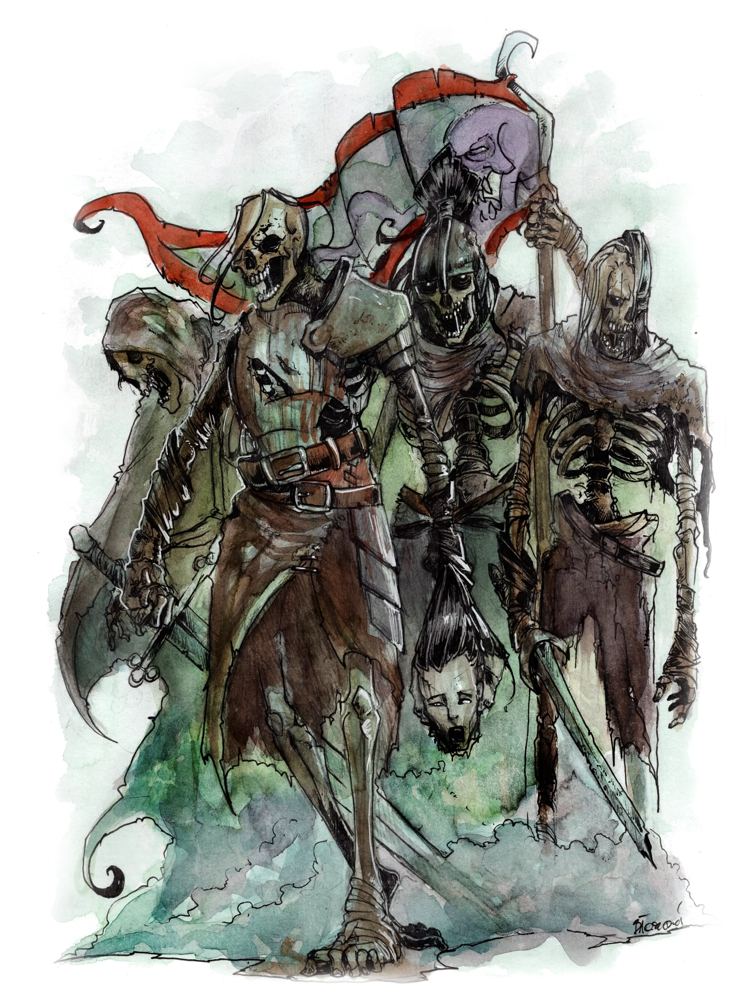

# Foe Foundry Monsters

## Undead

Bleached bones. Rotting flesh. Soul fragments clawing their way back to life from the River Styx. The [Undead](../families/undead.md) of Foe Foundry aren't just cannon fodder. They're cursed echoes of mortal lives, each with their own twisted flavor.

- [Skeletons](skeleton.md) - fragments of a soul bound to bleached bones
- [Zombies](zombie.md) - shambling relentless hordes
- [Ghouls](ghoul.md) - ravenous cannibals possessed by undeath
- [Spirits](spirit.md) - echoes of rage and regret
- [Wights](wight.md) - deathly cold malignant warriors of old
- [Necromancers](mage.md#necromancers) - mortal mages practicing heretical dark arts
- [Liches](lich.md) - immortal masters of undeath and arcana

{.monster-image}

## Monstrosities

Monstrosities defy nature: ancient experiments, magical amalgams, and living symbols of disaster.

- [Mimics](mimic.md) - paranoia-inducing shapeshifting ambusher
- [Manticores](manticore.md) - flying hunters with spiked tails and sharper tongues
- [Owlbears](owlbear.md) - unnaturally territorial predators
- [Chimeras](chimera.md) - monstrous messenger of imminent disaster

{.monster-image .masked .white-background}

## Humanoids

Not all threats crawl from crypts. Some wear robes and carry grimoires. These monsters think, plan, and cast.

- [Mages](mage.md) - master of arcane magicks

{.monster-image .masked .white-background}

## Oozes

Slimes, jellies, and cubes. Silent, shapeless, and strangely efficient.

- [Gelatinous Cubes](gelatinous-cube.md) - acidic, nigh-invisible dungeon cleaner
