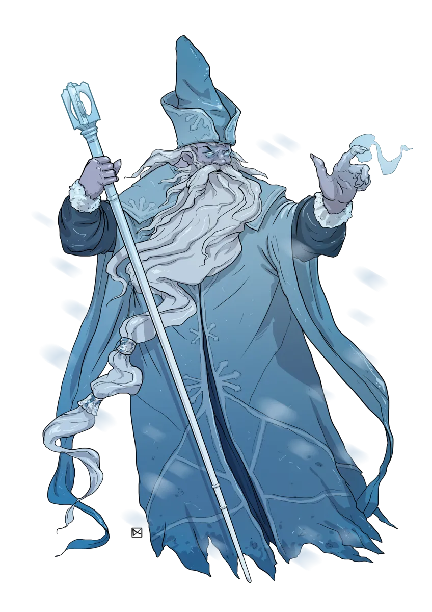

# Foe Foundry Monsters

## Humanoids

Not all threats crawl from crypts. Some wear robes and carry grimoires. These monsters think, plan, and cast.

- [Cultists](cultist.md) - worshippers of the occult and forbidden
- [Goblins](goblin.md) - little balls of mischief and mayhem
- [Mages](mage.md) - master of arcane magicks
- [Orcs](orc.md) - bloodrage-fueled ancestral warriors
- [Priests](priest.md) - faithful instruments of the divine

{.monster-image .masked .white-background}

## Undead

Bleached bones. Rotting flesh. Soul fragments clawing their way back to life from the River Styx. The [Undead](../families/undead.md) of Foe Foundry aren't just cannon fodder. They're cursed echoes of mortal lives, each with their own twisted flavor.

- [Ghouls](ghoul.md) - ravenous cannibals possessed by undeath
- [Liches](lich.md) - immortal masters of undeath and arcana
- [Necromancers](mage.md#necromancers) - mortal mages practicing heretical dark arts
- [Skeletons](skeleton.md) - fragments of a soul bound to bleached bones
- [Spirits](spirit.md) - echoes of rage and regret
- [Wights](wight.md) - deathly cold malignant warriors of old
- [Zombies](zombie.md) - shambling relentless hordes

{.monster-image}

## Monstrosities

Monstrosities defy nature: ancient experiments, magical amalgams, and living symbols of disaster.

- [Chimeras](chimera.md) - monstrous messenger of imminent disaster
- [Manticores](manticore.md) - flying hunters with spiked tails and sharper tongues
- [Merrow](merrow.md) - demonically twisted merfolk
- [Mimics](mimic.md) - paranoia-inducing shapeshifting ambusher
- [Owlbears](owlbear.md) - unnaturally territorial predators

{.monster-image .masked .white-background}

## Oozes

Slimes, jellies, and cubes. Silent, shapeless, and strangely efficient.

- [Gelatinous Cubes](gelatinous-cube.md) - acidic, nigh-invisible dungeon cleaner
