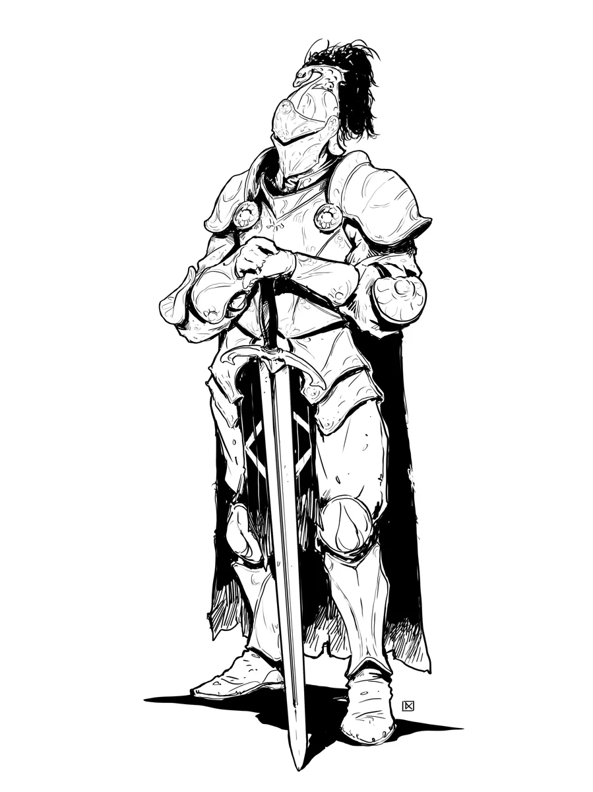

# Knights

*Champions Bound by Armor and Oaths*

- [Jump to Knight Statblocks](#knight-statblocks)
- [Jump to Knight Encounters](#knight-encounter-ideas)
- [Jump to Knight Adventures](#knight-adventure-ideas)

[[Knights]] are elite warriors sworn to serve a cause greater than themselves. Many serve monarchs, faiths, or noble houses, while others pursue their own ideals. They are trained from youth in the arts of war, steeped in honor, and armored for battle. Whether rallying troops, dueling for glory, or riding into battle under sacred banners, knights blend martial skill with purpose.

Most are cavalry soldiers, but not all knights ride **Warhorses**. Some fight on foot or from the backs of exotic beasts such as a **Griffon**. A knight may command soldiers, uphold ancient codes, or seek redemption on a perilous quest. At higher ranks, knights swear divine oaths that grant them miraculous powers fueled by faith, conviction, or zeal.

{.masked .monster-image}

## Knight Lore

- Knights are highly trained warriors who fight with discipline, precision, and honor
- Most swear fealty to a liege, faith, order, or cause, but some are oathless wanderers
- They often lead soldiers into battle, command squires, or act as noble champions
- Higher-ranking knights may gain divine powers through holy oaths and miracles
- Knights fight with skill and tactics, often trained in advanced martial techniques

## Knight Tactics

Knights are [Soldier Role NPCs](../topics/monster_roles.md#soldier) who lead from the front and dominate the battlefield. Knights frequently:

- Use powers like [[Command the Attack]], [[Parry and Riposte]], and [[Zone of Control]] to dictate the flow of battle
- Protect allies with [[Interception]], [[Disciplined]], or [[Taunt]] while punishing reckless foes
- Coordinate with allies using [[Rally the Troops]] or [[Stay in Formation]]
- Engage in mounted combat, where terrain allows it, with abilities like [[Mounted Warrior]] or [[Griffin Knight]]
- High-CR knights use oath-bound powers such as [[Divine Smite]] to devastate enemies or inspire nearby troops

---

## Knight Statblocks

From loyal squires to oathbound champions, these knight statblocks scale to suit any campaign. Knights are perfect for elite castle guards, tournament champions, or wandering paladins.

### Knight

A capable and loyal combatant trained in the arts of war, the basic [[Knight]] leads by example and holds the line with skill and determination.

[[!Knight]]

## Knight of the Realm

These prestigious knights serve kings, queens, and high lords. A [[Knight of the Realm]] combines martial prowess with tactical leadership.

[[!Knight of the Realm]]

### Questing Knight

Sworn to a sacred cause, the [[Questing Knight]] journeys the world in pursuit of a sacred oath, which grants them divine power.

[[!Questing Knight]]

## Paragon Knight

A [[Paragon Knight]] has sworn an unbreakable oath and is the embodiment of heroic ideals and battlefield mastery.

[[!Paragon Knight]]

## Knight Encounter Ideas

These knight-themed 5E encounters are built for dramatic reveals, battlefield moments, and moral tests. Use them to introduce loyal retainers, confront duty-bound foes, or test the party's sense of honor.

- A wounded [[Knight]] staggers forward, beseeching the party for help. Their liege has been kidnapped by [[Bandits]] not far away. The bandits wish to ransom their prisoner in return for amnesty.
- A group of villagers flees a merciless and duty-bound [[Knight of the Realm]] and his squires who are hunting them down for failing to pay taxes to their liege.
- The PCs stumble upon the tail-end of a battle - a [[Knight]] and a handful of [[Line Infantry]] are encircled by a horde of [[Berserkers]]. The knight flies the banner of a faction or NPC important to the party. Though the knight stands unwavering, the other troops look close to surrendering.
- A [[Paragon Knight]] is disguised as an old begger asking for help. He rewards those who honorably offer aid and punishes those who refuse to help. The knight seeks the fabled heroes of prophecy.

## Knight Adventure Ideas

These knightly adventure hooks feature chivalric quests, sacred oaths, and noble duels. Perfect for weaving knights into multi-session 5E arcs with politics, prophecy, or battlefield stakes.

- A [[Knight]] who swore an oath to recover a legendary artifact wishes to join the PCs on their next quest, believing that the artifact will be uncovered. The knight swore to never lie, retreat, or abandon the cause. 
- A knightly tournament is being held to choose the next royal heir. The PCs have been hired by one of the heirs (of questionable suitability to rule) to face off against the other claimant's [[Knight of the Realm]] champions.
- A [[Questing Knight]] has sworn an oath to defeat the same villain the PCs are currently dealing with by the next holy day. The knight believes the PCs are amateurs and demands they stay out of her way.
- An honorable [[Paragon Knight]] has been misled by one of the villains into believeing the PCs are a threat to the stability of the realm. The knight tracks down the party for their alleged transgressions.