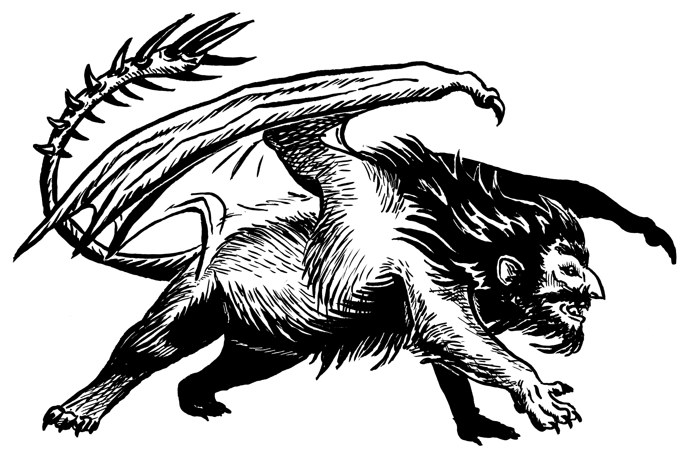

# Manticores

*Flying hunters with spiked tails and sharper tongues*

Manticores are bizarre amalgamations with the body of a lion, dragon-like wings, a bristling tail of barbed spines, and the leering face of a voracious human. They are known for their cruel appetites and even crueler wit.

Manticores swoop down on their prey from above, launching volleys of barbed tail spikes while jeering and taunting their victims. Manticores often propose lopsided "deals" full of veiled threats and barbed wit to their victims.

Manticores are classic flying predators in Dungeons & Dragons, 5E, Pathfinder, and other fantasy RPGs, feared for their cruel wit, deadly spiked tails, and relentless aerial assaults.

## Manticore Lore

- Manticores lair in desolate cliffs, ruined towers, and harsh wilderness far from civilization, claiming vast hunting grounds.
- Though they relish the taste of humanoid flesh, manticores are vain creatures who love to hear themselves talk.
- Manticores hurl iron-hard spikes from their tails like arrows, cackling as their victims fall.
- Some form loose herds to hunt larger prey, but most are too selfish, arrogant, and ill-tempered to share the spotlight.

## Manticore Tactics

- Manticores enjoy softening up their prey with a spine volley while hurling insults and offering lopsided deals
- It will retreat when wounded, hurling vile insults

{.monster-image .masked .white-background}

---

## Manticore Statblocks

### Manticore

![[Manticore]]

### Manticore Ravager

A **Manticore Ravager** has intimidated enough of its fellows that it leads a loosely-subservient pack. Ravagers often hone their insults on their inferiors, and the lowest-ranked Manticore in the pack is mercilessly bullied.

![[Manticore Ravager]]

## Manticore Encounter Ideas

- A lone **Manticore** is perched on a pile of corpses, carefully grinding its tail spikes on the rusted blades of fallen guards.
- A **Manticore** swoops down, hidden by the blinding sun, and strafes the party with its tail spines. It then circles overhead, taunting and jeering at the party before preparing to strike again.
- As the PCs journey on a mountain path, it hugs a sheer cliff, which is home to several (1d4 + 1) squabbling **Manticores**. The Manticores argue amongst themselves - for now - and their roars and hurled insults echo off the cliff.
- A **Manticore Ravager** blocks a narrow mountain pass, demanding tribute. It wants choice cuts hacked from the party's juiciest limbs - or else.

## Manticore Adventure Ideas

- A **Manticore** is ravaging the local livestock, but witnesses say it intentionally ignores the juiciest livestock, only striking when herders are nearby. It seems oddly disappointed that it kills farmers instead of fighters. Why is it baiting a challenge?
- A **Hag** has manipulated four **Manticore** into her service by playing to their egos. Now they test adventuring parties, devouring the weakest and bringing back the strongest in chains to serve the Hag. Locals beg the party to end the twisted trials.
- A rich merchant once humiliated a flamboyant **Manticore Ravager** that styles itself the "Ravager of the Ravine" by outwitting it. Now, the proud creature has vowed its revenge. It attacks any and all caravans flying the merchant's banner, demanding she face him again. The party is hired by the merchant to end the troublesome threat.
- A **Hobgoblin Captain** seeks to bind a local herd of 2d6 **Manticores** to his warband. If the monsters are recruited, the balance of power in the region will collapse.