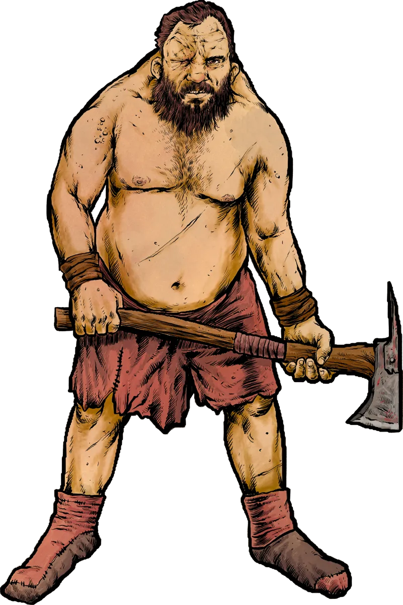

# Ogres

*Ravenous and Destructive Hulks*

[[Ogres]] covet three things: grubz, shineyz, and smaaaashing. They are ravenous, brutish, and hulking. Strength and destruction is everything to a group of ogres. Standing within the clan is based on the biggest thing the ogre has smashed. They rely on sheer strength and utilize crude clubs hewn from upended saplings or thick chains ripped from walled settlements.  

After a raid, ogres will wantonly destroy anything that isn't immediately useful, and take a special glee in destroying art, books, and other fine things, which they consider useless.

{.masked .monster-image}

## Ogre Lore

- Ogres love to smash anything that isn't immediately edible, usable as a weapon, or sparkly
- Ogres are impulsive, dim witted, and easily tricked or bribed
- Ogres were born from fallen giants who lost the mystical connection to their primordial magic
- Very rarely, a hyper-intelligent ogre is born. These ogres inevitably trick their kin into subservience become known as [[Ogre Big Brainz]]

## Ogre Statblocks

### Ogre

Ogres are massive and brutish ravagers. Their hunger and anger is matched only by their strength and stupidity.

[[!Ogre]]

### Ogre Wallsmasha

Ogres occasionally uproot whole trees and fashion them into crude battering rams that can smash through walls and anything else dumb enough to get in the way.

[[!Ogre Wallsmasha]]

### Ogre Burnbelcha

Some ogres ritually imbibe a horrendous and highly flammable concoction that they belch on unsuspecting foes.

[[!Ogre Burnbelcha]]

### Ogre Chaincrakka

Chaincrakka ogres wield deadly chain whips and vicious barbed nets to capture prey for the cooking pots.

[[!Ogre Chaincrakka]]

### Ogre Big Brainz

Ogre Big Brainz are rare freaks among their brutish kin, born with wicked cunning and gifted with dark, unnatural powers. They inevitably trick and manipulate their dim kin into subservience and often lead a pack of ogres.

[[!Ogre Big Brainz]]

{.masked .monster-image}

## Ogre Encounter Ideas

- Three Ogres (an [[Ogre Burnbelcha]], [[Ogre Chaincrakka]], and [[Ogre Wallsmasha]]) have set up camp overlooking the only road through a treacherous pass. They argue over who gets the first bite of a stew they plan to make of a group of tied up dwarves.
- A large, crude signpost warns travelers of a toll ahead. There are multiple mangled humanoid bodies nailed to the sign. Those who don't pay enough get added to the post. The [[Ogre]] tollkeeper waiting nearby is convinced it owns this entire road and everything on it.
- The party stumbles into a sunken glade where an [[Ogre Burnbelcha]] sleeps under a mound of hides, with one meaty arm splayed out over the corpse of a crushed traveler. The corpse still clutches a valuable scroll or magic item.
- The players find a ruined campsite littered with barrels and bones. An [[Ogre]], seated in a massive mudhole, slurps ale and chews sheep bones. Drunk and bloated, it challenges the PCs to a drinking contest. Refusal would be unwise.

## Ogre Adventure Ideas

- A mining town reports strange tremors below and vanishing workers, kidnapped by a hungre [[Ogre]] that has recently made the mines its den.
- The PCs have been hired to protect a trade caravan on a once-safe route where many caravans have gone missing of late. The culprit is a band of [[Ogres]] driven out of their hinterland caves by a fearsome [[Hydra]]. The ogres want help restoring their den in return for leaving the trade route alone.
- A [[Priest]] hires the party to investigate what happened to all the villagers of nearby hamlet who haven't been seen since the last feast day. Unfortunately, an [[Ogre]] crashed the feast, ate all the food, and the townsfolk as well.
- An [[Orc Warchief]] has sent emissaries to all the scattered [[Ogre]] clans in the hinterland hills to recruit them to his cause, promising vast spoils of war. The PCs must win over the ogres or prevent their recruitment lest the entire kingdom be overrun. A particularly cunning [[Ogre Big Brainz]] seeks to play both sides against each other for his benefit.
