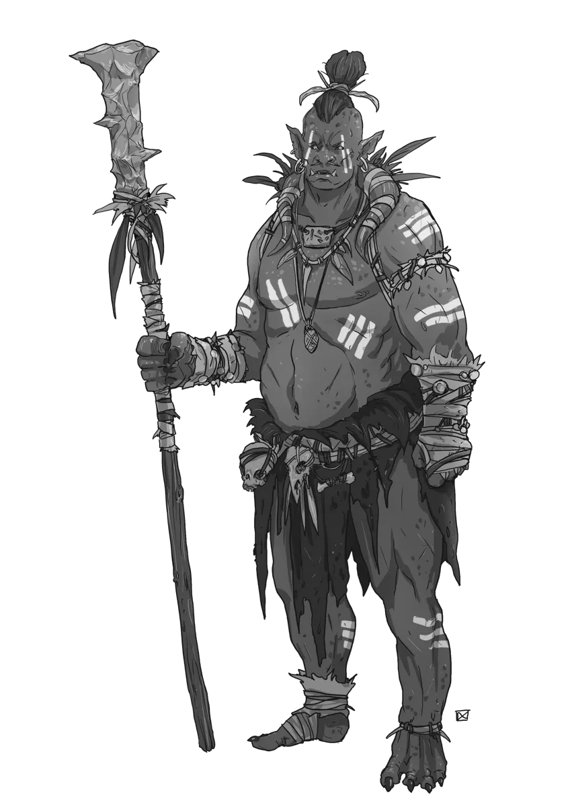
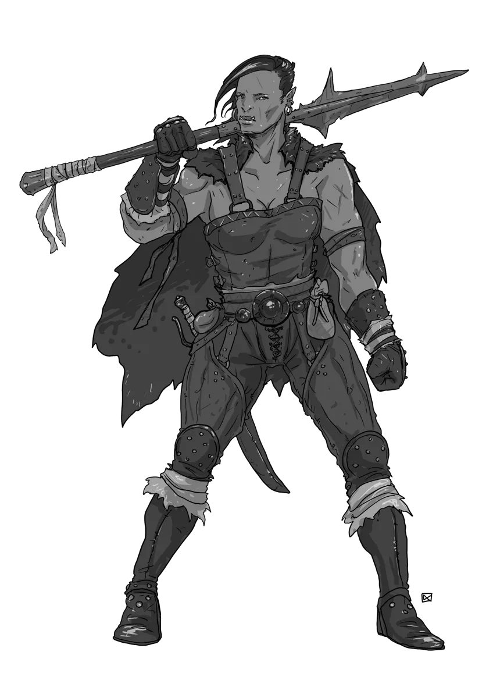

# Bloodrage and Battle: Orcs

*Bloodrage-Fueled Ancestral Warriors*

Long ago, the ancestors of the orcs made pacts with demons to flee their dying world. The demonic blood strengthened the orcs and gifted them with a powerful bloodrage that made them formidable foes, though at a great cost. The orcs and all of their descendents were prone to fits of an all-consuming bloodrage that enhances their innate strength with a savage ferocity. While the bloodrage burns, the orc's speed, aggression, and stamina are all supernaturally boosted. Wounds that could slay a grown man are shrugged off as annoyances and visceral rage is all-consuming.

Some orcs embrace the bloodrage and seek out ever greater danger and violence, chasing the near-ecstatic release of the bloodrage. Others meditate on the spirits of their ancestors, seeking ancestral wisdom to master the rage that lives in their blood.  

Generally, orcs value strength, honor, and tradition. They often organize into warbands that are led by powerful warchiefs and counseled by shamans who interpret the will of the ancestors and elemental spirits.

## Orc Lore

Learn the dark origins and cultural code of orcs in your 5E campaign: from demonic pacts to ancestral pride and the ever-burning curse of bloodrage. You can hand these table-ready lore tidbits out directly to your players as [Secrets and Clues](https://slyflourish.com/sharing_secrets.html).

- **Demon-Blooded Exiles**: Long ago, orcs fled their dying world by forging a pact with demons. This dark bargain granted them strength and cursed their bloodlines with an uncontrollable battle-fury known as bloodrage.
- **Bloodrage and Discipline**: All orcs carry the bloodrage, but not all surrender to it. Some give in to its ecstasy and seek out ever more violence. Others learn to master it, guided by ancestral spirits and strict codes of honor.
- **Ancestral Kinship**: Orc society venerates its forebears. Names are earned through trial, and warbands preserve oral histories, tattoos, and heirlooms that link them to the blood-bound warriors who came before.
- **Warbands and Warchiefs**: Orc society is tribal and mobile. Warbands are led by the strongest fighters, but shamans and elders wield influence through visions, omens, and ancestral rites.
- **Strength in All Forms**: Orcs value strength in all of its forms. This includes physical might, as well as strength of will, conviction, and loyalty. Outsiders may see only savagery, but among orcs, even restraint, when wielded with iron purpose, can be as revered as the blade.
- **Not All Orcs Raid**: While many orcs embrace destruction and raiding, others pursue personal discipline, spiritual insight, or selective alliances. All share a common origin, but not a common path.

### d12 Orc Names

This d12 table of unique orc names will help you create the perfect warriors, shamans, and chieftans.

| d12 | Name       |
|-----|------------|
|  1  | Grukkhar   |
|  2  | Vezhka     |
|  3  | Torvulk    |
|  4  | Azhra      |
|  5  | Dromnart   |
|  6  | Skurra     |
|  7  | Morgat     |
|  8  | Zaggala    |
|  9  | Tarzga     |
| 10  | Rekhaat    |
| 11  | Ulgrak     |
| 12  | Kaavira    |

### Orc Diplomacy

Orc diplomacy may be brutal, but it’s not mindless. Learn how orcs treat elves, dwarves, and humans—and when negotiation turns to conquest.

Orc warbands are highly pragmatic with their diplomacy with outsiders. They respect strength and honor it in others, but show contempt for weakness, cowardice, or indecision. Many orcs have a deep-seated distaste for elves, often viewing them as arrogant and frail creatures whose pride far exceeds their strength.

In some ways, dwarves and orcs share cultural echoes in their focus on pride, honor, and ancestral tradition. Many dwarven clans, however, would be outraged by any suggestion that they have common ground with orcs. Grudges between orcs and dwarves often run deep.

Orcs and humans cross paths often. When a warband grows to respect a strong and organized human settlement, then diplomacy and even alliances become possible But, when a new warband rises, it often tests the strength of nearby lands. If human communities appear weak or disorganized then the result is often raids, pillaging, and wanton destruction.

## Orc Tactics

Orcs fight like they live: with purpose, pride, and overwhelming force. They are not stupid and are capable of tactical combat, but their approach is usually aggressively direct. Orcs find great honor in hand-to-hand combat and will frequently challenge worthy foes to one-on-one duels. On the other hand, ranged combatants are treated with scorn, and orcs will send screaming reavers through the lines to hack down the cowardly mage hiding in the rear before turning their blades on the armored warriors in ritual combat.

## NPCs or Monsters?

Foe Foundry gives you two options for Orc statblocks:

- There are dedicated Orc statblocks like the [[Orc Soldier]] and [[Orc Bloodrite Shaman]]
- You can apply an Orc species template to any humanoid NPC statblock, such as an [[Orc Priest]] or an [[Orc Thug]]

As always, GMs are free to decide how intelligent humanoids are portrayed at their table. But, we suggest the following guidance:

- *Some* Orcs have given in to the savagery of their bloodrage and join conquering bands of reavers and pillagers. The bespoke Orc statblocks listed below can be used to represent these orcs
- *Some* Orcs instead focus their efforts inward and hone their sense of honor and tradition. For these, simply apply the Orc species template to the suitable NPC statblock. Foe Foundry makes this lightning-fast. Use the template when you want an orc who breaks the bloodrage-fueled mold.

## Orc Statblocks

These bespoke orc statblocks are built to hit hard and ooze flavor. From soldiers to shamans, you’ll find monsters ready for battle in your 5E campaign.

### Orc Soldier

[[Orc Soldiers]] are the backbone of any orc warband. They are strong and tough, and they fight with a ferocity that is unmatched. Every soldier strives to distinguish themselves in battle and earn the coveted promotion to reaver. This often leads to orcs recklessly challenging dangerous foes in the hopes of earning a battlefield promotion.

[[!Orc Soldier]]

[[$Orc Soldier]]

{.masked .monster-image}

### Orc Reaver

[[Orc Reavers]] are the most aggressive and bloodthirsty warriors in the warband. They charge into battle with reckless abandon, seeking to kill and maim as many foes as possible. Reavers are distinguished by prominent tattoos depicting the foe that was slain to earn the promotion.

[[!Orc Reaver]]

[[$Orc Reaver]]

### Orc Hardened One

[[Orc Hardened Ones]] are the elite warriors of the orc warband. They are tough and resilient, and they fight with a brutal efficiency. To earn the title of "Hardened One", a reaver must first fight an entire battle unarmored, demonstrating defensive prowess without the need of armor. Only then may the warrior don the clan's ancestral armor and take up their duty as an elite bodyguard to the warchief. 

[[!Orc Hardened One]]

[[$Orc Hardened One]]

### Orc Bloodrite Shaman

[[Orc Bloodrite Shamans]] are the spiritual leaders of the orc warband. They are powerful spellcasters who can call upon the spirits of their ancestors to aid them in battle. They often create protective totems to aid their allies and curse their enemies.

[[!Orc Bloodrite Shaman]]

[[$Orc Bloodrite Shaman]]

{.masked .monster-image}

### Orc Bloodrite Elder Shaman

The [[Orc Bloodrite Elder Shaman]] has gained sufficient skill and wisdom to commune with the first ancestors of the orcs who made the fateful blood pact. Their command of ancestral rites and spirit-magic is unmatched within the warband.

[[!Orc Bloodrite Elder Shaman]]

[[$Orc Bloodrite Elder Shaman]]

### Orc Bloodletter

[[Orc Bloodletters]] are the most feared and deadly warriors in an orc warband. They are skilled in the art of assassination and can strike from the shadows with deadly precision. Before battle, a bloodletter swears an oath of silence and will not speak again until they have slain a foe.

[[!Orc Bloodletter]]

[[$Orc Bloodletter]]

### Orc Warchief

[[Orc Warchiefs]] are the leaders of the orc warband. They are ferocious warriors and skilled tacticians who can rally their allies to victory. They are often accompanied by a retinue of elite warriors. A warchief never turns down a challenge.

[[!Orc Warchief]]

[[$Orc Warchief]]

{.masked .monster-image}

### Orc Warchief of the Bloody Fang

The most powerful warchiefs dye their tusks red with the blood of their slain foes. They are living legends amongst the warbands, lead massive warbands, and command immense respect from even the most vicious orc reavers.

[[!Orc Warchief of the Bloody Fang]]

[[$Orc Warchief of the Bloody Fang]]

---

## Orc NPC Statblocks

Want a more nuanced orc? Use these NPC variants to represent spiritual leaders, war-scarred veterans, or pragmatic allies.  

These are suggested humanoid NPC statblocks that work well when re-skinned or customized as orcs. The [Foe Foundry Generator](../generate.md) makes it dead-simple to generate any NPC as an Orc, but for convenience some common Orc NPC variants are listed here.

### Orc Berserker

An [[Orc Berserker]] is a classic variant of the humanoid [[Berserker]]. This is a good choice for an Orc NPC who embodies the raw, blood-fueled frenzy of orcish combat; great for frontline brutes.

[[!Orc Berserker]]

### Orc Druid

The [[Orc Druid]] is a [[Druid]] variant. Ideal for a spirit-binder or tribal guardian who communes with ancestor spirits and wields primal magic.

[[!Orc Druid]]

### Orc Knight

The [[Orc Knight]] is a [[Knight]] variant and represents disciplined orcs who have mastered their rage and fight with tactical purpose.

[[!Orc Knight]]

### Orc Priest

[[Orc Priest]] is a variant of the [[Priest]] and serves as a spiritual leader who interprets omens and channels divine wrath.

[[!Orc Priest]]

### Orc Scout

The [[Orc Scout]] is a [[Scout]] variant and is ideal for stealthy orcs who serve as hunters, vanguard scouts, or brutal ambushers.

[[!Orc Scout]]

### Orc Tough

[[Orc Tough]] is a variant of the [[Tough]]. A rugged, no-nonsense enforcer who relies on endurance and brute strength.

[[!Orc Tough]]

### Orc Shock Infantry Veteran

The [[Orc Shock Infantry Veteran]] is a variant of the [[Shock Infantry Veteran]]. A seasoned orc soldier who has survived countless battles and earned respect through prowess.

[[!Orc Shock Infantry Veteran]]

---

## Orc Encounter Ideas 

These open-ended encounters are designed as open-ended, table-ready situations you can drop immediately into your sessions. Each one is packed with flavor, tensions, or unexpected twists and is more than just "Orcs Attack!".

- While traveling on a trade road, the PCs encounter a merchant caravan protected by [[Thugs]] that is under siege by [[Orc Soldiers]] and [[Orc Reavers]]. The orcs are incensed the thugs refused to pay the tribute to enter their ancestral lands, but promise to let the PCs pass unscathed if they pay the tithe. The guards, however, beg the PCs to intervene on their behalf. Unbeknownst to the players, the caravan is smuggling illicit goods.
- The PCs stumble into a group of young [[Orc Soldiers]] who are attempting an ancient ritual to awaken the latent demonic power of their bloodrage. As the orcs ceremonially pass through fire, the ritual goes wrong. Everyone's shadows (the Orcs and the PCs) writhe and animate as [[Shadows]] that lash out indiscriminately. Then, the flames burn brightly as a [[Vrock]] appears, summoned by the ancient ritual.
- Two [[Orc Warchiefs]] are dueling in a sacred circle, surrounded by their chanting retinue of [[Orc Hardened Ones]]. The winner will lead both tribes to a glorious future. One warchief accuses the other of betrayal for inviting the PCs, who are clearly assassins or mercenaries.
- The PCs pass through the remains of an ancient battlefield where an ancient Orc legend is said to have slain 100 foes before being slain. An [[Orc Bloodrite Elder Shaman]] and her retinue of [[Orc Reavers]] are busy conducting a ritual to speak with the hero of legend, and don't take kindly to the PCs interrupting.

## Orc Adventure Ideas

Looking to build a multi-session arc around orcs? These open-ended adventure hooks explore politics, prophecy, blood feuds, and broken pacts.

- A mighty [[Orc Warchief of the Bloody Fang]] is gathering all the orcs in the surrounding region under his Crimson Banner. So far, he has gathered 1d4 of the 5 clans under his sway. The chieftain must be dealt with somehow before the warbands unify, or it spells certain doom for the surrounding region.
- An orc warband, led by an [[Orc Bloodrite Shaman]], are making a pilgrimage to an ancient site of significance to their ancestral spirits. Though the orcs are peaceful, the locals are suspicious and want the party to "deal with them".
- A well-respected [[Orc Warchief of the Bloody Fang]] is dying and insists on a ritual trial to choose between two rival successors ([[Orc Warchiefs]]). The chief has invited the PCs, who are known for their great strength, to serve as judges to adjudicate. One candidate seeks aggressive expansion of the clan, while the other wishes to focus on internal matters.
- A grizzled [[Orc Bloodrite Elder Shaman]] has had a vision and believes that the curse of the bloodrage on his clan can be broken, if only the [[Balor]] who the ancestors made a pact with can be forced into breaking the pact. The shaman has located a relic that can be used to summon the foul demon and asks the party for help, offering ancient armaments under his care as a reward.

---

## Orc Bossfight Ideas

Looking to create a memorable Orc bossfight? Look no further than the [[Orc Warchief of the Bloody Fang]]. The warchief should be surrounded by an elite retinue of [[Orc Hardened Ones]] and advised by one or more [[Orc Bloodrite Shamans]] and have a squad of [[Orc Reavers]] at his disposal. The warchief should delight in the challenge of facing the PCs and should eagerly challenge the melee combatants to honorable duels. If a duel breaks out, the hardened one bodyguards should engage other PCs to protect the sanctity of the duel. If the PCs are trying to kite the boss or attack dishonorably from a distance, then one or more of the hardened one bodyguards should be available to use [[Protection]] while the rest of the orcs angrily charge the rear line to eliminate the threat.

---