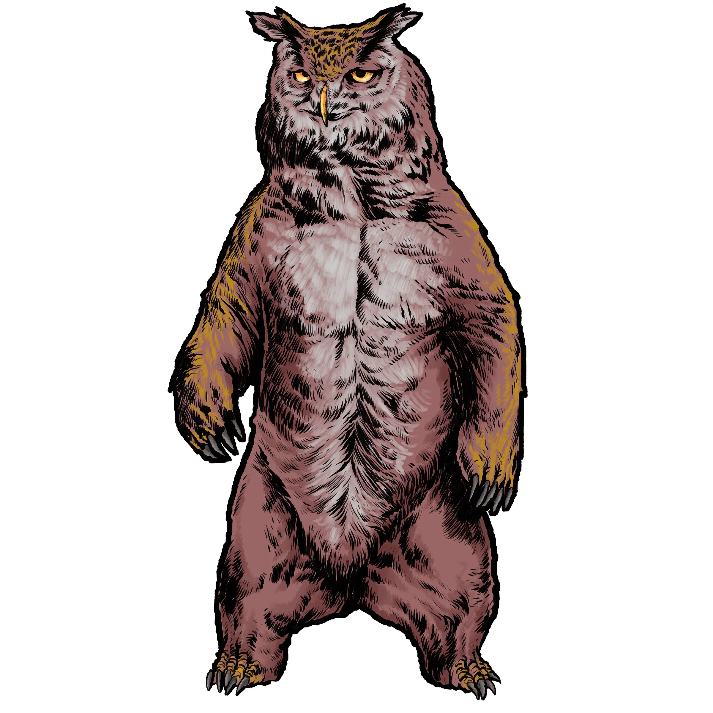

# Owlbears

*Unnaturally Territorial Predators*

An Owlbear is a fearsome hybrid creature, combining the powerful frame of a bear with the hooked beak, feathers, and piercing eyes of a giant owl. These creatures are fast-moving, flightless predators with terrifying physical strength and a savage temperament. With razor claws and a crushing beak, they shred anything that strays too close to their lair.

While originally created through arcane experimentation, owlbears have long since spread across the wilderness, becoming dominant predators in forests, caves, and rocky mountain regions. Their senses are as sharp as their talons, and their aggression is legendary.

Owlbears embody the wild fury of the frontier in Dungeons & Dragons, 5E, Pathfinder, and other fantasy RPGs; a fusion of feral bear strength and the primal instincts of a hunting owl.

## Owlbear Lore

- The true origin of Owlbears is lost to time, though some scholars blame wayward arcane experiments.
- Owlbear dens are typically found in forests, rocky outcrops, or deep caves, often marked by clawed trees and littered bones.
- Some druids and wilderness folk have been known to form bonds with owlbears, but they cannot truly be trained or domesticated.
- Owlbears are nocturnal hunters who will track prey over miles and rarely give up once they’ve locked on a target.
- Some villages prepare offerings to an Owlbear in order to benefit from its territorial protection.
- Albino Owlbears are extremely rare and are sought out by practitioners of the occult as particularly powerful sacrifices.

## Owlbear Tactics

Owlbears are fiercely territorial and will defend their cubs to the death. If a dangerous-looking foe enters their territory, they will first attempt to frighten the foe away before risking an engagement. However, if the foe appears frail or weak, an Owlbear will prepare a vicious ambush from elevated terrain, dense underbrush, or partially collapsed ruins. Owlbears retreat as soon as they have downed a potential meal or if they appear to be outmatched. However, unlike natural predators like the **Dire Wolf**, many Owlbears enter a frenzied rage when injured and fight viciously to the death.

{.monster-image .masked}

---

## Owlbear Statblocks

### Owlbear

[[!Owlbear]]

[[$Owlbear]]

### Owlbear Cub

Owlbears are fiercely protective of their cubs, despite their individualistic tendencies. Many a fool has perished attempting to capture and tame an **Owlbear Cub**.

[[!Owlbear Cub]]

[[$Owlbear Cub]]

### Savage Owlbear

A **Savage Owlbear** has extended its territory sufficiently the only thing matching its massive size is its unbridled aggression.

[[!Savage Owlbear]]

[[$Savage Owlbear]]

## Owlbear Encounters

- A gigantic **Owlbear** feasts contentedly on a dead Giant Elk. The monstrosity is momentarily distracted by its kill.
- The PCs stumble across a mother **Owlbear** guarding her young cubs (1d4 **Owlbear Cubs**) as they learn how to fish. The river's current is swift and this is the nearest ford for miles.
- A lone **Owlbear** is holding its own against a small pack of wolves (1d4 **Wolves** led by a **Dire Wolf**) that are howling for reinforcements from the pack
- The PCs encounter a caravan led by a seedy merchant named Bortosh who has a chained **Owlbear** as a sort of trophy. The beast is clearly mistreated and angry.
- The light of the full moon glimmers off countless shiny trinkets woven into the nest of a nearby **Savage Owlbear** atop a crumbled tower. Rhythmic hoots echo from within the crumbled tower...
- The PCs stumble into a clearing whose trees are shredded with deep gouges, the designated combat arena of two rivals (2 **Savage Owlbears**). The two rivals mistake the party's approach as a challenge from the other.

## Owlbear Adventures

- An ancient heirloom was stolen from a local temple or merchant. Tracking magic leads not to a thief, but to a huge **Owlbear** nesting deep in the woods. The relic is tangled in the owlbear's nest and acts as a shiny mobile for her newborn cubs (1d4 **Owlbear Cub**).
- An unscrupulous poacher and his crew (**Scout Captain** and 2d6 **Scout**) have captured a rare albino **Savage Owlbear**. They plan to auction it to the highest bidder. Two vile cults, led by a **Death Cultist** and a **Fiend Cultist** are competing to sacrifice the beast in a dark ritual. The players are hired to liberate the beast from the auction house, but can they transport the furious owlbear across a crowded city?
- After someone desecrated the local village's shrine to their **Owlbear** protector, the beast has become furious and is attacking the village itself.
- An adorably cute, yet troublingly unpredictable, **Owlbear Cub** is lost in the party's camp. It imprints on one of the players... and now its furious **Owlbear** mother is tracking the party wherever they go.