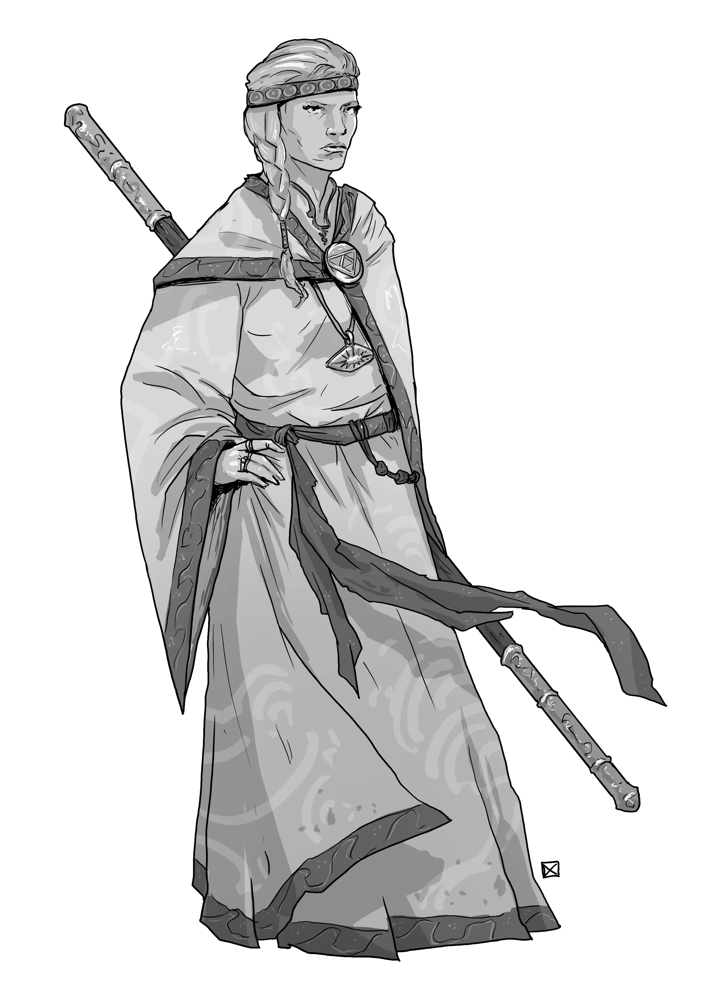

# Priests

*Faithful Instruments of the Divine*

> **Need tips for how to run religion and faith in your RPG?** The default lore of Foe Foundry is a [**Low Magic Setting**](../topics/faith.md) where divine beings do not directly communicate with mortals. If you run a setting where the gods are known to exist and actively intervene in the Mortal Realms then you can easily modify the lore to include direct involvement by the Gods. But it is much more difficult to remove the Gods from the Machine, so the lore is presented here with the least assumptions being made about your setting.

Priests are those rare mortals who find themselves as conduits to the Divine; through faith, perseverance, belief, or unusual circumstances. 

The [Distant Gods are silent and unknowable](../topics/faith.md#distant-gods). Miracles are rare and mysterious. No priest can say for certain the true source of their power. Does it flow from a God, a Saint, or something more mysterious or sinister still?  

What they do know is that their *belief* has power. The devout whispers, prayers, and rituals that Priests dedicate their lives to do sometimes lead to miracles. When the needy cry out, sometimes a light does come to their aid. Most priests find that belief on its own is difficult to wield, and find comfort in a rigid orthodoxy and ideology that enables them to manifest the power of their beliefs into tangible miracles.

There is no single road to becoming a conduit to the divine. Priests may be solitary mystics, village healers, war-chaplains, or archpriests leading massive temples. Some being their journeys with visions, and others with tremendous grief. For some Priests, the divine can be found through meditation, while others find it in compassionate or selfless service.

## Priest Lore

- Priests are rare mortals with a mysterious connection to the Divine, a wellspring of miraculous power
- The gods are distant, silent, dead, or unknowable
- Many worship Saints, former devout mortals who accomplished great deeds in life
- The divine power of a priest manifests through raw belief structured and reinforced through doctrine, ritual, or ideology

{.masked .monster-image}

## Priest Statblocks

### Acolyte

[[Acolytes]] have shown the hints of being touched by the Divine. The acolyte has begun their journey, whether after long years of study, rigorous meditation, or selfless deeds. Though their miraculous powers are still developing, acolytes are devoted disciples who fervently strive to improve their skills.

[[!Acolyte]]

### Priest

A [[Priest]] has enacted multiple miracles and is known to be touched by the Divine. In smaller communities, priests serve as local leaders, healers, and advisors. In larger settlements, they serve as parts of larger religious orders or temples.

[[!Priest]]

### Priest Anointed One

An [[Priest Anointed One]] is capable of performing astounding miracles. Some have been known to raise the dead, while others call down the wrath of the heavens upon the unrepentant.

[[!Priest Anointed One]]

### Archpriest

[[Archpriests]] serve as the heads of temples whose power and influence reaches across kingdoms. Their miracles are known far and wide and they are exemplars of the ideology they preach.

[[!Archpriest]]

### Archpriest Living Saint

The only thing standing between an [[Archpriest Living Saint]] and true Sainthood is martyrdom for their cause. The Living Saint has amassed disciples and followers of their own throughout the land and will be long remembered after their passing.

[[!Archpriest Living Saint]]

## Priest Encounter Ideas

These priest-themed encounter ideas are perfect for adding moral tension, mystery, and miracles to your next TTRPG session:

- Two rival [[Acolytes]] from opposing sects each claim to be the sole inheritor of a Saint's blessed relic. Both beg the PCs to escort them, and the holy relic, to a nearby temple of their respective sects.
- A [[Priest]], surrounded by a throng of [[Skeletons]] and [[Zombies]], barely holds the undead at bay. The priest begs the party not to harm the creatures, who are the bodies of their congregants raised by a [[Necromancer]] to spite the [[Priest]]
- A [[Priest Anointed One]] stops the PCs on the road and offers sanctuary in a storm. Over the night, they confess doubts about their power and share dreams of terrifying portents.
- An [[Archpriest]] and their [[Priest]] followers attend to a dying family. The priest is secretly a [[Death Cultist Grand Master]] subverting their charge's beliefs and draining the life from their clueless victims.

## Priest Adventure Ideas

These divine adventure hooks explore spiritual conflict, forbidden knowledge, and the cost of faith and are ideal for multi-session arcs in any dark fantasy TTRPG setting.

- A [[Priest]] begs the party to infiltrate a cult formed by their former [[Acolyte]], who has now become a [[Cultist Grand Master]], and disentangle the unfortunate cultists who have fallen victim to their cult leader's lies
- A mysterious disease only afflicts the devout. [[Acolytes]] collapse mid-sermon, [[Priests]] lose their miracles, and false prophets rise in their place.
- Rival temples are at the brink of holy war after the recent actions of the PCs have uncovered lost knowledge that contradicts established orthodoxy. Both groups demand the PCs testify against the other in a religious court.
- A newly unsealed crypt holds the remains of a legendary Saint who died sealing a foul [[Balor Dreadlord]] inside the crypt. A wizened [[Archpriest Living Saint]] recruits the party to escort them into the crypt to defeat and re-seal the vile fiend.