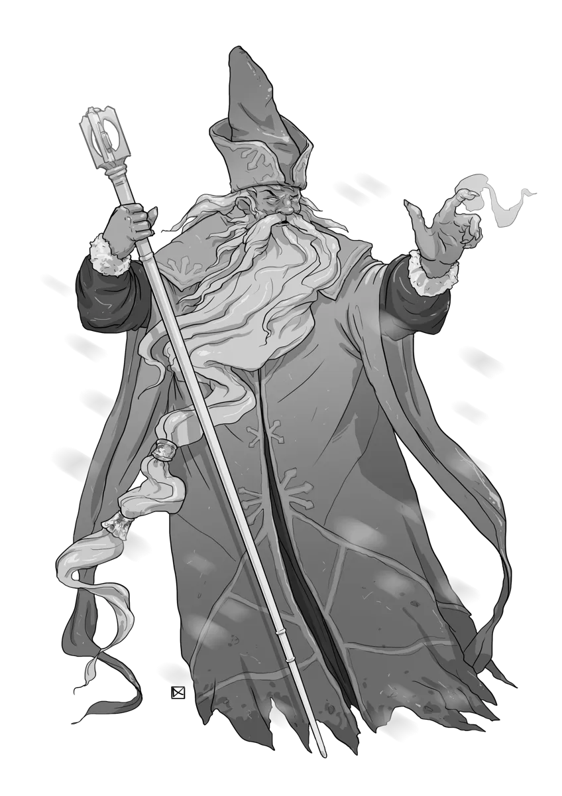

# Simulacrum

*Magically Animated Fragments of Personality*

A **Simulacrum** is a near-perfect magical duplicate of a living creature, sculpted from snow and shadow, and infused with a fragment of the original's personality. It walks and speaks like its original, mimicking its movements and powers. Yet, it cannot grow or learn.  

A simulacrum is often created as an agent for its creator, serving as a spy, decoy, or disposable commander. Many serve their masters loyally, but some break their bindings and act of their own volition. A rare few simulacra become convinced that they are the true version of themselves and that the original is the imposter.

## Simulacrum Lore

- Simulacra are powerful magical constructs crafted from shadow and ice that act as a copy of an original
- Simulacra are imbued with the fragments of original's personality, memories, and knowledge
- Powerful **Archmages** often create a **Simulacrum** of themselves to act as a servant
- Mages occasionally create a simulacrum of another creature, such as a powerful warrior or an important figure, to further their own goals

{.monster-image .masked}

## Simulacrum Tactics

- Acts as a [**Skirmisher**](../topics/monster_roles.md#skirmisher), using [[Simulacrum Spellcasting]] and its flying speed to keep its distance
- Quite fragile, but resistance to physical damage of all types
- Uses illusory powers like [[Illusory Reality]] and [[Hypnotic Lure]] to confuse its foes
- Uses reality-bending abilities like [[Bend Space]], [[Scatter]], and [[Time Rift]] to control the battlefield

## Simulacrum Statblocks

Explore three unique [[Simulacrum]] statblocks for 5E — from the classic arcane duplicate to the powerful [[Mastercraft Simulacrum]] and the illusory [[Simulacrum Mirrorblade]]. Whether you’re looking for a magical servant, a shadowy copy of your players, or a full-blown arcane boss, these flavorful constructs are ready to deploy.

### Simulacrum

A [[Simulacrum]] is a clone of a powerful arcanist, created to serve or deceive. It copies the arcane prowess of the original and hides behind illusions.

[[!Simulacrum]]

[[$Simulacrum]]

### Mastercraft Simulacrum

Creating a [[Mastercraft Simulacrum]] is the pinnacle of arcane mastery. These copies are so powerful that they often don't even realize they are clones.

[[!Mastercraft Simulacrum]]

[[$Mastercraft Simulacrum]]

### Simulacrum Mirrorblade

A [[Simulacrum Mirrorblade]] is created when a mage wants to copy a particularly skilled warrior or notable figure. The copy retains the martial prowess of the original, while being imbued with additional illusory magic.

[[!Simulacrum Mirrorblade]]

## Simulacrum Encounter Ideas

Looking for encounter ideas involving Simulacrum monsters? These table-ready prompts add mystery, tension, and magical confusion to any 5E session and are perfect for one-shots, intrigue arcs, or sudden mirror duels.

- When the party rescues an important NPC that they are seeking, they find the NPC as well as a [[Simulacrum]] copy of the NPC bound together, arguing over which one is the real one
- The PCs are accosted by the [[Simulacrum]] of the [[Archmage]] controlling this region, acting as its agent. The agent demands the customary tribute for entering its masters territory: a magic item or a secret piece of magical lore
- The PCs enter a town entirely populated by [[Simulacrum]] copies of a reclusive [[Archmage]] whose tower is at the center of the strange settlement. The copies all say their master has gone mad after creating a powerful magical artifact one moon ago
- The PCs wander down a hall filled with silvor mirrors. Suddenly, the reflection of each party member steps out of the mirror as an exact duplicate (use [[Simulacrum]] or [[Simulacrum Mirrorblade]]). The duplicates genuinely believe themselves to be the real copies and the PCs are the imposters.

## Simulacrum Adventure Ideas

Simulacra are plot hooks in disguise. These adventure ideas turn magical duplicates into story-driving forces, from rogue copies in the sewers to political schemes and identity crises.

- A nervous [[Mage]] hires the party to track down his rogue [[Simulacrum]] in the city sewers. It seems the mage did not perform the spell correctly, and the copy is a bit... off...
- An [[Archmage]] hires the PCs to kidnap a notable figure so that they can replace this figure with a [[Simulacrum]]. The kidnapping must be done in complete secret for the plan to succeed.
- An [[Archmage]] has secretly created a [[Simulacrum]] (or [[Simulacrum Mirrorblade]]) of the PCs and uses it to recruit or cajole the PCs into performing a quest on its behalf
- An [[Archmage Primagus]] recently died, and her three [[Mastercraft Simulacrum]] apprentices are at war with each other, each attempting to claim they are the true successor of their master's will. The copies attempt to involve the PCs as pawns in their complex intrigue against each other, offering them valuable information, magic, or treasure for their assistance.