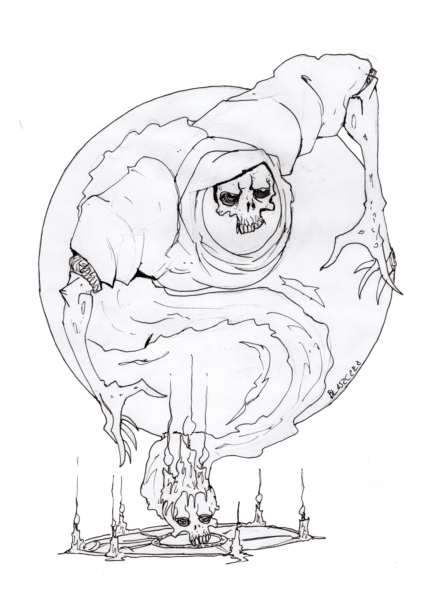
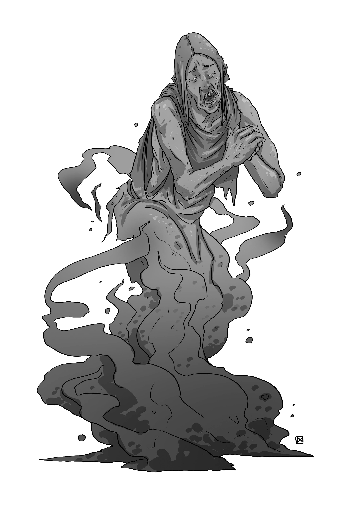
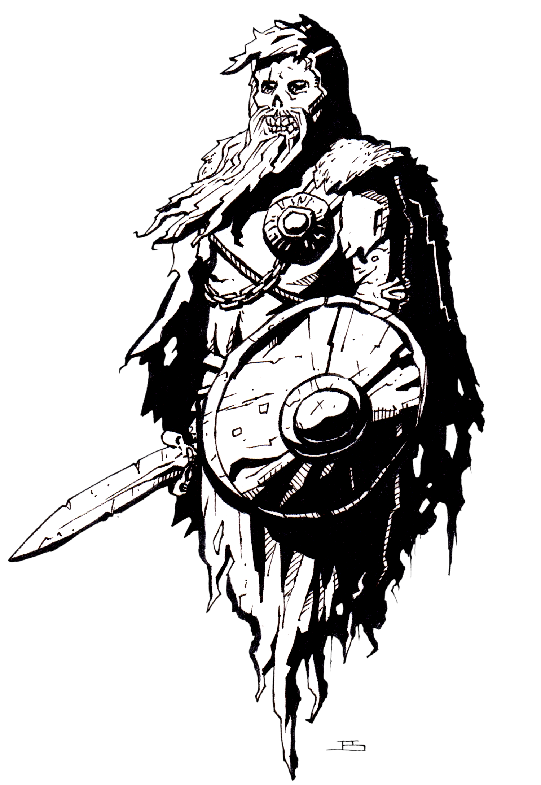
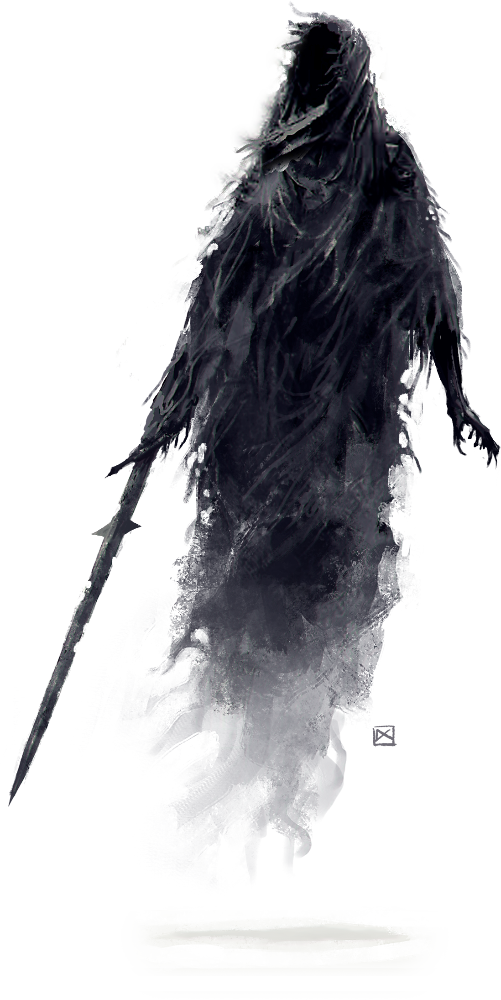

# Spirits

*Echoes of Rage and Regret*

Spirits are the echoes and imprints of the deceased that refuse to pass due to unbearable grief, unfinished purpose, or wrathful vengeance. A Spirit forms when a soul is anchored to the Mortal Realm by dreadful purpose, rather than being carried peacefully upon the Styx to the Great Beyond. Existing neither truly in death nor in life, the spirit is a hollow echo of its former self. Spirits are classified according to strength of will of the deceased and the forcefullness of the anguish that binds the soul to the mortal plane.

| **Spirit**   | **Embodiment**                        | **Manifestation**                                             | **What Binds Them**                  |
|--------------|----------------------------------------|----------------------------------------------------------------|--------------------------------------|
| **Shadow**   | Fragment of a Sin-Stained Soul         | Corrupted shadows that drown out light        | Sin or moral corruption              |
| **Specter**  | Fragment of a Soul Shattered by Trauma | Mindless haunting in broken loops      | A violent or interrupted death       |
| **Banshee**  | Spirit of Betrayal and Grief           | Wailing mourner who radiates unbearable sorrow                 | A personal betrayal                  |
| **Revenant** | Soul Burning with Vengeance            | Lucid, relentless hunter inhabiting a corpse                   | Unresolved injustice       |
| **Ghost**    | Soul Bound by Memory and Regret        | Reenacting lost moments, fixated on people or places         | A memory too painful to release      |
| **Wraith**   | Malignant Core of Condensed Evil       | Powerful shadow-form that enslaves or absorbs other spirits    | Hunger for power and dominion        |

From Shadows and Specters to Banshees, Ghosts, Revenants, and Wraiths, spirits bring grief, vengeance, and corruption to life across Dungeons & Dragons, 5E, Pathfinder, and fantasy RPGs.

{.monster-image .masked}

---

## Shadows

A **Shadow** is the cast-off remnant of a soul too vile to pass cleanly into death. While the rest of the spirit is swept down the Styx, the Shadow lingers behind like a stain - alive with jealousy, hunger, and spite. Shadows are drawn to extinguish warmth, light, and life, which they revile above all.

### Shadow Lore

- Shadows are drawn to those with strong convictions, pure hearts, or hopeful dreams—things they once lacked, and now despise.
- The more light a creature brings into the world, the more their shadow twists in ways it should not.
- In cursed places, one’s own shadow may rebel, tearing itself free to plot its former owner's downfall.

{.monster-image .masked}

## Specters

A **Specter** is a soul fragment, splintered by violence or unendurable pain. Lacking the memory of a **Ghost** or the malignant will of a **Wraith**, it drifts through the world in spasms of confusion and malice.

### Specter Lore

- Specters often haunt the place of their death, reenacting their final moments in endless, distorted loops.
- Some say Specters are the result of improperly performed death rites, or when a soul is interrupted in its crossing.
- Though easily dismissed alone, swarms of Specters can overwhelm the mind, drowning victims in secondhand terror.

{.monster-image .masked}

### Specter Statblock

![[Specter]]

## Banshees

A **Banshee** is a mournful spirit borne of overwhelming tragedy, sorrow, and betrayal. In life, the spirit loved too deeply and lost too dearly. Many Banshees are spirits of women who were betrayed by a loved one, though not exclusively. The mournful wail of a banshee is often enough to drag the souls of the weak-willed directly into death and chill the minds of even the strong-of-heart.

### Banshee Lore

- The keening of a Banshee is said to carry across the River of the Dead, heralding death before it arrives.
- In some cultures, Banshees are seen not as monsters but as messengers that warn those fated to die.
- A Banshee’s presence carries a dread silence that can be physically painful to break

{.monster-image .masked}

### Banshee Statblock

![[Banshee]]

## Revenants

A **Revenant** is a soul fueled not by sorrow, but by rage. It rises not to haunt the world, but to correct a single, searing injustice. It remembers how it died and who is to blame, and will not rest until vengeance is taken. Revenants are not mindless: they are deliberate, relentless, and terrifyingly lucid. If their quarry is powerful, Revenants are known to assemble a posse of lesser undead to support their relentless quest.

### Revenant Lore

- A Revenant rises in its original body—but if destroyed, it finds another, which slowly reshapes to resemble the first.
- A Revenant will not rest until the injustice that binds it to life has been righted by its own hands. Even if its killer has long since died, the Revenant will only rest when it has spilled the blood of the offender's descendants, disciples, or legacy
- Some Revenants are given leave by divine forces, but others tear themselves out of the River of Death through raw will, dragging pieces of the underworld with them.

{.monster-image .masked}

### Revenant Statblock

![[Revenant]]

## Ghosts

**Ghosts** are spirits that died with memories too painful to release. They are not held by hatred or vengeance, but by the sorrowful weight of what they recall. Lives cut too short, loved ones left behind, and truths unsaid. These souls haunt the world not because they won’t move on, but because their memories won’t let them.

Unlike the shattered fragments of a **Specter**, a **Ghost** is whole - but trapped in an endless loop of remembrance. It relives its death again and again, clinging to names, moments, and gestures long lost. Some lash out when disturbed. Others seek comfort in the living, drawn to those who carry echoes of their own regret.

### Ghost Lore

- Ghosts are animated by memory, often reenacting scenes from their lives with eerie accuracy or speaking in riddles drawn from personal history.
- They often fixate on objects, people, or places tied to their strongest memories: an heirloom locket, a family home, or the battlefield where they fell.
- Their presence distorts time and perception, as their pain bleeds into the world. Dreams fray, names slip, and voices echo from forgotten places.

{.monster-image .masked}

### Ghost Statblocks

![[Ghost]]

## Wraiths

When a soul steeped in malice dies, it may resist the pull of the Styx. Caught in the cold eddies of that underworld current, its will festers. Twisting and swelling, it draws in the remnants of other damned spirits. Layer by layer, a powerful **Wraith** forms: a cursed vortex of souls too vile to cross over.

Unlike the scattered fragments of a **Specter** or **Shadow**, a **Wraith** is cohesive and cunning. Its presence dims light, drains warmth, and enslaves lesser spirits to serve as extensions of its will.

### Wraith Lore

- Though formed of countless fragmented spirits, at the core of the Wraith is a singular evil spirit clinging to un-life
- Unlike **Ghosts**, who cling to memory, **Wraiths** cling to power
- **Wraiths** are drawn to places where evil lingers, especially where other spirits might be harvested

{.monster-image .masked}

### Wraith Statblocks

#### Wraith

![[Wraith]]

#### Wraith Shadelord

When the spirit of the wraith is particularly evil it can attract such a dense miasma of negative energy that a **Wraith Shadelord** forms.

![[Wraith Shadelord]]

## Spirit and Ghost Encounters

- A torch sputters in a narrow hallway as the party's shadows stretch and split. One or more of them peel off the wall as a **Shadow** and attack their sources.
- A group of guards lie dead in a torchlit room, killed by unseen assailants. If the sputtering torch extinguishes, 1d4 **Shadow** take form and lunge from the darkness.
- As the party rests, each member begins hearing faint whispers in their native language: fragments of dying thoughts, regrets, and fears. A **Specter** drifts unseen nearby, trying to feed on emotional weakness. Unless acknowledged, it becomes violent.
- The party finds a wounded guard calling for help. If healed or aided, the figure flickers and reveals it is a **Specter** repeating its death throes. The act of kindness awakens its fragmented mind, and it lashes out in panic unless calmed.
- In a ruined bedchamber, a **Banshee** cradles a bundle of bones in a broken cradle. She demands the party sing her child back to sleep.
- The party discovers a group of fresh corpses, faces frozen in abject horror, with no obvious cause of death. The looters were attempting to break into the tomb of a vain **Banshee** and abscond with her enchanted silver mirror.
- A **Revenant** and its posse (3d6 **Skeleton**, **Zombie**, and/or **Ghoul**) shambles into a tavern mid-conversation, points at a party member, and declares "You ride with a murderer! I will have justice".
-  A cloaked figure on a skeletal steed blocks a mountain pass. The **Revenant** demands information on the whereabouts of "Thalrus Vall" and will not let the PCs pass unless they comply. Thalrus is someone connected to one or more of the PCs.
- A cracked mirror in a ruin shows a sobbing party member’s reflection. The **Ghost** inside demands that the PC remember the name of someone they failed, or it will trap them in the glass to join in its ghostly penance.
- A **Ghost** blocks the only path forward, whispering “I must not be forgotten.” The spirit demands someone speak its name in order to pass.
- The air grows thin and cold as the party enters a forgotten tomb. One of them stumbles, but their **Shadow** doesn’t get up, rising instead as the herald of the **Wraith** within. The herald demands a blood sacrifice for its master.
- A crypt door swings open as if pushed from within. The **Wraith Shadelord** within does not attack immediately. It offers the most ambitious PC power if they take their place beside it.

## Spirit and Ghost Adventures

- The last monk of an ancient priestly order tasked with protecting a holy site asks the party for help. The holy site is a vault of powerful cursed relics protected by holy flames. The flames are about to fail, and when they do, waves of **Shadow**s will seize the cursed relics.
- A collapsed mining town lies silent beneath a blanket of ash. At night, the wind carries faint cries and the dying breaths of trapped workers. The **Specter**s below won’t rest until they are named and buried, but the local baron insists the disaster never happened. The party is approached by the widows of the dead miners asking for help putting their slain kin to rest.
- For the last twelve full moons, a **Banshee** has let out a terrible, prophetic wail. And each morning, someone in the hamlet is discovered dead. The local village chief implores the party to put an end to her village's curse.
- The party finds a hanged man swinging gently in the breeze on a gallows tree. It looks like an entire family was executed here. The hanged man calls out and begs the party the cut him down, for the **Revenant** has unfinished business with a powerful **Noble** who had his entire family executed
- A wealthy merchant hires the party to clear a curse from an inherited estate that he needs to sell immediately to cover some debts. Each year, on the anniversary of her betrayal, a **Banshee** manifests and wails about her betrayal, forcing the **Ghost** of the lover who spurned her to beg forgiveness for hours on end. The anniversary is in three days...
- Three hundred years ago, a merciless tyrant was betrayed by his underlings. The tyrants corpse, as well as all of his ill-gotten cursed treasure, was entombed within his palatial crypt in the center of a wealthy trading city. The spirit of the tyrant rises each century as a **Wraith Shadelord** and wreaks havoc on the city. The mayor hires the party to put an end to the curse and promises them the tyrant's hoard, as well as a hefty payment for successful work.