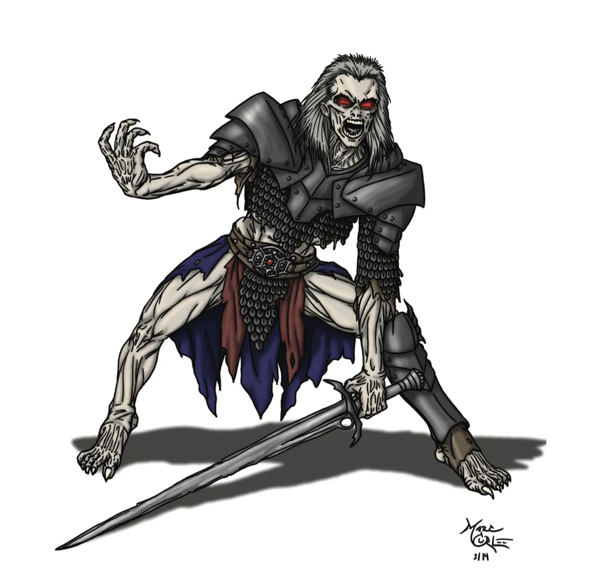

# Wights

*Deathly cold malignant warriors of old*

Wights are the dead and frozen corpses of wicked champions of bygone eras whose evil deeds persist into undeath. Their piercing blue eyes instill terror while their freezing blades of ice rend armor and flesh alike. They are Greater Undead who maintain the goals, memories, and ambitions that drove their wicked spirits. The bitter cold of the Styx surrounds them, and their chilling touch can freeze the hearts of even the bravest warriors. The souls of those slain by a Wight are cast deep into the freezing currents of the Styx while their bodies rise as undead servants of the wight.

Wights are cunning, soul-hungry undead in Dungeons & Dragons, 5E, Pathfinder, and fantasy RPGs, commanding undead legions and freezing the living with Styx-born wrath.

## Wight Lore

- Wights possess a malignant will and cunning far greater than lesser undead like skeletons or zombies
- Wights are instinctivly drawn to feed upon the souls of the living, which shine like bright bonfires to the wight's cold eyes
- A Wight forms from a soul that has clawed its way back into life, fighting the freezing currents of the Styx. Many are empowered by some malignant force such as a dark god, a potent curse, foul necromancy, or pure malevolence.
- Ancient battlefields and fallen kingdoms often birth Wights when powerful warriors die with their souls twisted by rage or injustice.
- Some Wights were once mighty champions, generals, or kings whose ambition or hubris led to their downfall — now cursed to serve darker masters.
- Entire tombs, crypts, or cursed cities may be ruled by Wight-lords, gathering other undead to their banners in mockery of the living empires they once served.

## Wight Tactics

- Wights command squads or even armies of lesser undead, which they use to harry and surround their prey before closing in on their victims
- Wights are patient, cunning, and cruel. They show no mercy.
- Wights are often drawn to the life-force of particularly powerful divine magic wielders

{.monster-image .masked}

---

## Wight Statblocks

### Wight

[[!Wight]]

[[$Wight]]

### Wight Fell Champion

A **Wight Fell Champion** was once a mortal champion of great renown who fell into service to a dark power. Perhaps loyalty to their corrupted liege dragged them inexorably towards a ruinous path, or plain greed led to their downfall.

[[!Wight Fell Champion]]

[[$Wight Fell Champion]]

### Wight Dread Lord

A **Wight Dread Lord** was once a powerful ruler, thain, or champion whose pride and fear of death drove them to foul pacts with malevolent forces. In undeath, they command armies of lesser undead who mindlessly serve their twisted commands.

[[!Wight Dread Lord]]

[[$Wight Dread Lord]]

## Wight Encounter Ideas

- **Icy Ambush**: A **Wight** lays hidden underneath icy water, waiting to drag any unsuspecting victims to their frozen demise
- **Sacrifical Patrol**: The PCs come across a patrol of **Skeletons** led by a **Wight**. Among them, an important-looking prisoner is bound up with icy chains and is being led to a desecrated shrine for dark rituals.
- **Grave-Barrows**: The PCs wander through ancient burial grounds thick with clamy mist. All around, ancient hands claw their way to freedom as a group of blue-eyed **Wight Fell Champions** emerge
- **Cursed Domain**: A **Wight Lord** is bound by an ancient curse to drain the life of all who enter its domain. The curse can only be broken by someone willingly offering their life to end the curse.

## Wight Adventure Ideas

- **The Ruined Watchtower**: A crumbling watchtower in a cursed forest is the lair of a **Wight** who once served as a captain of the guard. His skeletal soldiers (**Skeletons**) still patrol the ruins.
- **The Cursed Tomb**: A Wight-queen (**Wight Lord**), betrayed by her lover, haunts her shattered palace beneath the earth. Explorers must contend with her rage and her spectral knights (**Wight**).
- **Ghostly Siege**: In a remote village, farmers wake to find crops ruined by frost and dead relatives clawing at their doors (**Zombie**) — the work of a **Wight** seeking to raise an undead army for some grim purpose.
- **Grim Assassin**: A **Wight** bound by an ancient pact still hunts down the descendants of those who betrayed its master, appearing by nightfall to claim the blood debt.
- **Cursed Battlefield**: In cursed plains where ancient armies clashed, two competing **Wight Fell Champion** generals lead endless skirmishes between their undead armies.
- **The Fell Court**: A foul **Lich** has assembled seven dread **Wight Fell Champions** who vie for their master’s favor, each roaming the land in search of a terrible secret lost to mortal memory...