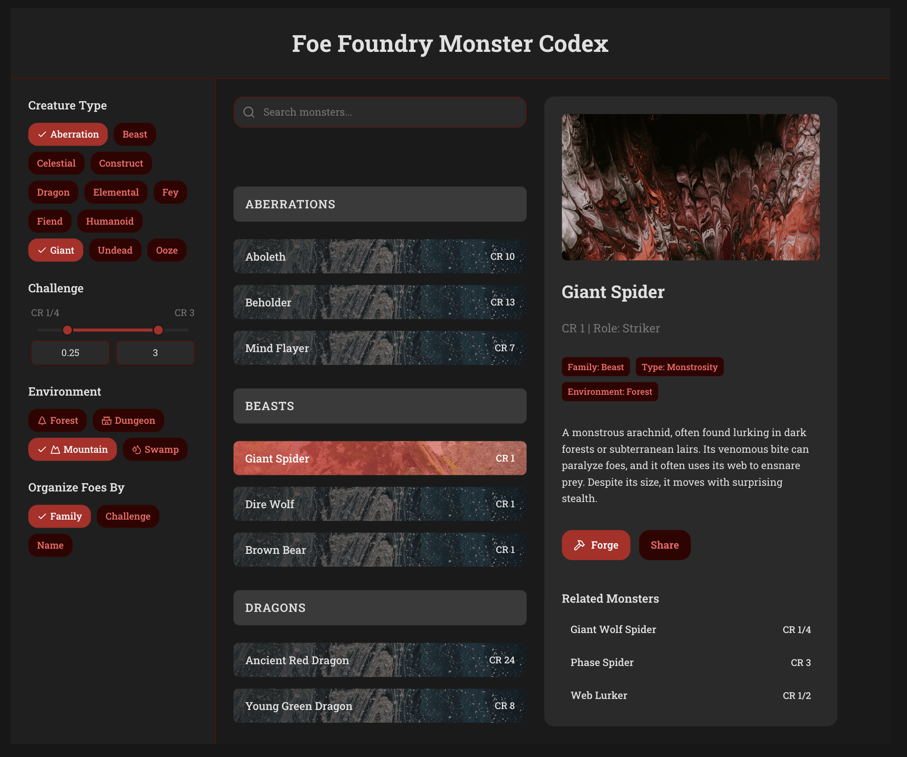
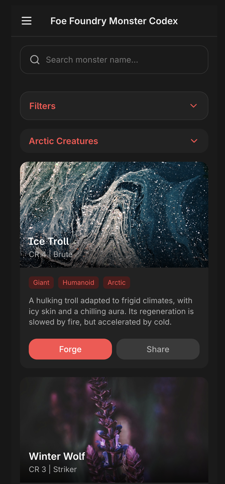
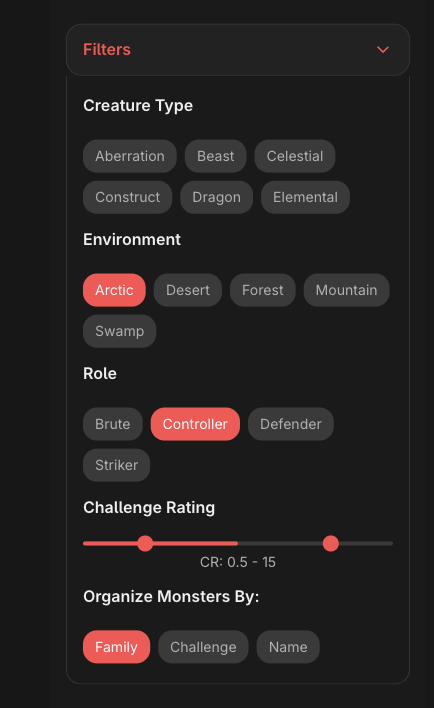

# PRD: Monster Index – Faceted List with Previews

## Overview
This project delivers a **desktop-first monster browsing and search interface** for the Foe Foundry Monster Codex.  
The feature combines **multi-faceted filtering**, **grouped monster lists**, and a **live preview panel** into a single high-density UI optimized for GMs preparing encounters.

The goal is to enable **fast, precise search** for known monsters and **rich thematic browsing** for inspiration, all without leaving the index view.

---

## Motivation
Existing monster search tools (D&D Beyond, A5E Tools, Monster Manual 2024) have significant UX limitations:
- Poor or slow filtering that makes multi-criteria searches difficult.
- Alphabetical-only or flat lists that hinder thematic discovery.
- No quick preview — requiring full page loads to inspect each monster.
- Low visual differentiation between groups or monster types.

This design addresses those gaps by:
- Allowing **instant filter combinations** across key monster attributes.
- Offering **smart grouping** by family, type, CR, or alphabetical order.
- Providing an **always-visible preview panel** that updates on hover/click.
- Maintaining an aesthetic consistent with Foe Foundry’s dark fantasy brand.

---

## Goals
- **Search efficiently:** Find a known monster quickly via text search and filtering.
- **Filter precisely:** Combine multiple criteria (e.g., “Undead” + “Swamp” + “CR 3–5” + “Artillery”).
- **Browse thematically:** Group monsters by family, type, or CR to inspire encounter ideas.
- **Preview instantly:** See monster details without navigating away from the index.
- **Maintain high information density** for “power user” desktop workflows.

---

## Scope
### In-Scope
- Full-width desktop-first layout with three primary columns:
  1. **Sidebar Filters** (facet selection)
  2. **Monster List** (grouped results)
  3. **Preview Panel** (details)
- Multi-facet filter support for:
  - **Creature Type**
  - **Challenge Rating (CR)** via range slider
  - **Environment**
  - **Monster Family**
  - **Role** (soldier, bruiser, artillery, controller, etc.)
- Grouping toggle: by Family, Challenge, or Name.
- Live preview update on monster hover or click.
- Search bar to narrow results by name or keyword.

### Out-of-Scope
- New monster creation or editing UI.
- Backend filtering/search logic (assumes APIs already provide relevant data).

---

## Desktop Design Choices



### Layout
- **Left Sidebar** — Persistent filter panel with pill-style toggles for each facet, a CR slider, and grouping buttons.
- **Center List** — Scrollable vertical list of monsters, grouped under headers matching the current grouping mode.
  - Each monster row: name + CR, with optional background texture.
  - Active monster highlighted.
- **Right Panel** — Monster preview showing:
  - Large monster image.
  - Name, CR, Role.
  - Tags for Family, Type, Environment.
  - Short description/flavor text.
  - Action buttons (e.g., “Forge”, “Share”).
  - Related monsters list with CRs.

### Filtering
- Pill-style facet controls for **Creature Type**, **Environment**, and **Role**.
- Range slider for **Challenge Rating**, supporting fractional CR notation.
- Multiple filters can be applied at once, with instant result updates.
- “Organize Foes By” buttons to re-group list view without changing filters.

### Interaction Model
- **Hover** over a monster name updates preview panel (desktop).
- **Click** selects monster, keeps it highlighted for context.
- Filters and search update results in real time without page reload.
- Group headings remain sticky when scrolling for context.

### Visual Style
- Dark theme with red accent color for active filters and highlights.
- Textured backgrounds in monster list rows for thematic flavor.
- High-contrast pills for selected filters.
- Section headers bold and clearly differentiated.

## Mobile Design Choices





### Layout Adaptation
The mobile interface transforms the three-column desktop layout into a **single-column, stacked approach** optimized for touch interaction and smaller screens:

- **Top Header** — Contains the Foe Foundry branding and hamburger menu button for navigation
- **Search Bar** — Full-width search input with magnifying glass icon, prominently placed for easy access
- **Collapsible Filters** — Red "Filters" section that expands/collapses to reveal filtering options
- **Monster Cards** — Vertically stacked, full-width monster cards with rich visual presentation
- **Inline Preview** — Monster details displayed within expanded cards rather than separate panel

### Filter Interface
The mobile filter system uses a **collapsible accordion approach**:

- **Primary Filter Button** — Red "Filters" button with chevron indicator shows/hides the entire filter panel
- **Category Sections** — Each filter category (Creature Type, Environment, Role, etc.) has its own collapsible section
- **Pill-Style Tags** — Same visual treatment as desktop but optimized for touch targets
- **Range Slider** — Challenge Rating slider adapted for touch interaction with larger touch targets
- **Organize By** — Quick toggle buttons for grouping options (Family, Challenge, Name)

### Monster Card Design
Mobile monster cards feature a **rich, immersive presentation**:

- **Hero Image** — Large, atmospheric background image for each monster
- **Overlay Text** — Monster name and CR overlaid on the image with high contrast
- **Tag Pills** — Creature type, family, and environment tags displayed as colored pills
- **Descriptive Text** — Short flavor description visible on the card
- **Action Buttons** — "Forge" and "Share" buttons prominently displayed
- **Expandable Details** — Tap to reveal full monster statistics and abilities

### Touch Interaction Model
Mobile interactions prioritize **touch-friendly gestures**:

- **Tap to Expand** — Monster cards expand inline to show full details rather than navigating away
- **Swipe Navigation** — Horizontal swipe between monster details when expanded
- **Pull to Refresh** — Standard mobile pattern for refreshing the monster list
- **Filter Persistence** — Applied filters remain visible as chips when filter panel is collapsed
- **Scroll Position Memory** — Returns to previous scroll position when navigating back from expanded views

### Visual Hierarchy
The mobile design maintains **visual consistency** while adapting to constraints:

- **Dark Theme** — Consistent with desktop, optimized for mobile viewing conditions
- **Red Accents** — Used for active filters, selected states, and primary actions
- **Typography Scaling** — Larger text sizes appropriate for mobile reading
- **Spacing Adaptation** — Increased touch targets and padding for finger navigation
- **Card Grouping** — Visual separation between monster families/groups using subtle dividers

### Progressive Disclosure
Mobile interface uses **layered information architecture**:

1. **Overview Level** — Monster name, CR, and hero image immediately visible
2. **Summary Level** — Tags, description, and action buttons on card face
3. **Detail Level** — Full statistics, abilities, and related monsters in expanded state
4. **Filter Level** — Comprehensive filtering options hidden behind collapsible interface

This approach ensures that users can quickly scan and browse monsters while having access to full detail when needed, without overwhelming the limited screen space.

---

## Implementation Plan

### Phase 1: API & Data Types Foundation

#### 1.1 Extend Search API Types
**Location**: `/docs/src/data/search.ts` (new file)

Create comprehensive TypeScript interfaces that match the enhanced search API:

```typescript
// Enhanced search request interface
export interface MonsterSearchRequest {
  query?: string;
  limit?: number;
  creatureTypes?: string[];
  environments?: string[];
  roles?: string[];
  minCr?: number;
  maxCr?: number;
}

// Enhanced search response with facets
export interface MonsterSearchResult {
  monsters: Monster[];
}

```

#### 1.2 Create API Client
**Location**: `/docs/src/data/searchApi.ts` (new file)

Implement the client for the enhanced search API:

```typescript
export class MonsterSearchApi {
  
  async searchMonsters(request: MonsterSearchRequest): Promise<MonsterSearchResult> {
    // API call implementation
  }

}
```

### Phase 2: MonsterCardPreview Component

#### 2.1 Create MonsterCardPreview Component
**Location**: `/docs/src/components/MonsterCardPreview.ts` (new file)

Build a simplified monster card for preview and mobile display that reuses the existing MonsterArt component:

```typescript
import './MonsterArt';

@customElement('monster-card-preview')
export class MonsterCardPreview extends LitElement {
  @property({ type: Object }) monster?: Monster;
  @property({ type: Boolean }) compact = false; // For desktop list rows
  @property({ type: Boolean }) selected = false;

  static styles = css`
    :host {
      display: block;
      cursor: pointer;
      transition: all 0.2s ease;
      border-radius: var(--medium-margin);
      overflow: hidden;
    }
    
    :host(.selected) {
      outline: 2px solid var(--tertiary-color);
      outline-offset: 2px;
    }
    
    .preview-card {
      position: relative;
      border-radius: var(--medium-margin);
      overflow: hidden;
    }
    
    .preview-card.compact {
      height: 60px; /* For desktop list rows */
    }
    
    .preview-card.full {
      height: 300px; /* For mobile cards and desktop preview */
    }
    
    .preview-card.compact monster-art {
      height: 60px;
    }
    
    .preview-card.full monster-art {
      height: 300px;
    }
    
    .monster-overlay {
      position: absolute;
      inset: 0;
      background: linear-gradient(transparent 40%, rgba(0,0,0,0.8));
      display: flex;
      flex-direction: column;
      justify-content: flex-end;
      padding: 1rem;
      pointer-events: none;
    }
    
    .monster-overlay.compact {
      flex-direction: row;
      align-items: center;
      justify-content: flex-start;
      padding: 0.5rem;
    }
    
    .monster-name {
      color: white;
      font-size: 1.2rem;
      font-weight: bold;
      margin-bottom: 0.25rem;
      text-shadow: 2px 2px 4px rgba(0,0,0,0.8);
    }
    
    .monster-name.compact {
      font-size: 1rem;
      margin-bottom: 0;
      margin-right: 0.5rem;
    }
    
    .monster-details {
      color: rgba(255,255,255,0.9);
      font-size: 0.9rem;
      text-shadow: 1px 1px 2px rgba(0,0,0,0.8);
    }
    
    .monster-details.compact {
      font-size: 0.8rem;
    }
  `;

  render() {
    if (!this.monster) return html``;
    
    return html`
      <div class="preview-card ${this.compact ? 'compact' : 'full'}">
        <monster-art
          monster-image="${this.monster.image || ''}"
          background-image="${this.monster.backgroundImage || ''}"
          background-color="rgba(255, 255, 255, 0.55)"
          image-mode="contain"
        ></monster-art>
        
        <div class="monster-overlay ${this.compact ? 'compact' : ''}">
          <div class="monster-name ${this.compact ? 'compact' : ''}">${this.monster.name}</div>
          <div class="monster-details ${this.compact ? 'compact' : ''}">
            CR ${this.monster.cr} | ${this.monster.creatureType}
          </div>
        </div>
      </div>
    `;
  }
}
```

### Phase 3: Desktop MonsterCodex Component

#### 3.1 Create Main MonsterCodex Component
**Location**: `/docs/src/components/MonsterCodex.ts` (new file)

Build the three-panel desktop layout with all functionality inline:

```typescript
import './MonsterCardPreview';

@customElement('monster-codex')
export class MonsterCodex extends LitElement {
  @state() private query = '';
  @state() private selectedCreatureTypes: string[] = [];
  @state() private selectedEnvironments: string[] = [];
  @state() private selectedRoles: string[] = [];
  @state() private minCr?: number;
  @state() private maxCr?: number;
  @state() private groupBy: 'family' | 'challenge' | 'name' = 'family';
  @state() private monsters: Monster[] = [];
  @state() private facets: SearchFacets | null = null;
  @state() private selectedMonster: Monster | null = null;
  @state() private loading = false;

  private searchApi = new MonsterSearchApi();

  static styles = css`
    :host {
      display: block;
      height: 100vh;
      overflow: hidden;
    }
    
    .codex-container {
      display: grid;
      grid-template-columns: 300px 1fr 400px;
      height: 100vh;
      gap: 1rem;
      padding: 1rem;
    }
    
    .filters-panel {
      background: var(--bg-color);
      border-radius: var(--medium-margin);
      padding: 1rem;
      overflow-y: auto;
    }
    
    .monster-list-panel {
      background: var(--bg-color);
      border-radius: var(--medium-margin);
      display: flex;
      flex-direction: column;
      overflow: hidden;
    }
    
    .preview-panel {
      background: var(--bg-color);
      border-radius: var(--medium-margin);
      padding: 1rem;
      overflow-y: auto;
    }
    
    /* Search bar styles */
    .search-bar {
      padding: 1rem;
      border-bottom: 1px solid var(--tertiary-color);
    }
    
    .search-input {
      width: 100%;
      padding: 0.75rem;
      border: 1px solid var(--tertiary-color);
      border-radius: 4px;
      background: var(--bg-color);
      color: var(--fg-color);
      font-size: 1rem;
    }
    
    /* Filter styles */
    .filters-container h3 {
      color: var(--tertiary-color);
      margin-bottom: 1rem;
    }
    
    .filter-section {
      margin-bottom: 1.5rem;
    }
    
    .filter-section h4 {
      color: var(--fg-color);
      margin-bottom: 0.5rem;
      font-size: 1rem;
    }
    
    .pill-container {
      display: flex;
      flex-wrap: wrap;
      gap: 0.5rem;
    }
    
    .filter-pill {
      padding: 0.25rem 0.75rem;
      border: 1px solid var(--tertiary-color);
      border-radius: 20px;
      background: transparent;
      color: var(--fg-color);
      cursor: pointer;
      font-size: 0.9rem;
      transition: all 0.2s ease;
    }
    
    .filter-pill:hover {
      background: var(--tertiary-color);
      color: var(--bg-color);
    }
    
    .filter-pill.active {
      background: var(--tertiary-color);
      color: var(--bg-color);
      font-weight: bold;
    }
    
    .group-buttons {
      display: flex;
      gap: 0.5rem;
    }
    
    .group-btn {
      padding: 0.5rem 1rem;
      border: 1px solid var(--tertiary-color);
      border-radius: 4px;
      background: transparent;
      color: var(--fg-color);
      cursor: pointer;
      transition: all 0.2s ease;
    }
    
    .group-btn:hover {
      background: var(--tertiary-color);
      color: var(--bg-color);
    }
    
    .group-btn.active {
      background: var(--tertiary-color);
      color: var(--bg-color);
      font-weight: bold;
    }
    
    /* Monster list styles */
    .monster-list {
      flex: 1;
      overflow-y: auto;
      padding: 1rem;
    }
    
    .group-header {
      font-size: 1.1rem;
      font-weight: bold;
      color: var(--tertiary-color);
      margin: 1rem 0 0.5rem 0;
      padding-bottom: 0.25rem;
      border-bottom: 1px solid var(--tertiary-color);
      position: sticky;
      top: 0;
      background: var(--bg-color);
      z-index: 1;
    }
    
    .monster-row {
      display: flex;
      align-items: center;
      padding: 0.5rem;
      margin-bottom: 0.25rem;
      border-radius: 4px;
      cursor: pointer;
      background-size: cover;
      background-position: center;
      background-blend-mode: overlay;
      background-color: rgba(0,0,0,0.7);
      transition: all 0.2s ease;
    }
    
    .monster-row:hover {
      background-color: rgba(0,0,0,0.5);
      transform: translateX(4px);
    }
    
    .monster-row.selected {
      background-color: rgba(255,0,0,0.3);
      border: 1px solid var(--tertiary-color);
    }
    
    .monster-info {
      color: white;
      text-shadow: 1px 1px 2px rgba(0,0,0,0.8);
    }
    
    .monster-name {
      font-weight: bold;
      margin-bottom: 0.25rem;
    }
    
    .monster-cr {
      font-size: 0.9rem;
      opacity: 0.9;
    }
    
    .loading {
      display: flex;
      justify-content: center;
      align-items: center;
      height: 200px;
      color: var(--fg-color);
    }
    
    .no-selection {
      display: flex;
      justify-content: center;
      align-items: center;
      height: 200px;
      color: var(--fg-color);
      text-align: center;
    }
  `;

  render() {
    return html`
      <div class="codex-container">
        <!-- Filters Panel -->
        <div class="filters-panel">
          <div class="filters-container">
            <h3>Filters</h3>
            
            <div class="filter-section">
              <h4>Creature Type</h4>
              <div class="pill-container">
                ${this.facets?.creatureTypes.map(facet => html`
                  <button 
                    class="filter-pill ${this.selectedCreatureTypes.includes(facet.value) ? 'active' : ''}"
                    @click=${() => this.toggleCreatureType(facet.value)}>
                    ${facet.value} (${facet.count})
                  </button>
                `)}
              </div>
            </div>
            
            <div class="filter-section">
              <h4>Environment</h4>
              <div class="pill-container">
                ${this.facets?.environments.map(facet => html`
                  <button 
                    class="filter-pill ${this.selectedEnvironments.includes(facet.value) ? 'active' : ''}"
                    @click=${() => this.toggleEnvironment(facet.value)}>
                    ${facet.value} (${facet.count})
                  </button>
                `)}
              </div>
            </div>
            
            <div class="filter-section">
              <h4>Role</h4>
              <div class="pill-container">
                ${this.facets?.roles.map(facet => html`
                  <button 
                    class="filter-pill ${this.selectedRoles.includes(facet.value) ? 'active' : ''}"
                    @click=${() => this.toggleRole(facet.value)}>
                    ${facet.value} (${facet.count})
                  </button>
                `)}
              </div>
            </div>
            
            <div class="filter-section">
              <h4>Challenge Rating</h4>
              <!-- CR range slider would go here -->
              <div>CR ${this.minCr || 0} - ${this.maxCr || 30}</div>
            </div>
            
            <div class="filter-section">
              <h4>Organize Monsters By</h4>
              <div class="group-buttons">
                <button 
                  class="group-btn ${this.groupBy === 'family' ? 'active' : ''}"
                  @click=${() => this.setGroupBy('family')}>
                  Family
                </button>
                <button 
                  class="group-btn ${this.groupBy === 'challenge' ? 'active' : ''}"
                  @click=${() => this.setGroupBy('challenge')}>
                  Challenge
                </button>
                <button 
                  class="group-btn ${this.groupBy === 'name' ? 'active' : ''}"
                  @click=${() => this.setGroupBy('name')}>
                  Name
                </button>
              </div>
            </div>
          </div>
        </div>
        
        <!-- Monster List Panel -->
        <div class="monster-list-panel">
          <div class="search-bar">
            <input 
              type="text" 
              class="search-input"
              placeholder="Search monster name..."
              .value=${this.query}
              @input=${this.handleSearchInput}
            />
          </div>
          
          <div class="monster-list">
            ${this.loading ? html`
              <div class="loading">Loading monsters...</div>
            ` : this.renderMonsterList()}
          </div>
        </div>
        
        <!-- Preview Panel -->
        <div class="preview-panel">
          ${this.selectedMonster ? html`
            <monster-card-preview 
              .monster=${this.selectedMonster}
              .compact=${false}
            ></monster-card-preview>
          ` : html`
            <div class="no-selection">
              Select a monster to see preview
            </div>
          `}
        </div>
      </div>
    `;
  }
  
  private renderMonsterList() {
    const groupedMonsters = this.groupMonsters();
    
    return html`
      ${Object.entries(groupedMonsters).map(([groupName, monsters]) => html`
        <div class="group-header">${groupName}</div>
        ${monsters.map(monster => this.renderMonsterRow(monster))}
      `)}
    `;
  }
  
  private renderMonsterRow(monster: Monster) {
    return html`
      <div 
        class="monster-row ${this.selectedMonster?.key === monster.key ? 'selected' : ''}"
        style="background-image: url('${monster.backgroundImage}')"
        @click=${() => this.selectMonster(monster)}
        @mouseenter=${() => this.previewMonster(monster)}>
        <div class="monster-info">
          <div class="monster-name">${monster.name}</div>
          <div class="monster-cr">CR ${monster.cr}</div>
        </div>
      </div>
    `;
  }
  
  private groupMonsters(): Record<string, Monster[]> {
    // Group monsters based on this.groupBy
    // Implementation would group by family, challenge, or name
    return {};
  }
  
  private handleSearchInput(e: Event) {
    const input = e.target as HTMLInputElement;
    this.query = input.value;
    this.performSearch();
  }
  
  private toggleCreatureType(type: string) {
    if (this.selectedCreatureTypes.includes(type)) {
      this.selectedCreatureTypes = this.selectedCreatureTypes.filter(t => t !== type);
    } else {
      this.selectedCreatureTypes = [...this.selectedCreatureTypes, type];
    }
    this.performSearch();
  }
  
  private toggleEnvironment(env: string) {
    if (this.selectedEnvironments.includes(env)) {
      this.selectedEnvironments = this.selectedEnvironments.filter(e => e !== env);
    } else {
      this.selectedEnvironments = [...this.selectedEnvironments, env];
    }
    this.performSearch();
  }
  
  private toggleRole(role: string) {
    if (this.selectedRoles.includes(role)) {
      this.selectedRoles = this.selectedRoles.filter(r => r !== role);
    } else {
      this.selectedRoles = [...this.selectedRoles, role];
    }
    this.performSearch();
  }
  
  private setGroupBy(groupBy: 'family' | 'challenge' | 'name') {
    this.groupBy = groupBy;
    this.requestUpdate();
  }
  
  private selectMonster(monster: Monster) {
    this.selectedMonster = monster;
  }
  
  private previewMonster(monster: Monster) {
    // On desktop, hover updates preview
    this.selectedMonster = monster;
  }
  
  private async performSearch() {
    this.loading = true;
    try {
      const searchRequest: MonsterSearchRequest = {
        query: this.query,
        creatureTypes: this.selectedCreatureTypes,
        environments: this.selectedEnvironments,
        roles: this.selectedRoles,
        minCr: this.minCr,
        maxCr: this.maxCr
      };
      
      const results = await this.searchApi.searchMonsters(searchRequest);
      this.monsters = results.monsters;
      this.facets = results.facets;
    } finally {
      this.loading = false;
    }
  }
}
```

### Phase 4: Integration & Polish

#### 4.1 Create Demo Page for Testing
**Location**: `/docs/search-demo.html` (new file)

Create a standalone demo page to test the monster codex component:

```html
<!DOCTYPE html>
<html lang="en">
<head>
    <meta charset="UTF-8">
    <meta name="viewport" content="width=device-width, initial-scale=1.0">
    <title>Monster Codex Demo - Foe Foundry</title>
    
    <!-- Base CSS variables and styles -->
    <style>
        :root {
            --bg-color: #1a1a1a;
            --fg-color: #ffffff;
            --tertiary-color: #dc3545;
            --medium-margin: 8px;
            --bs-dark: #212529;
            --bs-light: #f8f9fa;
            --primary-tertiary: #6c757d;
        }
        
        * {
            box-sizing: border-box;
        }
        
        body {
            margin: 0;
            padding: 0;
            font-family: 'Segoe UI', Tahoma, Geneva, Verdana, sans-serif;
            background: var(--bg-color);
            color: var(--fg-color);
        }
        
        .demo-header {
            background: var(--bs-dark);
            padding: 1rem;
            border-bottom: 2px solid var(--tertiary-color);
            text-align: center;
        }
        
        .demo-header h1 {
            margin: 0;
            color: var(--tertiary-color);
            font-size: 2rem;
        }
        
        .demo-subtitle {
            margin: 0.5rem 0 0 0;
            color: var(--fg-color);
            opacity: 0.8;
        }
        
        /* Mock data notice */
        .mock-notice {
            background: #ffc107;
            color: #000;
            padding: 0.75rem;
            text-align: center;
            font-weight: bold;
        }
        
        #monster-codex-container {
            height: calc(100vh - 140px); /* Subtract header height */
        }
    </style>
</head>
<body>
    <div class="demo-header">
        <h1>Foe Foundry Monster Codex</h1>
        <p class="demo-subtitle">Desktop Search & Filter Interface Demo</p>
    </div>
    
    <div class="mock-notice">
        DEMO MODE: Using mock data for testing - Replace with real API integration
    </div>
    
    <div id="monster-codex-container">
        <!-- MonsterCodex component will be inserted here -->
    </div>

    <!-- Module imports for the component -->
    <script type="module">
        // Mock data for testing
        window.mockMonsterData = {
            monsters: [
                {
                    key: 'ice-troll',
                    name: 'Ice Troll',
                    cr: 4,
                    creatureType: 'Giant',
                    template: 'Troll Template',
                    environments: ['Arctic', 'Mountain'],
                    roles: ['Brute'],
                    families: ['Troll'],
                    image: '/img/monsters/ice-troll.webp',
                    backgroundImage: '/img/backgrounds/textures/giant.webp',
                    tagLine: 'A hulking troll adapted to frigid climates'
                },
                {
                    key: 'winter-wolf',
                    name: 'Winter Wolf',
                    cr: 3,
                    creatureType: 'Monstrosity',
                    template: 'Wolf Template',
                    environments: ['Arctic', 'Forest'],
                    roles: ['Striker'],
                    families: ['Wolf'],
                    image: '/img/monsters/winter-wolf.webp',
                    backgroundImage: '/img/backgrounds/textures/monstrosity.webp',
                    tagLine: 'A fierce predator of the frozen wastes'
                },
                {
                    key: 'frost-giant',
                    name: 'Frost Giant',
                    cr: 8,
                    creatureType: 'Giant',
                    template: 'Giant Template',
                    environments: ['Arctic', 'Mountain'],
                    roles: ['Artillery'],
                    families: ['Giant'],
                    image: '/img/monsters/frost-giant.webp',
                    backgroundImage: '/img/backgrounds/textures/giant.webp',
                    tagLine: 'Towering warriors from frozen peaks'
                }
            ],
            facets: {
                creatureTypes: [
                    { value: 'Giant', count: 2 },
                    { value: 'Monstrosity', count: 1 }
                ],
                environments: [
                    { value: 'Arctic', count: 3 },
                    { value: 'Mountain', count: 2 },
                    { value: 'Forest', count: 1 }
                ],
                roles: [
                    { value: 'Brute', count: 1 },
                    { value: 'Striker', count: 1 },
                    { value: 'Artillery', count: 1 }
                ],
                families: [
                    { value: 'Troll', count: 1 },
                    { value: 'Wolf', count: 1 },
                    { value: 'Giant', count: 1 }
                ],
                crRange: { min: 0, max: 30 }
            }
        };
        
        // Mock API implementation
        class MockMonsterSearchApi {
            async searchMonsters(request) {
                // Simulate API delay
                await new Promise(resolve => setTimeout(resolve, 500));
                
                let filteredMonsters = [...window.mockMonsterData.monsters];
                
                // Apply filters
                if (request.query) {
                    filteredMonsters = filteredMonsters.filter(m => 
                        m.name.toLowerCase().includes(request.query.toLowerCase())
                    );
                }
                
                if (request.creatureTypes?.length) {
                    filteredMonsters = filteredMonsters.filter(m => 
                        request.creatureTypes.includes(m.creatureType)
                    );
                }
                
                if (request.environments?.length) {
                    filteredMonsters = filteredMonsters.filter(m => 
                        m.environments.some(env => request.environments.includes(env))
                    );
                }
                
                if (request.roles?.length) {
                    filteredMonsters = filteredMonsters.filter(m => 
                        request.roles.includes(m.roles[0])
                    );
                }
                
                return {
                    monsters: filteredMonsters,
                    facets: window.mockMonsterData.facets
                };
            }
        }
        
        // Replace the real API with mock for demo
        window.MonsterSearchApi = MockMonsterSearchApi;
        
        // Import and initialize the component
        import('./src/components/MonsterCodex.js').then(() => {
            const container = document.querySelector('#monster-codex-container');
            const codex = document.createElement('monster-codex');
            container.appendChild(codex);
        }).catch(error => {
            console.error('Failed to load MonsterCodex component:', error);
            document.querySelector('#monster-codex-container').innerHTML = `
                <div style="padding: 2rem; text-align: center; color: var(--tertiary-color);">
                    <h2>Component Loading Error</h2>
                    <p>Failed to load the MonsterCodex component. Check console for details.</p>
                    <p>Make sure the component files are built and available.</p>
                </div>
            `;
        });
    </script>
</body>
</html>
```

#### 4.2 Page Integration
**Location**: `/docs/src/pages/codex.ts` (new file)

Create the main page integration for production use:

```typescript
// Main page setup similar to existing pages
export function initializeCodexPage() {
  const container = document.querySelector('#monster-codex-container');
  if (container) {
    const codex = document.createElement('monster-codex');
    container.appendChild(codex);
  }
}
```

### Implementation Notes

1. **Background Image Consistency**: The monster rows in the desktop list will use the same `backgroundImage` property from `MonsterSearchResult` that matches the existing `MonsterArt` component's background handling.

2. **Event System**: Components will use custom events for communication (filter changes, monster selection, etc.) to maintain loose coupling.

3. **Accessibility**: All interactive elements will include proper ARIA labels and keyboard navigation support.

4. **Error Handling**: Comprehensive error boundaries and loading states throughout the component tree.

5. **Testing Strategy**: Unit tests for individual components, integration tests for the search flow, and E2E tests for the complete user journey.

This implementation plan provides a solid foundation for the desktop monster codex interface while setting up the architecture to later extend to mobile responsiveness.