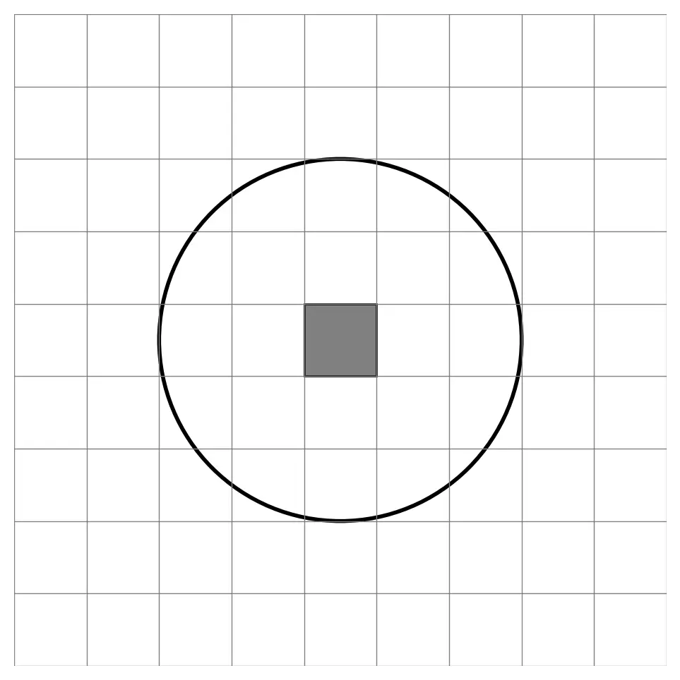

# What Is an Emanation in 5E (And How Does It Work)?

An **emanation** is a circular area of effect that extends outward from the creature in all directions - usually 10, 15, or 30 feet - and affects anything in that radius. It’s like an aura, but triggered by an ability.

{.masked .blog-image}

!!! info "What It Used to Be Called"
    In the original 2014 edition of 5E, these effects were often described in long-form:  
    *“Each creature within 10 feet of you...”* or  
    *“An aura extends 30 feet in every direction centered on you...”*  
     
    Starting in 2024-era rules (and [Foe Foundry](../index.md){.branding}), the keyword **emanation** is used instead. It's just a shorthand to make rules clearer and faster to parse.

## How Big Are Emanations in D&D 5E?

| Radius | Area Size | Use Case |
|--------|-----------|----------|
| 10 ft  | 5x5       | Close-range pulses (roars, shocks) |
| 15 ft  | 7x7       | Medium auras (Spirit Guardians, fear fields) |
| 30 ft  | 13x13     | Battlefield control (boss auras, divine storms) |
| 60 ft  | 25x25     | Legendary-scale auras, domain-wide effects |

---

## Player Tips: How to use Emanation Abilities

Use emanations when you want to:

- Affect enemies around you without needing to aim
- Trigger effects when creatures enter your range
- Combo with positioning (e.g. charge into the middle of enemies, then release)
- Protect allies with supportive auras like healing or damage reduction

---

## DM Tips: Make Emanations Matter

!!! info "Want monsters with built-in emanations?"
    Try out our free & powerful [[Lich]] to see what emanations are capable of

!!! info "Want to add emanations to your monsters?"
    Check out our free [**Emanation Powers**](../powers/emanation.md) for inspiration.

Emanations shine when they **change how players move**. Use them for:

- **Lingering auras**: A [[Wight]]'s aura of despair or a solar’s divine halo
- **Triggered pulses**: A [[Banshee]]’s scream or psychic nova

Here are two emanation examples - [[Raging Flames]] and [[Draconic Standard]]

[[!Raging Flames]]

[[!Draconic Standard]]

---

## Try It Out

[Foe Foundry](../index.md){.branding} is a free 5E monster generator that can create monsters with emanation powers. For example, the [[Kobold Ascendant]] has a fun and unique emanation ability:

[[!Kobold Ascendant]]

[[$Kobold Ascendant]]

[[@Subscribe to the Foe Foundry Newsletter]]

---

## Frequently Asked Questions

### What is a 30-foot emanation?

A 30-foot emanation is a circular effect centered on the caster or creature, affecting everything within 30 feet.

### Is an emanation the same as an aura?

Essentially, yes. An **emanation** is the specific rules keyword that describes aura-like effects in 5E.

### How big is a 10-foot emanation?

It covers a 20-foot diameter circle centered on the caster, or a 5x5 square on a grid.

---

Whether you’re building terrifying undead or protecting allies with divine light, emanations give you powerful tools for battlefield control. Explore [more powers](../powers/all.md) or [summon your own monster](../generate.md) to put them to work.