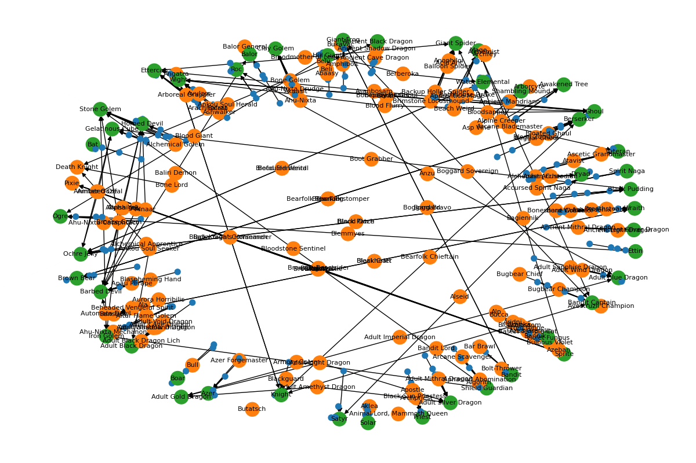

# Foe Foundry Graph Overview

## What is the Foe Foundry Graph?
The Foe Foundry graph is a directed, multi-type graph that models relationships between RPG monsters, documents, families, and powers. It is designed to power fast, explainable, and composable search and retrieval for the Foe Foundry monster database.

## What is it Useful For?
- **Monster Search & Discovery:** Enables keyword and graph-based search for monsters, supporting alias resolution, structured filters (CR, type, environment, family), and indirect matches via graph propagation.
- **Explainability:** Surfaces the reasoning path for each result, showing how documents, statblocks, and relationships contributed to the match.
- **Integration:** Provides a flexible structure for integrating new filters, semantic search, and additional content types.
- **Scalability:** Handles thousands of monsters and tens of thousands of documents efficiently using sparse graph representations and CPU-friendly algorithms.

## Node & Edge Model
### Node Types
- **DOC**: Background RPG documents (SRD, blogs, sourcebooks). Attributes: `id`, `monster_key`, `text`.
- **MON**: Published monster statblocks (SRD or 3rd party). Attributes: `id`, `name`, `is_srd`, `description`.
- **FF_MON**: Foe Foundry monster instances. Attributes: `monster_key`, `template_key`, references to SRD/other monsters.
- **FF_FAM**: Monster families. Attributes: `family_key`, member monsters.
- **POW**: Powers. Attributes: `power_key`, granted monsters.

### Edge Types
- **DOC → MON**: Document describes a monster (`type="about"`, `relevancy`).
- **MON → MON**: Similar monsters via SRD mapping (`type="similar"`).
- **FF_MON → MON**: FF monster implements SRD/other monster (`type="implemented"`).
- **FF_FAM → FF_MON**: Family membership (`type="member"`).
- **POW → FF_MON**: Power grants to monster (`type="grants"`).

## How Does Search Work?
1. **Alias Resolution:** Direct match against known aliases returns mapped FF_MON.
2. **Filter Extraction:** CR, type, family, environment filters parsed from query.
3. **Keyword Scoring:** TF-IDF/BM25 scores for query tokens against DOC nodes (and optionally MON/FF_MON text).
4. **Graph Propagation:** Scores propagate from DOC → MON → FF_MON via edges, multiplying by edge weights.
5. **Ranking & Explainability:** Results are ranked by combined score, and top paths are shown to explain why each result was returned.

## Build & Indexing
- **Offline Build:**
  - Precompute TF-IDF vectors for DOC, MON, FF_MON text.
  - Build adjacency matrices for graph edges.
  - Persist vectorizer, matrices, and graph structure for fast runtime queries.

## Implementation Details
- **Libraries:**
  - `networkx` for graph construction
  - `scikit-learn` or `rank-bm25` for lexical scoring
  - `spaCy` for tokenization and lemmatization
  - `SciPy` for sparse matrix math
- **Graph Construction:** See `foe_foundry_search/graph/build_graph.py` for details on node/edge creation and error handling.

## Key Features
- **Fast:** Designed for sub-200ms query latency on CPU.
- **Explainable:** Returns reasoning paths for each result.
- **Composable:** Easy to add new node/edge types or filters.
- **Scalable:** Handles large document and monster sets efficiently.

## Further Reading
For more details, see the initial PRD (Product Requirements Document) in the repository, and the source code in `foe_foundry_search/graph/build_graph.py`.
